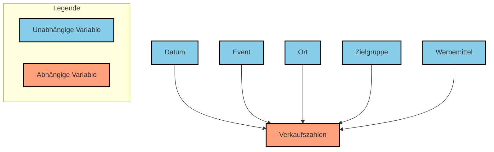

Abhängige und unabhängige Daten sind grundlegende Konzepte in der Statistik, die die Beziehungen zwischen Variablen beschreiben. Unabhängige Daten, auch als Eingabevariablen bezeichnet, haben keinen Zusammenhang miteinander und beeinflussen sich nicht gegenseitig. Abhängige Daten hingegen, oft als Ergebnisvariablen oder zu erklärende Variablen bezeichnet, werden von unabhängigen Daten beeinflusst und weisen einen Zusammenhang auf. Diese Unterscheidung ist wesentlich für die Auswahl geeigneter statistischer Verfahren und Tests, um korrekte Schlussfolgerungen zu ziehen.

## Variablen in der Statistik

In der Statistik unterscheidet man zwischen abhängigen und unabhängigen Variablen, um Experimente zu planen und auszuwerten. Abhängige Variablen sind diejenigen, deren Werte vorhergesagt oder erklärt werden sollen. Sie hängen von anderen Faktoren ab. Unabhängige Variablen hingegen sind die Einflussfaktoren, die die abhängige Variable beeinflussen.

- **Abhängige Variable:** Im Beispiel der Verkaufszahlen von Masken ist die Anzahl der verkauften Masken oder der Erfolg die abhängige Variable, da sie von anderen Faktoren abhängt.
- **Unabhängige Variablen:** Datum, Event, Ort, Zielgruppe, Werbemittel und Kosten sind unabhängige Variablen, die Einfluss auf die abhängige Variable ausüben.

## Unabhängige Daten

Unabhängige Daten sind Datensätze ohne jeglichen Zusammenhang. Die Werte einer Datenmenge beeinflussen nicht die Werte einer anderen. Jeder Datensatz kann separat betrachtet werden, und statistische Tests für unabhängige Stichproben kommen zum Einsatz.

- **Beispiele:**
  - Die Ergebnisse zweier Münzwürfe sind unabhängig voneinander.
  - Die Körpergröße von zufällig ausgewählten Personen ist unabhängig von ihrer Postleitzahl.

## Abhängige Daten

Abhängige Daten weisen einen Zusammenhang auf, wobei die Werte in einer Datenmenge die Werte in einer anderen beeinflussen oder korreliert sind. Oft sind die Datensätze paarweise verknüpft, wie bei Vorher-Nachher-Messungen. Statistische Tests für abhängige Stichproben werden verwendet.

- **Beispiele:**
  - Die Körpergröße von Eltern und ihren Kindern ist abhängig.
  - Die Testergebnisse einer Person vor und nach einer Behandlung sind abhängig.

## Bedeutung der Unterscheidung

Die korrekte Unterscheidung zwischen abhängigen und unabhängigen Daten ist entscheidend für die Wahl der statistischen Verfahren. Eine falsche Wahl kann zu fehlerhaften Schlussfolgerungen führen. Abhängige Daten haben häufig eine größere Varianz innerhalb der Gruppen, was die statistische Aussagekraft verringern kann.

### Visuelle Darstellung

| Merkmal                | Unabhängige Daten                         | Abhängige Daten                                               |
| ---------------------- | ----------------------------------------- | ------------------------------------------------------------- |
| **Beziehung**          | Kein Zusammenhang                         | Zusammenhang (Korrelation, Paarung)                           |
| **Beispiel**           | Ergebnisse zweier verschiedener Gruppen   | Ergebnisse derselben Gruppe zu verschiedenen Zeitpunkten      |
| **Statistische Tests** | t-Test für unabhängige Stichproben, ANOVA | t-Test für abhängige Stichproben, gepaarte Stichproben t-Test |

### Anwendungsbeispiele

- **Medizin:** Vergleich der Wirksamkeit eines Medikaments bei zwei verschiedenen Patientengruppen (unabhängig) versus Vergleich der Wirksamkeit bei denselben Patienten vor und nach der Behandlung (abhängig).
- **Psychologie:** Vergleich der Leistungsfähigkeit von zwei verschiedenen Lerngruppen (unabhängig) versus Vergleich der Leistungsfähigkeit derselben Lerngruppe unter verschiedenen Bedingungen (abhängig).
- **Soziologie:** Vergleich der Einkommen in zwei verschiedenen Städten (unabhängig) versus Vergleich des Einkommens von Ehepartnern (abhängig).