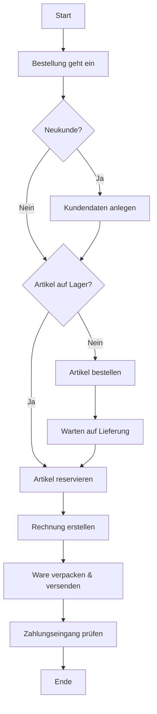

Die Ablauforganisation beschäftigt sich mit der dynamischen und prozessorientierten Gestaltung von Arbeitsabläufen. Sie zielt darauf ab, Aufgaben mit geringstem Aufwand zu erledigen, Bearbeitungs- und Durchlaufkosten zu minimieren, Bearbeitungszeiten und -fehler zu reduzieren, Termine einzuhalten sowie Kapazitäten optimal zu nutzen. Dabei erfolgt eine Zerlegung der Gesamtaufgabe in Teilaufgaben und deren anschließende Zusammenfassung zu effizienten Abläufen.

## Arbeitsanalyse
Die Arbeitsanalyse umfasst die Zerlegung der Gesamtaufgabe in einzelne Teilaufgaben. Sie beinhaltet zudem die Verteilung dieser Aufgaben auf verschiedene Stellen oder Personen.

## Arbeitssynthese
Die Arbeitssynthese bezieht sich auf die Zusammenfassung der Teilaufgaben zu kohärenten Abläufen. Dabei werden Arbeitsmittel zugeordnet, das Arbeitspensum sowie die Mitarbeiter festgelegt und der Arbeitsablauf definiert.

## Darstellung der Ablauforganisation
Zur Visualisierung der Ablauforganisation werden häufig [Flussdiagramme](/open-fidup/lerninhalte/flussdiagramm), [BPMN](/open-fidup/lerninhalte/bpmn) oder [eEPK](/open-fidup/lerninhalte/eepk) verwendet. Diese Darstellungen helfen, komplexe Prozesse verständlich zu machen und Schwachstellen zu identifizieren.

## Beispiel eines Flussdiagramms in der Ablauforganisation

Ein klassisches Beispiel für die Anwendung eines Flussdiagramms in der Ablauforganisation ist der Prozess einer **Bestellabwicklung**.

Dieses Beispiel zeigt, wie ein Prozess in logische Schritte zerlegt wird, um die Effizienz zu steigern und klare Anweisungen für die beteiligten Mitarbeiter zu schaffen. Es hilft dabei, Engpässe zu identifizieren und den Prozess zu optimieren.

## Quellen

> Ausbilderwelt. (2021, March 19). Ablauforganisation einfach erklärt für die IHK-Prüfung. Youtube. Retrieved from https://www.youtube.com/watch?v=ImnadIPICmA
