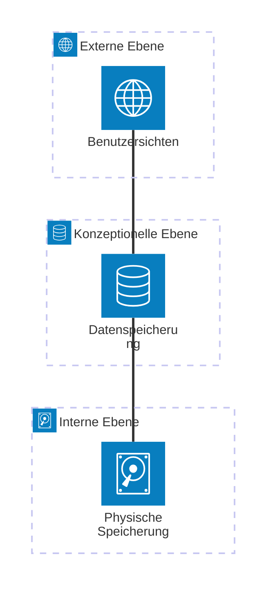

Die ANSI-SPARC-Architektur ist ein Modell zur Strukturierung von Datenbankschemata, das eine grundlegende Trennung verschiedener Beschreibungsebenen vorsieht. Es zielt darauf ab, die Unabhängigkeit der Daten zu erhöhen, indem es zwischen externen, konzeptionellen und internen Ebenen unterscheidet. Dies ermöglicht eine robustere und wartungsfreundlichere Datenbankgestaltung.

## Ebenen

1. **Externe Ebene**: Diese Ebene stellt Anwendungen und Benutzern individuelle Benutzersichten bereit. Sie umfasst Benutzeroberflächen und Schnittstellen, die auf die spezifischen Bedürfnisse einzelner Benutzer zugeschnitten sind.
2. **Konzeptionelle Ebene**: Hier wird festgelegt, welche Daten gespeichert werden und welche Beziehungen zwischen ihnen bestehen. Das Designziel ist eine vollständige und redundanzfreie Darstellung, die oft durch [Normalisierung](/open-fidup/lerninhalte/normalisierung) erreicht wird.
3. **Interne Ebene**: Diese Ebene befasst sich damit, wie und wo die Daten physisch in der Datenbank gespeichert werden. Das Designziel liegt in einem effizienten Zugriff auf die Daten.

## Vorteile

- **Physische Unabhängigkeit**: Änderungen an der physischen Ebene, wie der Wechsel des Speichermediums, wirken sich nicht auf die externe oder konzeptionelle Ebene aus.
- **Logische Datenunabhängigkeit**: Modifikationen an der Datenbankstruktur, etwa das Hinzufügen neuer Attribute oder Entitäten, haben keine Auswirkungen auf die externe Ebene.
- **Höhere Robustheit gegenüber Änderungen**: Die Architektur macht das System widerstandsfähiger gegen verschiedene Arten von Veränderungen.
- **Einfachere Wartung und Anpassung**: Durch die klare Trennung der Ebenen wird die Pflege und Anpassung der Datenbank erleichtert.

## Quellen

> Autoren der Wikimedia-Projekte. (2004, 29. Juli). ANSI-SPARC-Architektur – Wikipedia. Abgerufen von https://de.wikipedia.org/w/index.php?title=ANSI-SPARC-Architektur&oldid=236727164  
> DuckDuckGo AI Chat (2023). Anfrage zur Verbesserung des Lernzettels über ANSI-SPARC-Architektur.