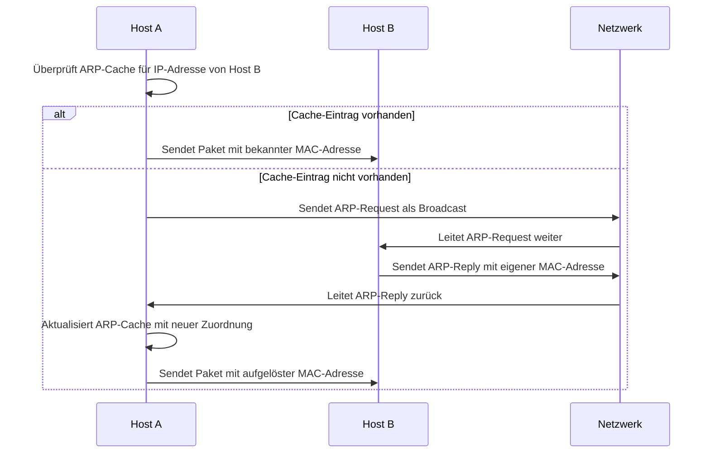

Das Address Resolution Protocol (ARP) ist ein Netzwerkprotokoll, das auf der Netzzugangsschicht des [TCP/IP-Modells](/open-fidup/lerninhalte/tcp-ip-modell) oder der Sicherungsschicht des [OSI-Modells](/open-fidup/lerninhalte/osi-modell) arbeitet. Es dient der Übersetzung von [IPv4-Adressen](/open-fidup/lerninhalte/ip) in [MAC-Adressen](/open-fidup/lerninhalte/mac). Die Zuordnung wird gegebenenfalls in ARP-Tabellen der beteiligten Rechner gespeichert. Für [IPv6](/open-fidup/lerninhalte/ip) übernimmt das Neighbor Discovery Protocol eine vergleichbare Funktion.

## Definition und Abkürzung

ARP steht für Address Resolution Protocol. Es handelt sich um ein Protokoll, das die Zuordnung von logischen Netzwerkadressen zu physischen Hardwareadressen ermöglicht.

## Funktionsweise

Das Protokoll übersetzt [IPv4-Adressen](/open-fidup/lerninhalte/ip) in [MAC-Adressen](/open-fidup/lerninhalte/mac), um die Kommunikation innerhalb eines lokalen Netzwerks zu erleichtern. Die ermittelten Zuordnungen können in ARP-Tabellen hinterlegt werden, die von den beteiligten Rechnern verwaltet werden.

Der Ablauf des ARP-Prozesses lässt sich wie folgt darstellen:

## Vergleich zu IPv6

Für [IPv6](/open-fidup/lerninhalte/ip) wird anstelle von ARP das Neighbor Discovery Protocol verwendet, das ähnliche Funktionen erfüllt, aber an die Anforderungen von IPv6 angepasst ist.

## Quellen

> Seite „Address Resolution Protocol“. In: Wikipedia – Die freie Enzyklopädie. Bearbeitungsstand: 26. Januar 2024, 11:22 UTC. URL: [https://de.wikipedia.org/w/index.php?title=Address_Resolution_Protocol&oldid=241562255](https://de.wikipedia.org/w/index.php?title=Address_Resolution_Protocol&oldid=241562255) (Abgerufen: 17. September 2024, 08:29 UTC)