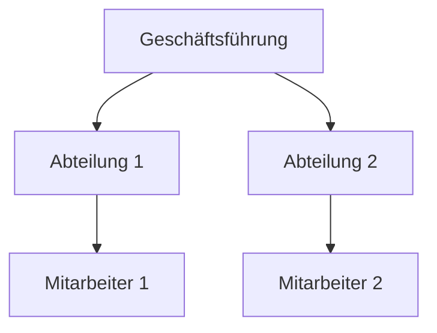
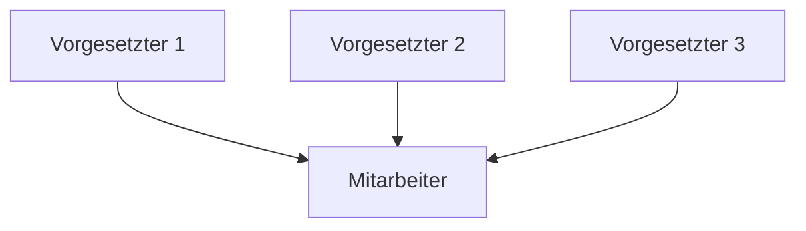
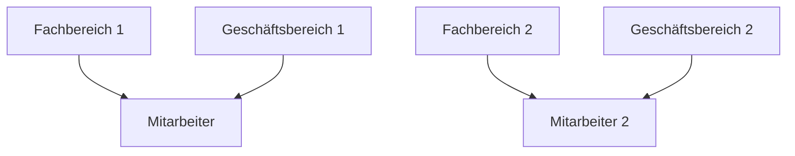
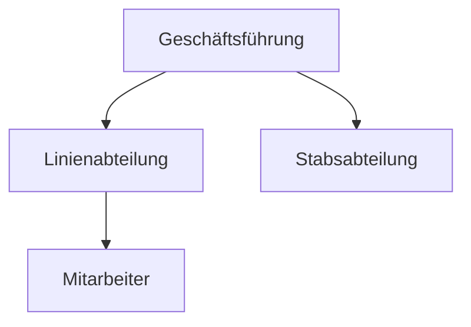

Die Aufbauorganisation bildet das hierarchische Grundgerüst eines Unternehmens. Sie legt fest, wer Führung übernimmt, wer Verantwortung trägt und welche Abteilungen existieren. Das Organigramm dient dazu, Aufgaben- und Verantwortungsbereiche zu strukturieren. Die Aufbauorganisation basiert auf der Analyse und Synthese von Aufgaben sowie verschiedenen Organisationsformen.

## Aufgabenanalyse
Die Aufgabenanalyse umfasst die Untersuchung aller Aufgaben innerhalb eines Unternehmens. Zunächst werden die Hauptaufgaben identifiziert, die zur Erfüllung des Unternehmensziels beitragen. Diese werden anschließend in Teilaufgaben unterteilt, wobei Kriterien wie Objekte, Funktionen, Phasen und Rangstufen berücksichtigt werden. Beispiele für Objekte sind Kühlschränke oder Mikrowellen. Funktionen umfassen Bereiche wie Produktion (einschließlich Montagearbeiten wie Verkabelung), Vertrieb, Forschung und Entwicklung sowie Marketing. Phasen gliedern sich in Planung, Durchführung und Kontrolle.

## Aufgabensynthese
Die Aufgabensynthese besteht darin, Haupt- und Teilaufgaben zusammenzusetzen und zu gruppieren. Auf diese Weise entsteht eine Organisationsform, die die Struktur des Unternehmens definiert.

## Organisationsformen

### Einliniensystem
Das Einliniensystem zeichnet sich durch einen einfachen hierarchischen Aufbau aus. Es legt Delegations- und Rechtswege klar fest, wobei jeder Mitarbeiter einen direkten Vorgesetzten hat. Zu den Vorteilen zählen die Übersichtlichkeit, die klare Verteilung von Anordnungsbefugnissen sowie eindeutige Dienst-, Informations- und Kommunikationswege. Zudem vermeidet es Kompetenzüberschneidungen. Nachteile sind lange Dienstwege, die unnötige Belastung von Zwischeninstanzen, die Überlastung von Vorgesetzten sowie fehlende Flexibilität.

### Mehrliniensystem
Das Mehrliniensystem basiert auf der Mehrfachunterstellung, sodass jeder Mitarbeiter mehrere Vorgesetzte haben kann. Vorteile sind direkte Kommunikationswege, erleichterte Mitarbeiterkontrolle, der Einsatz von Spezialisten in Fachgebieten sowie die Entlastung ranghoher Instanzen. Nachteile umfassen Probleme bei der Abgrenzung von Zuständigkeiten und Verantwortung, Kompetenzüberschneidungen mit Konfliktpotenzial sowie widersprüchliche Arbeitsanweisungen.

### Matrixorganisation
Die Matrixorganisation stellt eine Umsetzung eines mehrdimensionalen Mehrliniensystems dar. Die Zuordnung erfolgt nach Fach- und Geschäftsbereich.

### Stabliniensystem
Das Stabliniensystem ordnet bestimmte Abteilungen zu, die eine unterstützende Funktion haben.

## Quellen
Aufbauorganisation. (2019, June 21). Retrieved from https://studyflix.de/wirtschaft/aufbauorganisation-1346  
Einliniensystem. (2019, June 21). Retrieved from https://studyflix.de/wirtschaft/einliniensystem-1344  
Mehrliniensystem. (2019, June 21). Retrieved from https://studyflix.de/wirtschaft/mehrliniensystem-1345