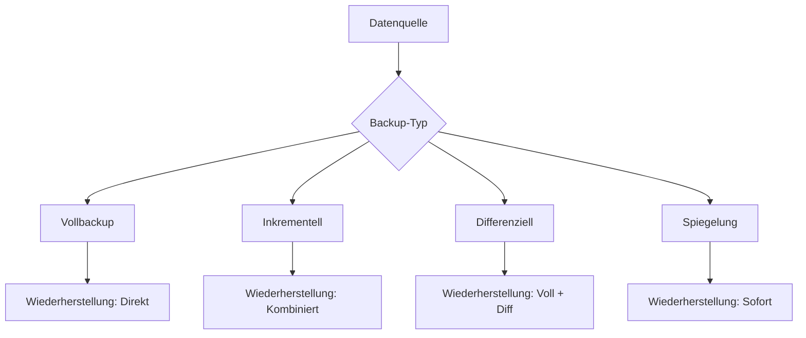
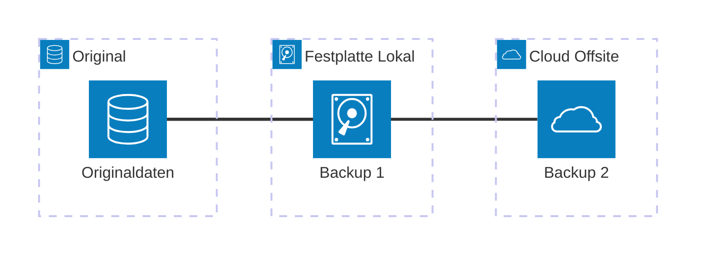
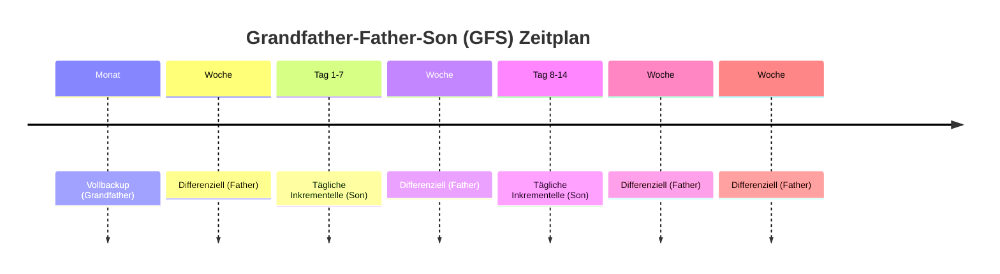
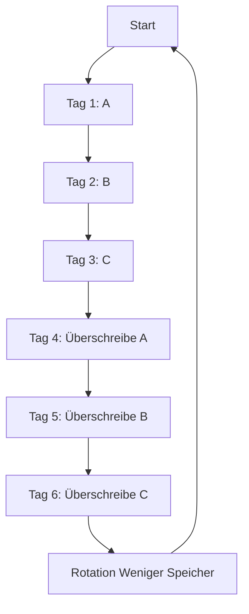

Backup bezeichnet die Erstellung von Kopien von Daten, die an einem anderen Ort aufbewahrt werden, um Datenverlust durch Hardware- oder Softwarefehler, menschliches Versagen, Hackerangriffe oder Naturkatastrophen zu vermeiden. Es handelt sich um eine zentrale Maßnahme zur Datensicherheit, die verschiedene Arten und Strategien umfasst, um die Wiederherstellung zu erleichtern und den Geschäftsbetrieb zu sichern.

## Gründe für Backups

Backups dienen mehreren Zwecken. Sie ermöglichen die Wiederherstellung verlorener oder beschädigter Daten und bieten Schutz vor Ransomware oder Malware-Angriffen. Gesetzliche Vorgaben erfordern oft die Aufbewahrung bestimmter Daten über Jahre hinweg. Zudem gewährleisten Backups die Kontinuität des Geschäftsbetriebs bei IT-Problemen.

## Backup-Arten

Es existieren verschiedene Arten von Backups, die sich in Umfang, Geschwindigkeit und Speicherbedarf unterscheiden. Die wichtigsten sind:

| Art | Beschreibung | Vorteile | Nachteile |
|----|-------------|----------|-----------|
| Vollbackup | Vollständige Sicherung aller Daten. | Alle Daten stehen bei Verlust zur Verfügung. | Zeitaufwendig und benötigt viel Speicherplatz. |
| Inkrementelles Backup | Sichert nur Daten, die sich seit dem letzten Backup geändert haben. | Spart Speicherplatz und Zeit. | Langsame Wiederherstellung erfordert Kombination mehrerer Backups. |
| Differenzielles Backup | Sichert alle Änderungen seit dem letzten Vollbackup. | Schnellere Wiederherstellung als inkrementell. | Wird mit der Zeit größer, je länger das letzte Vollbackup zurückliegt. |
| Spiegelung (Mirroring) | Echtzeit-Kopie von Daten auf externen Speicher. | Permanente Verfügbarkeit der neuesten Daten. | Kein Schutz vor versehentlichem Löschen; Änderungen werden sofort übernommen. |

### Visualisierung der Backup-Arten

Das folgende Diagramm veranschaulicht die unterschiedlichen Ansätze der Backup-Arten:

## Backup-Strategien

Backup-Strategien definieren, wie und wann Backups durchgeführt werden, um Effizienz und Sicherheit zu optimieren. Häufig verwendete Ansätze sind:

### 3-2-1-Strategie
Diese Strategie empfiehlt drei Kopien der Daten: die Originaldaten sowie zwei Backups. Die Backups sollten auf zwei verschiedenen Medien gespeichert werden, wobei mindestens eine Kopie extern (Offsite) aufbewahrt wird, beispielsweise in der Cloud oder an einem anderen geografischen Ort.

### Grandfather-Father-Son (GFS)
Diese Methode kombiniert tägliche, wöchentliche und monatliche Backups:
- Täglich (Son): Inkrementelles oder differenzielles Backup.
- Wöchentlich (Father): Differenzielles Backup.
- Monatlich (Grandfather): Vollbackup.

Der Vorteil liegt in der langfristigen und flexiblen Datensicherung.

### Towers of Hanoi
Eine komplexere Methode mit intelligentem Rotationsprinzip, die weniger Backups benötigt. Sie spart Speicherplatz durch ausgeklügelte Zeitplanung, ist jedoch schwierig umzusetzen und weniger verbreitet.

## Wichtige Begriffe

- **RPO (Recovery Point Objective)**: Die maximale Menge an Daten, die verloren gehen kann, gemessen als Zeitraum zwischen den Backups.
- **RTO (Recovery Time Objective)**: Die maximale Zeitspanne, die für die Wiederherstellung der Daten benötigt wird.
- **Backup-Fenster**: Der Zeitraum, in dem das Backup durchgeführt wird, idealerweise außerhalb der Arbeitszeiten.
- **Hot/Cold/Offline Backup**:
  - **Hot Backup**: Backup während der Betriebszeit, wobei das System weiterläuft.
  - **Cold Backup**: Backup bei ausgeschaltetem System.
  - **Offline Backup**: Backup auf nicht verbundene Systeme, wie externe Festplatten, die vom Netzwerk getrennt sind.