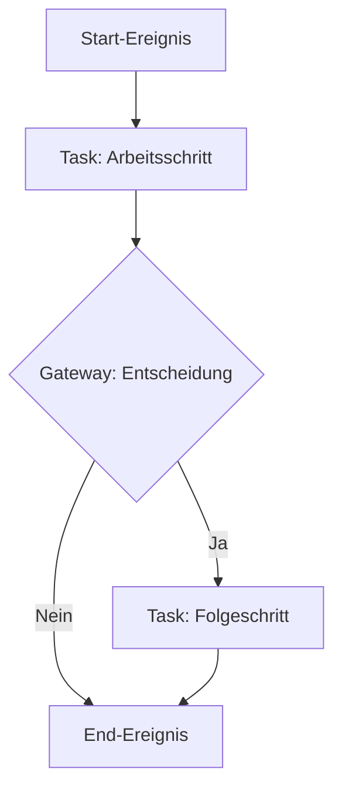

BPMN, die Abkürzung für Business Process Modelling Notation, stellt eine standardisierte grafische Notation dar, die zur Modellierung von Geschäftsprozessen dient. Sie ermöglicht die Visualisierung, Analyse und Dokumentation von Abläufen in Unternehmen und fördert die Kommunikation zwischen verschiedenen Beteiligten. Die Notation unterstützt zudem die Automatisierung von Prozessen durch Integration in IT-Systeme.

## Ziele und Vorteile

BPMN verfolgt mehrere zentrale Ziele, die auf die Verbesserung der Prozesshandhabung abzielen. Dazu zählt die Visualisierung komplexer Geschäftsprozesse, um sie verständlich und nachvollziehbar zu machen. Sie dient als einheitliche Sprache für Fachabteilungen, IT-Teams und Management, um Missverständnisse zu reduzieren. Zudem unterstützt sie die Prozessautomatisierung, indem Modelle direkt in Workflow-Management-Systeme integriert werden können.

Die Vorteile von BPMN liegen in ihrer standardisierten Darstellung, die das Verständnis und die Zusammenarbeit fördert. Sie reduziert Missverständnisse zwischen Abteilungen und ermöglicht eine effiziente Integration in IT-Systeme. Dadurch wird die Automatisierung von Prozessen erleichtert.

## Grundelemente

Die Grundelemente von BPMN bilden die Bausteine für die Modellierung. Sie umfassen Ereignisse, Aktivitäten, Gateways, Verbindungen sowie Pools und Lanes. Ereignisse markieren den Beginn, das Ende oder Zwischenstadien eines Prozesses. Aktivitäten beschreiben Arbeitsschritte, die als einfache Tasks oder komplexere Sub-Prozesse ausgeführt werden. Gateways steuern den Prozessfluss und ermöglichen Entscheidungen, etwa durch logische Operatoren wie XOR, AND oder OR. Verbindungen zeigen Sequenzflüsse oder Nachrichtenflüsse zwischen Elementen. Pools repräsentieren Organisationen oder Teilnehmer, während Lanes diese in spezifische Rollen oder Abteilungen unterteilen.

Ein einfaches Beispiel für ein BPMN-Diagramm veranschaulicht diese Elemente:

## Anwendungsbereiche

BPMN findet in verschiedenen Bereichen Anwendung. Sie dient der Prozessdokumentation, um bestehende Abläufe zu erfassen und zu visualisieren. Bei der Prozessoptimierung hilft sie, Schwachstellen zu identifizieren und Verbesserungspotenziale aufzudecken. Im Schulungsbereich unterstützt sie die Einarbeitung neuer Mitarbeiter in Geschäftsprozesse. Schließlich bildet sie die Grundlage für die Automatisierung durch Implementierung in Workflow-Management-Systeme.

## Herausforderungen

Trotz ihrer Vorteile bringt BPMN Herausforderungen mit sich. Bei sehr komplexen Prozessen kann die Modellierung unübersichtlich werden. Zudem erfordert sie Schulungen für Mitarbeiter, um die Notation effektiv zu nutzen. Diese Aspekte müssen bei der Einführung berücksichtigt werden, um den Nutzen voll auszuschöpfen. Im Vergleich zu anderen Notationen wie EPK oder UML bietet BPMN spezifische Stärken in der Visualisierung und Automatisierung, wie in [BPMN im Vergleich zu EPK und UML](/open-fidup/lerninhalte/bpmn-vs-epk-vs-uml) näher erläutert.