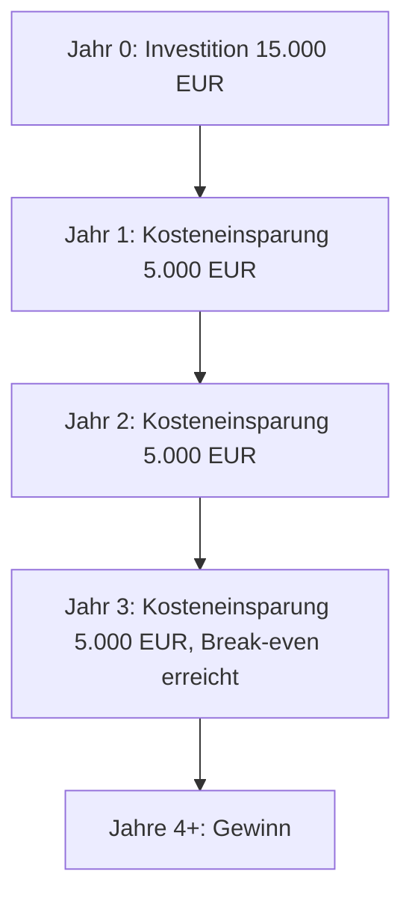

Die Break-even-Analyse dient der Bewertung der Wirtschaftlichkeit einer Investition, eines neuen Produkts oder einer neuen Dienstleistung. Sie berechnet den Zeitpunkt, ab dem die Investition Gewinne erzielt oder die anfänglichen Kosten amortisiert sind. Dies erfolgt durch den Vergleich der Investitionskosten mit den Kosteneinsparungen, die sich aus der Differenz zwischen alten und neuen laufenden Kosten ergeben. Die Analyse unterstützt Entscheidungen über die Einführung von Veränderungen, indem sie die Amortisationsdauer quantifiziert.

## Formel
Die Break-even-Dauer ergibt sich aus der Division der Investitionskosten durch die Differenz zwischen den alten und neuen laufenden Kosten. Dabei handelt es sich um eine einfache Berechnung, die auf folgenden Komponenten basiert:

- **Investitionskosten**: Einmalige Ausgaben für die Einführung eines neuen Produkts oder einer Dienstleistung.
- **Alte Kosten**: Laufende Kosten vor der Einführung.
- **Neue Kosten**: Laufende Kosten nach der Einführung.

Die Formel lautet:

$$\text{Break-even-Dauer} = \dfrac{\text{Investitionskosten}}{\text{Alte Kosten} - \text{Neue Kosten}}$$

### Beispiel
Ein Beispiel ist die Einführung neuer Software. Die jährlichen Kosten betragen 10.000 EUR. Ein Mitarbeiter, der nach einem Jahr der Softwareeinführung in den Ruhestand geht, verursacht Kosten in Höhe von 15.000 EUR. Diese 15.000 EUR fallen nur im ersten Jahr an und gelten daher als Investitionskosten.

Die Berechnung ergibt:

$$\text{Break-even-Dauer} = \dfrac{15.000}{15.000 - 10.000} = 3$$

Dies bedeutet, dass die Investition nach drei Jahren amortisiert ist.

