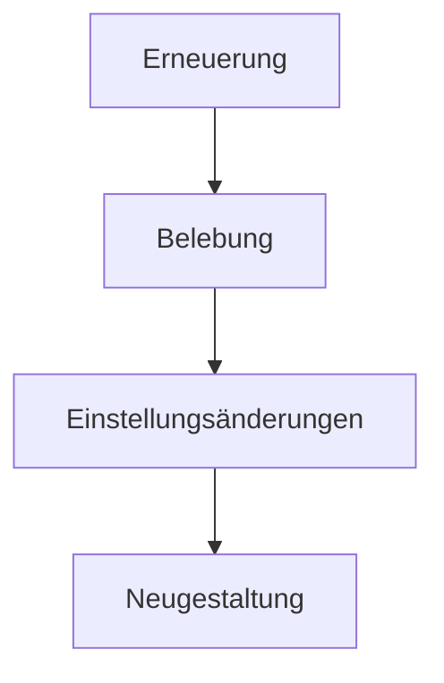

Business Process Reengineering (BPR) umfasst die radikale Neugestaltung von Geschäftsprozessen, um Qualität und Effizienz zu steigern. Es zielt auf Kostensenkung und höhere Kundenzufriedenheit ab. Methoden orientieren sich an den Vier R: Erneuerung, Belebung, Einstellungsänderungen und Neugestaltung. BPR findet Anwendung in Notlagen, birgt aber Risiken wie Personalabbau.

## Definition und Überblick
Business Process Reengineering (BPR) beschreibt die radikale Neugestaltung von Geschäftsprozessen zur Steigerung der Qualität und Effizienz. Es gilt als „Radikalkur für das Unternehmen“.

## Zielsetzung
BPR verfolgt die Steigerung der Qualität, die Senkung der Kosten und die Verbesserung der Kundenzufriedenheit. Es minimiert organisatorische Schnittstellen und fokussiert auf Kernprozesse, die Wert für Kunden schaffen.

## Anwendungsbereiche
BPR eignet sich in Notlagen, etwa zur Vermeidung von Insolvenzen. Es kommt zum Einsatz, wenn radikale Maßnahmen zur Optimierung des Kerngeschäfts erforderlich sind. Dabei erfolgt eine Überprüfung und gegebenenfalls Optimierung oder Auslagerung anderer Unternehmensprozesse.

## Methoden und Phasen
BPR folgt den Vier R nach Michael Hammer und James Champy:

1. **Erneuerung (Renewing)**: Förderung und Einbindung des Wissens der Mitarbeiter.
2. **Belebung (Revitalizing)**: Analyse der bestehenden Prozesse.
3. **Einstellungsänderungen (Reframing)**: Fundamentales Umdenken und Aufbrechen von Denkmustern.
4. **Neugestaltung (Restructuring)**: Etablierung neuer Prozessansätze im Unternehmen.

## Historische Entwicklung
BPR war in den 1980er und 1990er Jahren ein wichtiges Managementkonzept. Es wurde von Michael Hammer und Thomas Davenport entwickelt. Technologiefirmen wie SAP und Oracle förderten BPR als Lösung für Prozessneugestaltung. Kritiken richten sich gegen den hohen Fokus auf Technologie und Kostenreduzierung sowie die Vernachlässigung von Auswirkungen auf Mitarbeiter und Unternehmenskultur.

## Vor- und Nachteile
### Vorteile
- Gesteigerte Kundenorientierung.
- Nutzung neuer Informations- und Kommunikationstechniken.
- Ganzheitliche Betrachtung der Prozesse.
- Senkung der Kosten bei gleichzeitiger Qualitätssteigerung.
- Berücksichtigung der Mitarbeiterperspektive.

### Nachteile
- Mögliche Auflösung etablierter Strukturen.
- Personalabbau und Unzufriedenheit unter Mitarbeitern.
- Langwieriger Prozess mit verzögerten Erfolgen.
- Nicht für jedes Unternehmen geeignet.

## Umsetzungshinweise
BPR erfordert sorgfältige Überlegung und Planung. Eine gründliche Analyse der bestehenden Prozesse ist notwendig. Mitarbeiter sollten in den Veränderungsprozess eingebunden werden. Technologische Unterstützung hilft bei der Prozessoptimierung. Transparente Kommunikation über Veränderungen und deren Auswirkungen ist essenziell.

## Verwandte Konzepte
- [Lean Management](/open-fidup/lerninhalte/lean-management): Ansatz zur Minimierung von Verschwendung und Maximierung von Wertschöpfung.
- Kernprozesse sind zentrale Abläufe, die direkt zur Wertschöpfung für den Kunden beitragen.

## Quellen
- https://der-prozessmanager.de/aktuell/wissensdatenbank/business-process-reengineering-bpr