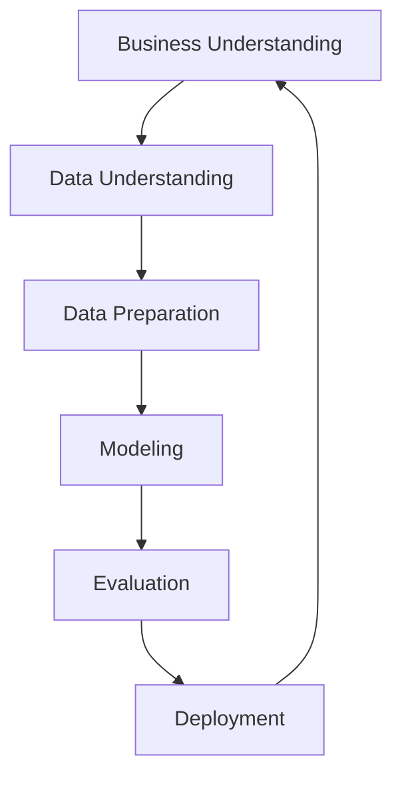

CRISP-DM (Cross-Industry Standard Process for Data Mining) stellt ein standardisiertes Modell für den Prozess des [Data Mining](/open-fidup/lerninhalte/data-mining) dar. Es umfasst sechs Phasen, die von der betriebswirtschaftlichen Problemstellung bis zur Umsetzung der gewonnenen Erkenntnisse führen. Das Modell zielt darauf ab, einen einheitlichen Ablauf zu schaffen und in verschiedenen Branchen anwendbar zu sein.

## Ziele
Das Modell verfolgt zwei Hauptziele:
- Schaffung eines einheitlichen Prozesses und Vorgehensmodells für Data-Mining-Projekte.
- Übergreifende Nutzung in verschiedenen Branchen, um Konsistenz und Effizienz zu gewährleisten.

## Phasen
CRISP-DM gliedert sich in sechs sequenzielle Phasen, die iterativ durchlaufen werden können.

### 1. Business Understanding
Diese Phase beginnt mit einer konkreten Beschreibung der betriebswirtschaftlichen Problemstellung. Es folgt eine Situationsbewertung, bei der Software- und Personalressourcen bestimmt und mögliche Risiken identifiziert werden. Aus der Problemstellung werden Datenanalyseaufgaben abgeleitet, beispielsweise Kundensegmentierung oder Scoring-Verfahren. Erfolgskriterien werden festgelegt, etwa die Steigerung der Antwortquote von Kampagnen um 3 Prozent. Abschließend wird ein Projektplan erstellt, der folgende Elemente umfasst:
- Auflistung einzelner Schritte mit Zeitspannen.
- Beurteilung möglicher Risiken, wie Verzögerungen oder Ursachen für das Scheitern des Projekts.
- Prüfung der verfügbaren Ressourcen, einschließlich Mitarbeiter, Hardware und Software.

### 2. Data Understanding
In dieser Phase werden die Daten gesammelt, was die Beschaffung und gegebenenfalls die Integration in bestehende Datenmengen einschließt. Probleme werden dokumentiert. Die Daten werden beschrieben, unter Berücksichtigung von Quantität, Formateigenschaften, Anzahl der Einträge und Felder sowie Eigenschaften der Felder. Eine zentrale Frage lautet, ob die vorliegenden Daten für den Projekterfolg ausreichen. Es folgt die Untersuchung der Daten durch erste Analysen, beispielsweise die Identifizierung von Produktgruppen. Reports werden erstellt, und Erkenntnisse sowie Hypothesen werden visualisiert. Abschließend erfolgt eine Bewertung der Datenqualität, der Datenmenge und der Vollständigkeit der Attributwerte.

### 3. Data Preparation
Diese Phase umfasst die Auswahl der Daten, die stark von den Zielen abhängt. Selektionen werden vorgenommen, beispielsweise Kunden mit einem Umsatz von mehr als 100 Euro pro Monat. Es wird eindeutig festgelegt, welche Datenmengen in die Analyse einbezogen oder ausgeschlossen werden. Die Bereinigung der Daten zielt darauf ab, eine sauberere Datenmenge zu erhalten oder die Daten so zu bereinigen, dass das gewünschte Ergebnis für die Modellierung erreicht wird. Daten werden transformiert und integriert, einschließlich Kodierung, Aggregation oder Disaggregation. Wichtige Kennzahlen werden erstellt, beispielsweise Durchschnittsgehälter. Schließlich werden die Daten formatiert, um den Datentyp für das Modell anzupassen.

### 4. Modeling
Hier wird die Modellierungstechnik ausgewählt. Ein Testmodell wird erstellt, um Qualität und Genauigkeit zu überprüfen. Bei überwachten Verfahren, wie Klassifikation, dienen Fehlerraten als Qualitätsmaß. Das Modell wird auf die definierten Data-Mining-Ziele und die betriebswirtschaftliche Fragestellung hin bewertet.

### 5. Evaluation
Die Ergebnisse werden bewertet, insbesondere inwieweit das Modell die Projektziele erreicht hat. Bei Nichterreichung werden Gründe analysiert. Der Prozess wird rückblickend bewertet, wobei alle wichtigen Faktoren berücksichtigt werden. Es wird geprüft, inwieweit die Erkenntnisse für zukünftige Projekte nutzbar sind. Der Projektleiter legt die nächsten Schritte fest, einschließlich der Entscheidung, ob das Projekt abgeschlossen und umgesetzt wird.

### 6. Deployment
Als letzte Phase werden die gewonnenen Erkenntnisse aufbereitet, beispielsweise durch die Entwicklung einer möglichen Implementierungsstrategie. Die Gültigkeit der Modelle wird überprüft. Abschließend erfolgt ein zusammenfassender Bericht und eine Präsentation.

## Quellen
> Wuttke, L. (2024). CRISP-DM: das Standard-Vorgehensmodell für Data Mining. Datasolut GmbH. Retrieved from https://datasolut.com/crisp-dm-standard.