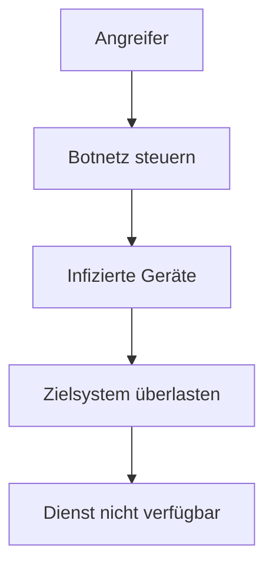

DDoS-Angriffe (Distributed Denial of Service) zielen darauf ab, die Verfügbarkeit von Systemen durch Überlastung zu unterbinden. Sie werden von verteilten Quellen ausgeführt, oft über Botnetze, und sind schwer abzuwehren. Abwehrstrategien umfassen technische Maßnahmen wie Firewalls und spezialisierte Dienste.

## Definition und Zweck

Ein DDoS-Angriff überlastet eine Ressource wie Netzwerk, CPU oder Speicher, um den Dienst unzugänglich zu machen. Der Angreifer nutzt keine eigenen Schwächen des Ziels aus, sondern überfordert es mit Masse. Zwecke sind Erpressung, Schädigung von Konkurrenten oder politischer Protest.

## Funktionsweise

Angriffe erfolgen durch Senden vieler Anfragen an das Ziel. Bei DDoS werden diese von vielen Quellen (z. B. Botnetz) ausgeführt, was die Abwehr erschwert.

## Arten von DDoS-Angriffen

- **Volumetrische Angriffe**: Überflutung mit Daten (z. B. UDP-Flood).
- **Protokoll-Angriffe**: Ausnutzung von Protokoll-Schwächen (z. B. SYN-Flood).
- **Anwendungs-Angriffe**: Überlastung auf Anwendungsebene (z. B. HTTP-Flood).

## Abwehrstrategien

### Technische Maßnahmen
- **Firewalls und Rate Limiting**: Begrenzung von Anfragen.
- **SYN-Cookies**: Schutz vor SYN-Flood.
- **IP-Filterung**: Blockierung verdächtiger Quellen.

### Spezialisierte Dienste
- **DDoS-Mitigation**: Externe Anbieter filtern Verkehr.
- **Überdimensionierung**: Erhöhung der Kapazität.
- **Cloud-basierte Abwehr**: Skalierbare Ressourcen in der Cloud.

### Prävention
- Sichere Passwörter und Updates für IoT-Geräte.
- Deaktivierung unnötiger Dienste.
- Monitoring und frühzeitige Erkennung.

## Bekannte Beispiele

- 2016: Angriff auf Dyn, der Twitter und Netflix lahmlegte.
- 2018: Memcached-Angriff auf GitHub mit 1,35 Tbit/s.
- Ukrainischer Konflikt: DDoS-Angriffe auf Infrastruktur.

## Rechtliche Aspekte

In Deutschland strafbar nach § 303b StGB (Computersabotage). International ähnliche Regelungen.

## Quellen

> Wikipedia. (2025). Denial of Service. Retrieved from https://de.wikipedia.org/wiki/Denial_of_Service
> BSI. (2025). DoS- und DDoS-Attacken. Retrieved from https://www.bsi.bund.de/DE/Themen/Unternehmen-und-Organisationen/Informationen-und-Empfehlungen/Empfehlungen-nach-Gefaehrdungen/DDoS/ddos_node.html
