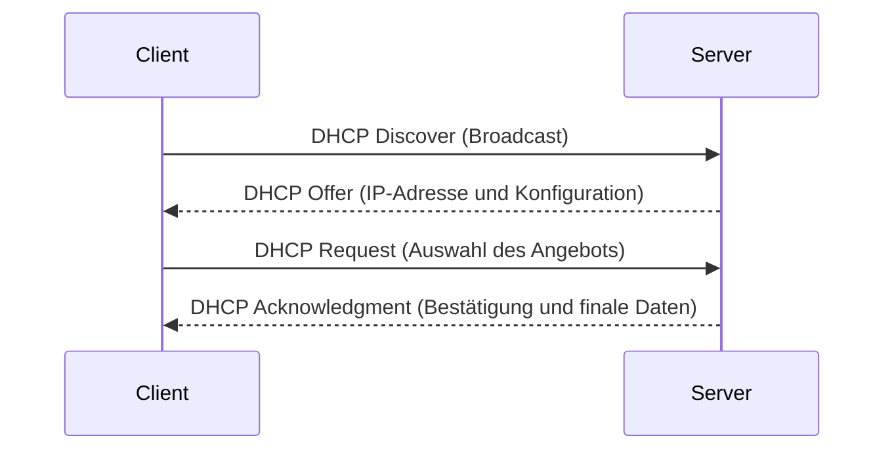

DHCP, kurz für Dynamic Host Configuration Protocol, ist ein Netzwerkprotokoll, das die automatische Zuweisung von IP-Adressen und anderen Netzwerkkonfigurationen an Geräte in einem lokalen Netzwerk ermöglicht. Es vereinfacht die Verwaltung von IP-Adressen, reduziert manuelle Eingriffe und unterstützt die Integration mit anderen Protokollen wie DNS. Der Prozess basiert auf vier Schritten: Discover, Offer, Request und Acknowledgment. DHCP bietet Optionen für zusätzliche Konfigurationen und umfasst Sicherheitsmechanismen wie DHCP Snooping.

## Grundlagen von DHCP

DHCP ist ein Netzwerkprotokoll, das automatisch IP-Adressen und andere Netzwerkinformationen an Geräte in einem Netzwerk zuweist. Sein Zweck besteht darin, die Verwaltung von IP-Adressen zu erleichtern und manuelle Konfigurationen zu minimieren.

## Funktionsweise von DHCP

Ein DHCP-Server stellt IP-Adressen und Konfigurationsinformationen bereit. Ein DHCP-Client fordert diese Informationen vom Server an. Der Server kann auf einem dedizierten Gerät oder einem Router laufen, während Clients typischerweise Endgeräte wie Computer oder Mobiltelefone sind.

## DHCP-Prozess

Der DHCP-Prozess erfolgt in vier Schritten:

1. **DHCP Discover**: Der Client sendet eine Broadcast-Nachricht, um verfügbare DHCP-Server im Netzwerk zu finden.
2. **DHCP Offer**: Der Server antwortet mit einem Angebot, das eine verfügbare IP-Adresse und andere Konfigurationsdaten enthält.
3. **DHCP Request**: Der Client wählt ein Angebot aus und sendet eine Anfrage an den entsprechenden Server.
4. **DHCP Acknowledgment (ACK)**: Der Server bestätigt die Zuweisung der IP-Adresse und übermittelt die endgültigen Konfigurationsdaten.

Dieser Ablauf kann durch ein Sequenzdiagramm dargestellt werden:

## DHCP-Optionen

DHCP unterstützt verschiedene Optionen zur Konfiguration von Clients:

- **IP-Adresse**: Die zugewiesene IP-Adresse für den Client.
- **Subnetzmaske**: Bestimmt die Teile der IP-Adresse, die das Netzwerk und den Host identifizieren.
- **Gateway**: Die IP-Adresse des Routers, über den der Client externe Netzwerke erreicht.
- **DNS-Server**: Die IP-Adressen der DNS-Server, die der Client für die Namensauflösung verwendet.

Diese Optionen ermöglichen eine umfassende Netzwerkkonfiguration ohne manuelle Eingriffe.

## Vorteile von DHCP

DHCP bietet mehrere Vorteile:

- **Automatisierung**: Es reduziert den Aufwand für die manuelle Zuweisung von IP-Adressen.
- **Zentralisierte Verwaltung**: Es erleichtert die Verwaltung von IP-Adressen in großen Netzwerken.
- **Flexibilität**: Clients können sich nahtlos in das Netzwerk integrieren und erhalten automatisch die erforderlichen Einstellungen.

## DHCP-Reservierungen

Eine DHCP-Reservierung weist einem bestimmten Client eine feste IP-Adresse zu, basierend auf seiner MAC-Adresse. Dies stellt sicher, dass Geräte wie Drucker oder Server stets die gleiche IP-Adresse erhalten. Der Zweck liegt in der Stabilität und Vorhersagbarkeit der Netzwerkkonfiguration.

## DHCP-Sicherheit

DHCP Snooping ist eine Sicherheitsfunktion, die nur autorisierte DHCP-Server im Netzwerk zulässt und so Angriffe verhindert. Rogue DHCP-Server sind unautorisierte Server, die falsche IP-Adressen zuweisen können, um Man-in-the-Middle-Angriffe oder andere Bedrohungen zu ermöglichen.

## Relevanz in Netzwerken

DHCP spielt eine zentrale Rolle in der Netzwerkadministration, besonders in dynamischen Umgebungen. Es integriert sich mit Protokollen wie [DNS](/open-fidup/lerninhalte/dns) und kann in größeren Infrastrukturen wie Active Directory verwendet werden. In [Netzwerkkonzepten](/open-fidup/lerninhalte/netzwerkkonzepte) unterstützt es die effiziente Verwaltung von [IP](/open-fidup/lerninhalte/ip)-Adressen.

## Quellen

> AI Chat. (2024, September 18). Retrieved from https://duckduckgo.com/?q=DuckDuckGo+AI+Chat&ia=chat&duckai=1 [Beleg erforderlich]