Diagrammarten sind visuelle Darstellungen von Daten, die zur Analyse, Interpretation und Kommunikation von Informationen dienen. Sie umfassen verschiedene Formen wie Balken-, Linien- und Kreisdiagramme, die jeweils spezifische Stärken und Schwächen aufweisen und in Bereichen wie Marktforschung, Finanzberichten und Prozessoptimierung Anwendung finden.

## Balkendiagramm

Das Balkendiagramm ist eine horizontale Darstellung von Säulendiagrammen, die Datensätze schnell visualisiert. Es eignet sich besonders für die einfache Erkennung von Daten und ist ideal für die Präsentation an ein breites Publikum.

### Vorteile
- Einfache Lesbarkeit und Interpretation, was es ideal für die Präsentation von Daten an ein breites Publikum macht.
- Klarer Vergleich zwischen verschiedenen Kategorien oder Gruppen, da die Längen der Balken visuell die Unterschiede darstellen.
- Verwendbar für qualitative als auch quantitative Daten und in verschiedenen Formaten (horizontal oder vertikal) darstellbar.

### Nachteile
- Kann unübersichtlich werden und viel Platz einnehmen, was die Lesbarkeit beeinträchtigen kann.
- Bei falsch gewählter Skala können Balkendiagramme die Daten verzerrt darstellen und falsche Eindrücke vermitteln.
- Zeigt keine Trends über die Zeit oder komplexe Beziehungen zwischen Variablen.

### Anwendungsfälle
- Marktforschung: Vergleich von Marktanteilen verschiedener Unternehmen oder Produkte in einem bestimmten Sektor.
- Umfragen: Darstellung der Ergebnisse von Umfragen, z. B. die Präferenzen von Konsumenten zu verschiedenen Produkten oder Dienstleistungen.
- Finanzberichte: Visualisierung von Einnahmen, Ausgaben oder anderen finanziellen Kennzahlen über verschiedene Zeiträume oder Abteilungen hinweg.

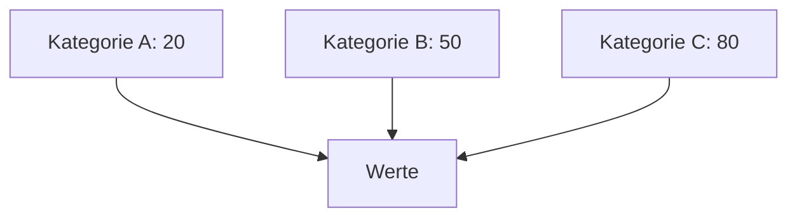

## Liniendiagramm

Das Liniendiagramm stellt kontinuierliche Daten oder Daten mit unendlichen Werten dar und zeigt Veränderungen im Zeitverlauf.

### Vorteile
- Einfache Lesbarkeit, was es ideal für die Präsentation von Trends und Entwicklungen über Zeiträume hinweg macht.
- Darstellung von Trends, da es Veränderungen in den Daten über einen bestimmten Zeitraum klar zeigt.
- Vergleich von mehreren Datensätzen möglich, indem mehrere Linien in einem Diagramm dargestellt werden, was einen direkten Vergleich erleichtert.

### Nachteile
- Kann bei zu vielen Linien überladen wirken, was die Lesbarkeit und das Verständnis beeinträchtigen kann.
- Schwierigkeiten bei der Interpretation von Datenpunkten, die nahe beieinander liegen, da sie visuell schwer zu unterscheiden sein können.
- Nicht ideal für kategoriale Daten, da es hauptsächlich für kontinuierliche Daten geeignet ist und bei kategorialen Daten weniger aussagekräftig sein kann.

### Anwendungsfälle
- Finanzanalysen: Darstellung von Umsatz- und Gewinnentwicklungen über mehrere Jahre.
- Wetterdaten: Visualisierung von Temperatur- oder Niederschlagsänderungen über verschiedene Zeiträume.
- Web-Analytics: Analyse von Besucherzahlen oder Seitenaufrufen über Zeit, um Trends im Nutzerverhalten zu erkennen.

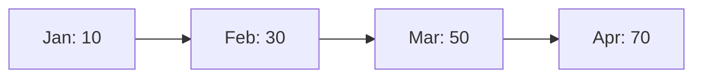

## Flächendiagramm

Das Flächendiagramm ähnelt dem Liniendiagramm, zeigt jedoch zusätzlich Volumen und Veränderungen im Zeitverlauf dar.

### Vorteile
- Visualisierung von kumulierten Werten, was hilft, die Gesamtentwicklung über Zeit oder Kategorien hinweg darzustellen.
- Einfache Darstellung von Trends, da die Fläche unter der Kurve Veränderungen im Zeitverlauf klar zeigt.
- Vergleich mehrerer Datensätze möglich, indem verschiedene Flächen übereinandergelegt werden, was den Vergleich zwischen verschiedenen Gruppen erleichtert.

### Nachteile
- Schwierigkeiten bei der genauen Interpretation von Werten, da die Fläche nicht immer die genauen Zahlen zeigt und visuelle Eindrücke täuschen können.
- Kann bei zu vielen Flächen überladen wirken, was die Lesbarkeit und das Verständnis beeinträchtigen kann.
- Nicht ideal für kleine Datenmengen, da die Vorteile der Flächendarstellung bei wenigen Datenpunkten nicht zur Geltung kommen.

### Anwendungsfälle
- Finanzberichte: Darstellung von Einnahmen und Ausgaben über Zeit, um die finanzielle Entwicklung eines Unternehmens zu visualisieren.
- Umweltanalysen: Visualisierung von Veränderungen in CO2-Emissionen oder anderen Umweltfaktoren über Jahre hinweg.
- Verkaufsanalysen: Vergleich von Verkaufszahlen verschiedener Produkte über Zeit, um Trends und saisonale Schwankungen zu erkennen.

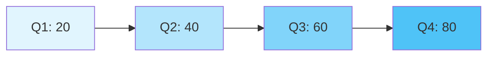

## Streudiagramm

Das Streudiagramm, auch Punktediagramm genannt, zeigt Beziehungen zwischen zwei Elementen auf Grundlage zweier verschiedener Variablen dar.

### Vorteile
- Visualisierung von Beziehungen zwischen zwei Variablen, was hilft, Korrelationen oder Muster zu erkennen.
- Identifikation von Ausreißern, da einzelne Punkte, die weit von der Mehrheit entfernt sind, leicht erkennbar sind.
- Flexibilität in der Darstellung, da sowohl quantitative als auch qualitative Daten in einem Streudiagramm abgebildet werden können.

### Nachteile
- Schwierigkeiten bei der Interpretation von großen Datenmengen, da die Punkte überlappen und die Übersichtlichkeit leiden kann.
- Keine klare Darstellung von Trends, es sei denn, eine Trendlinie wird hinzugefügt, was zusätzliche Interpretation erfordert.
- Begrenzte Aussagekraft, wenn die Daten nicht ausreichend variieren oder wenn keine signifikante Beziehung zwischen den Variablen besteht.

### Anwendungsfälle
- Wissenschaftliche Forschung: Untersuchung der Beziehung zwischen zwei Variablen, z. B. Temperatur und Pflanzenwachstum.
- Marktforschung: Analyse von Kundenverhalten, z. B. Zusammenhang zwischen Einkommen und Ausgaben für bestimmte Produkte.
- Qualitätskontrolle: Überwachung von Produktionsprozessen, um die Beziehung zwischen verschiedenen Produktionsparametern zu analysieren.

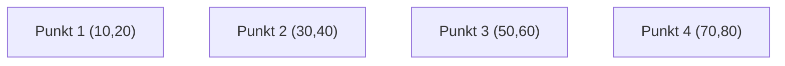
```

## Kreisdiagramm

Das Kreisdiagramm stellt Zahlen in Prozenten dar und zeigt Anteile innerhalb eines Ganzen.

### Vorteile
- Einfache Visualisierung von Anteilen, was hilft, die Verteilung von Kategorien innerhalb eines Ganzen schnell zu erfassen.
- Intuitive Darstellung, die es ermöglicht, die relativen Größen der Teile zueinander leicht zu vergleichen.
- Ansprechend und übersichtlich, was es ideal für Präsentationen und Berichte macht, um wichtige Informationen hervorzuheben.

### Nachteile
- Schwierigkeiten bei der genauen Interpretation von Werten, insbesondere wenn die Unterschiede zwischen den Segmenten gering sind.
- Begrenzte Anzahl an Kategorien, da zu viele Segmente das Diagramm unübersichtlich machen und die Lesbarkeit beeinträchtigen können.
- Nicht geeignet für zeitliche Entwicklungen, da es keine Informationen über Veränderungen im Zeitverlauf liefert.

### Anwendungsfälle
- Marktforschung: Darstellung der Marktanteile verschiedener Unternehmen oder Produkte innerhalb eines Sektors.
- Umfragen: Visualisierung der Verteilung von Antworten auf eine Frage, z. B. die Präferenzen der Konsumenten.
- Budgetverteilung: Darstellung der Aufteilung eines Budgets auf verschiedene Ausgabenposten, um die Verteilung der Mittel zu verdeutlichen.


## Piktogramm

Das Piktogramm verwendet Bilder und Symbole zur Darstellung von Daten und stellt quantitative Informationen visuell dar.

### Vorteile
- Visuelle Anschaulichkeit, die es ermöglicht, Informationen schnell und intuitiv zu erfassen, da Bilder oft leichter verständlich sind als Text.
- Ansprechende Gestaltung, die das Interesse der Betrachter weckt und die Aufmerksamkeit auf wichtige Daten lenkt.
- Einfache Darstellung von quantitativen Informationen, indem Symbole verwendet werden, um Mengen oder Anteile darzustellen, was die Interpretation erleichtert.

### Nachteile
- Begrenzte Detailtiefe, da Piktogramme oft nur eine vereinfachte Darstellung von Daten bieten und keine genauen Werte anzeigen.
- Missverständnisse durch unterschiedliche Interpretationen, da Symbole je nach kulturellem Kontext unterschiedlich verstanden werden können.
- Schwierigkeiten bei der Darstellung komplexer Daten, da Piktogramme nicht immer geeignet sind, um komplexe Zusammenhänge oder Trends darzustellen.

### Anwendungsfälle
- Umfragen und Statistiken: Visualisierung von Umfrageergebnissen, z. B. die Verteilung von Meinungen oder Präferenzen in einer Bevölkerung.
- Bildungsbereich: Verwendung in Lehrmaterialien, um Konzepte oder Daten anschaulich zu erklären, z. B. in Infografiken.
- Marketing und Werbung: Einsatz in Werbematerialien, um Produkteigenschaften oder Vorteile schnell und ansprechend zu kommunizieren.

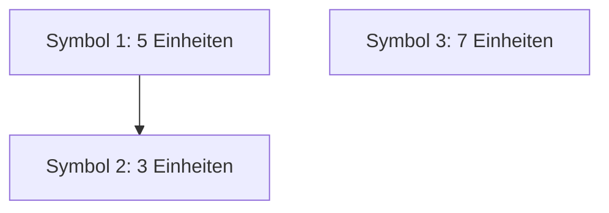

## Säulendiagramm

Das Säulendiagramm eignet sich zur Darstellung chronologischer Daten und visualisiert Datensätze vertikal.

### Vorteile
- Einfache Lesbarkeit, was es ideal für die Präsentation von Daten an ein breites Publikum macht.
- Klare Vergleichbarkeit zwischen verschiedenen Kategorien oder Gruppen, da die Höhen der Säulen visuell die Unterschiede darstellen.
- Flexibilität in der Darstellung, da es sowohl für qualitative als auch quantitative Daten verwendet werden kann und in verschiedenen Formaten (horizontal oder vertikal) darstellbar ist.

### Nachteile
- Platzbedarf, da bei vielen Kategorien das Diagramm unübersichtlich werden und viel Platz einnehmen kann.
- Verzerrung durch Skalen, wenn die Skala nicht richtig gewählt ist, können Säulendiagramme die Daten verzerrt darstellen und falsche Eindrücke vermitteln.
- Begrenzte Detailtiefe, da es keine Trends über die Zeit oder komplexe Beziehungen zwischen Variablen zeigt.

### Anwendungsfälle
- Marktforschung: Vergleich von Marktanteilen verschiedener Unternehmen oder Produkte in einem bestimmten Sektor.
- Umfragen: Darstellung der Ergebnisse von Umfragen, z. B. die Präferenzen von Konsumenten zu verschiedenen Produkten oder Dienstleistungen.
- Finanzberichte: Visualisierung von Einnahmen, Ausgaben oder anderen finanziellen Kennzahlen über verschiedene Zeiträume oder Abteilungen hinweg.

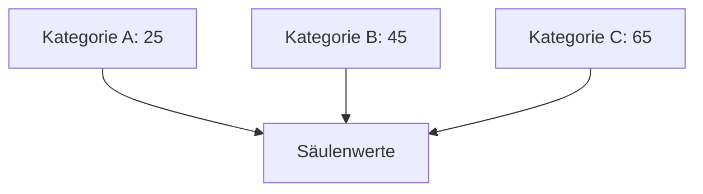
```

## Blasendiagramm

Das Blasendiagramm ähnelt dem Streudiagramm, stellt jedoch durch Punktgröße und Farbe zwei weitere Variablen dar.

### Vorteile
- Visualisierung von mehreren Dimensionen, da die Position der Blasen auf der X- und Y-Achse sowie die Größe der Blasen zusätzliche Informationen darstellen.
- Identifikation von Mustern und Trends, da die Verteilung der Blasen auf dem Diagramm Korrelationen zwischen Variablen aufzeigen kann.
- Einfache Darstellung von Datenpunkten, die eine große Menge an Informationen in einem kompakten Format präsentieren.

### Nachteile
- Schwierigkeiten bei der Interpretation, insbesondere wenn viele Blasen überlappen oder wenn die Größe der Blasen nicht intuitiv wahrgenommen wird.
- Begrenzte Lesbarkeit, wenn zu viele Datenpunkte dargestellt werden, was zu Verwirrung führen kann.
- Nicht ideal für kleine Datenmengen, da die Vorteile der Blasendarstellung bei wenigen Punkten nicht zur Geltung kommen.

### Anwendungsfälle
- Marktforschung: Analyse von Produkten oder Dienstleistungen, wobei Preis (X-Achse), Kundenzufriedenheit (Y-Achse) und Marktanteil (Größe der Blase) dargestellt werden.
- Wirtschaftsanalyse: Visualisierung von Unternehmensdaten, z. B. Umsatz (X-Achse), Gewinn (Y-Achse) und Mitarbeiterzahl (Größe der Blase).
- Umweltstudien: Darstellung von Daten zu Emissionen, wobei die X-Achse CO2-Ausstoß, die Y-Achse Luftqualität und die Blasengröße die Bevölkerung eines Gebiets repräsentiert.

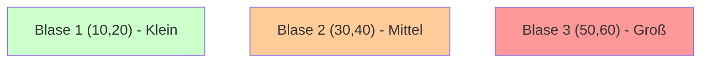

## Pegelkarte

Die Pegelkarte, auch Gauge-Diagramm genannt, zeigt, wo Datenwerte auf einer bestimmten Skala liegen.

### Vorteile
- Einfache Visualisierung von Leistungskennzahlen, die es ermöglicht, den aktuellen Status auf einen Blick zu erfassen, z. B. Fortschritt oder Zielerreichung.
- Intuitive Darstellung, die es den Betrachtern erleichtert, den aktuellen Stand im Verhältnis zu einem definierten Ziel oder Bereich zu verstehen.
- Schnelle Identifikation von Problemen, da Abweichungen von den Zielwerten sofort sichtbar sind.

### Nachteile
- Begrenzte Detailtiefe, da sie oft nur einen einzelnen Wert darstellen und keine umfassenden Informationen über Trends oder historische Daten bieten.
- Subjektive Interpretation, da die Farbcodierung (z. B. rot, gelb, grün) unterschiedlich interpretiert werden kann und nicht immer objektiv ist.
- Nicht geeignet für komplexe Datenanalysen, da sie keine Beziehungen zwischen mehreren Variablen darstellen können.

### Anwendungsfälle
- Geschäftsberichte: Darstellung von [KPIs](/open-fidup/lerninhalte/kpi), wie Umsatz, Gewinn oder Kundenzufriedenheit, um den aktuellen Stand zu visualisieren.
- Projektmanagement: Überwachung des Fortschritts von Projekten, z. B. den Abschlussgrad im Vergleich zu den geplanten Meilensteinen.
- Gesundheitsüberwachung: Visualisierung von Vitalzeichen oder anderen Gesundheitskennzahlen, um den aktuellen Gesundheitszustand schnell zu erfassen.

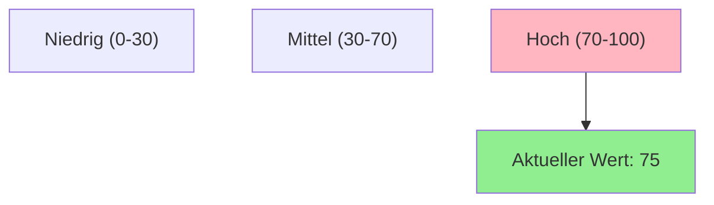

## Gestapeltes Venn

Das gestapelte Venn-Diagramm stellt überschneidende Beziehungen zwischen mehreren Datensätzen dar.

### Vorteile
- Visualisierung von Überschneidungen, die es ermöglicht, die Beziehungen zwischen mehreren Gruppen oder Kategorien klar darzustellen.
- Einfache Darstellung von Mehrfachzugehörigkeiten, da die Bereiche, in denen sich die Kreise überschneiden, die gemeinsamen Elemente zwischen den Gruppen zeigen.
- Intuitive Interpretation, die es den Betrachtern erleichtert, die Verteilung und die Beziehungen zwischen den verschiedenen Gruppen zu verstehen.

### Nachteile
- Komplexität bei vielen Gruppen, da die Darstellung unübersichtlich werden kann, wenn zu viele Kreise oder Überschneidungen vorhanden sind.
- Begrenzte Detailtiefe, da sie oft keine quantitativen Informationen über die Größe der Gruppen oder die Anzahl der Elemente in den Überschneidungen bieten.
- Schwierigkeiten bei der genauen Interpretation, insbesondere wenn die Kreise sehr nah beieinander liegen oder sich stark überschneiden.

### Anwendungsfälle
- Marktforschung: Analyse von Zielgruppen, um zu verstehen, wie verschiedene Kundensegmente miteinander interagieren oder sich überschneiden.
- Wissenschaftliche Studien: Untersuchung von Gemeinsamkeiten und Unterschieden zwischen verschiedenen Arten oder Populationen in der Biologie oder Ökologie.
- Datenanalyse: Visualisierung von Daten, um die Beziehungen zwischen verschiedenen Variablen oder Kategorien zu verdeutlichen, z. B. in der Soziologie oder Psychologie.

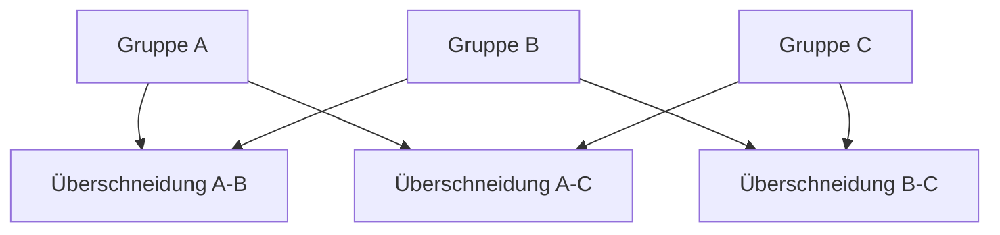

## Mosaik-Plot

Der Mosaik-Plot visualisiert Verhältnisse zwischen mehreren kategorialen Variablen in einer kompakten und vergleichbaren Form.

### Vorteile
- Visualisierung von komplexen Datenbeziehungen, die es ermöglicht, die Verteilung und die Beziehungen zwischen mehreren Kategorien auf einen Blick zu erfassen.
- Einfache Darstellung von Anteilen, da die Größe der Mosaikfelder die relative Häufigkeit oder den Anteil der jeweiligen Kategorie darstellt.
- Intuitive Interpretation, die es den Betrachtern erleichtert, Muster und Trends in den Daten zu erkennen, insbesondere bei großen Datensätzen.

### Nachteile
- Schwierigkeiten bei der genauen Quantifizierung, da die genauen Werte oft nicht direkt aus der Darstellung abgelesen werden können.
- Überladung mit Informationen, wenn zu viele Kategorien oder Unterkategorien dargestellt werden, was die Lesbarkeit und das Verständnis beeinträchtigen kann.
- Begrenzte Detailtiefe, da sie keine zeitlichen Entwicklungen oder komplexen Beziehungen zwischen Variablen darstellen können.

### Anwendungsfälle
- Marktforschung: Analyse von Kundenpräferenzen, um die Verteilung von Kaufentscheidungen über verschiedene Produktkategorien darzustellen.
- Sozialwissenschaftliche Studien: Untersuchung von demografischen Daten, um die Verteilung von Merkmalen wie Geschlecht, Alter oder Einkommen in einer Population zu visualisieren.
- Gesundheitsforschung: Darstellung von Krankheitsverteilungen oder Risikofaktoren in verschiedenen Bevölkerungsgruppen, um Muster und Zusammenhänge zu erkennen.

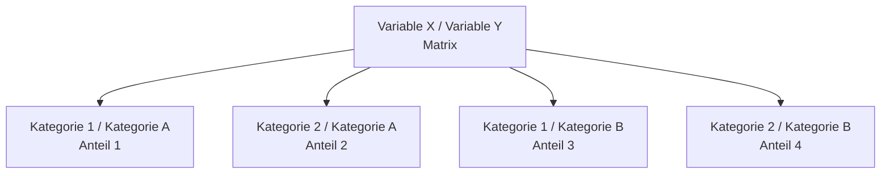

## Gantt-Diagramm

Das Gantt-Diagramm veranschaulicht einen Projektplan, wobei auf einer Achse Aufgaben und auf der anderen Zeitachse dargestellt werden.

### Vorteile
- Einfache Visualisierung von Projektzeitplänen, die es ermöglicht, den Fortschritt und die Dauer von Aufgaben auf einen Blick zu erfassen.
- Klare Darstellung von Abhängigkeiten, da die Beziehungen zwischen verschiedenen Aufgaben und deren zeitliche Abfolge deutlich gemacht werden.
- Hilfreich für die Ressourcenplanung, da es zeigt, welche Ressourcen zu welchem Zeitpunkt benötigt werden und wie sie auf verschiedene Aufgaben verteilt sind.

### Nachteile
- Komplexität bei großen Projekten, da Gantt-Diagramme unübersichtlich werden können, wenn viele Aufgaben und Abhängigkeiten dargestellt werden.
- Begrenzte Detailtiefe, da sie oft keine Informationen über die Qualität oder den Status der Aufgaben bieten, sondern sich nur auf die Zeitachse konzentrieren.
- Schwierigkeiten bei der Anpassung, da Änderungen im Zeitplan oft eine Neugestaltung des gesamten Diagramms erfordern können.

### Anwendungsfälle
- Projektmanagement: Planung und Überwachung von Projekten in verschiedenen Branchen, um den Fortschritt und die Einhaltung von Fristen zu verfolgen.
- Bauprojekte: Darstellung der verschiedenen Phasen und Aufgaben im Bauprozess, um sicherzustellen, dass alle Schritte rechtzeitig abgeschlossen werden.
- Softwareentwicklung: Visualisierung von Entwicklungszyklen, um die Planung von Aufgaben zu unterstützen.

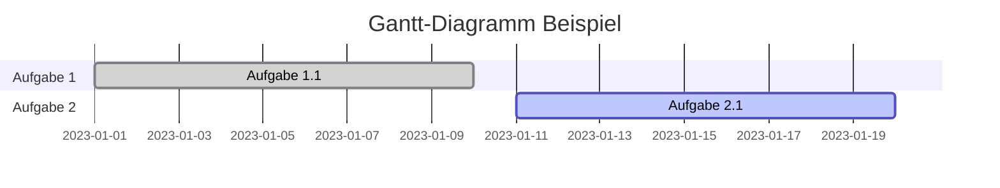

## Radarkarte

Die Radarkarte, auch als Spinnen- oder Netzdiagramm bekannt, verwendet mehrere verschiedene quantitative Achsen, um mehrere Variablen darzustellen.

### Vorteile
- Visualisierung mehrdimensionaler Daten, die es ermöglicht, mehrere Variablen gleichzeitig darzustellen und deren Beziehungen zueinander zu erkennen.
- Einfache Identifikation von Stärken und Schwächen, da die Form und Größe des Diagramms aufzeigt, in welchen Bereichen eine Leistung über oder unter dem Durchschnitt liegt.
- Intuitive Darstellung, die es den Betrachtern erleichtert, komplexe Informationen auf einen Blick zu erfassen und zu vergleichen.

### Nachteile
- Schwierigkeiten bei der genauen Quantifizierung, da die Werte oft schwer abzulesen sind und die Interpretation subjektiv sein kann.
- Begrenzte Anzahl an Variablen, da zu viele Achsen das Diagramm unübersichtlich machen und die Lesbarkeit beeinträchtigen können.
- Nicht ideal für zeitliche Entwicklungen, da Radarkarten keine Informationen über Veränderungen im Zeitverlauf liefern.

### Anwendungsfälle
- Leistungsbewertung: Vergleich von Produkten oder Dienstleistungen anhand mehrerer Kriterien, z. B. in der Marktforschung oder Produktentwicklung.
- Mitarbeiterbewertung: Visualisierung der Kompetenzen und Fähigkeiten von Mitarbeitern in verschiedenen Bereichen, um Stärken und Entwicklungsfelder zu identifizieren.
- Sportanalysen: Vergleich der Leistungen von Athleten oder Teams in verschiedenen Disziplinen oder Statistiken, um deren Gesamtleistung zu bewerten.

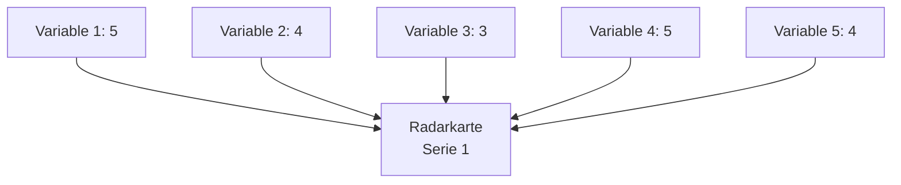

## Wasserfall-Diagramm

Das Wasserfall-Diagramm zeigt, wie ein Ausgangswert durch eine Reihe von Zwischenwerten erhöht und verringert wird.

### Vorteile
- Einfache Visualisierung von Veränderungen, die es ermöglicht, den Einfluss einzelner Faktoren auf einen Gesamtwert über einen bestimmten Zeitraum oder Prozess darzustellen.
- Klare Darstellung von positiven und negativen Werten, da die unterschiedlichen Farben (z. B. grün für Gewinne und rot für Verluste) sofort ins Auge fallen und die Entwicklung nachvollziehbar machen.
- Hilfreich für die Analyse von Finanzdaten, da es die Entwicklung von Einnahmen, Ausgaben und Gewinnen in einem übersichtlichen Format zeigt.

### Nachteile
- Begrenzte Detailtiefe, da es oft keine genauen Werte anzeigen, sondern nur die Veränderungen zwischen den einzelnen Schritten darstellen.
- Schwierigkeiten bei der Interpretation, wenn zu viele Datenpunkte oder Kategorien dargestellt werden, was die Übersichtlichkeit beeinträchtigen kann.
- Nicht ideal für zeitliche Entwicklungen, da es sich eher auf die Veränderung von Werten als auf deren Verlauf über die Zeit konzentriert.

### Anwendungsfälle
- Finanzberichte: Darstellung von Umsatz- und Gewinnentwicklungen, um die Auswirkungen von Kosten und Einnahmen auf den Gesamtgewinn zu visualisieren.
- Projektmanagement: Analyse von Budgetveränderungen im Verlauf eines Projekts, um die Auswirkungen von Ausgaben und Einsparungen zu verdeutlichen.
- Verkaufsanalysen: Visualisierung von Verkaufszahlen, um die Auswirkungen von Marketingmaßnahmen oder saisonalen Schwankungen auf den Gesamtumsatz zu zeigen.

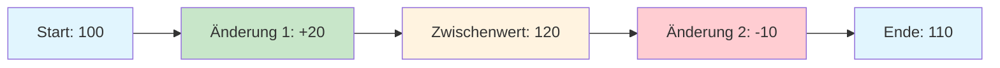

## Wärmekarte

Die Wärmekarte macht Muster, Varianz und Cluster sichtbar, indem sie Datenintensität durch Farben darstellt.

### Vorteile
- Einfache Visualisierung von Datenintensität, die es ermöglicht, Muster und Trends in großen Datensätzen schnell zu erkennen, indem Farben verwendet werden, um Werte darzustellen.
- Intuitive Darstellung, die es den Betrachtern erleichtert, Bereiche mit hoher oder niedriger Aktivität auf einen Blick zu identifizieren.
- Flexibilität in der Anwendung, da Wärmekarten in verschiedenen Bereichen eingesetzt werden können, z. B. in der Webanalyse, Marktforschung oder Gesundheitsforschung.

### Nachteile
- Schwierigkeiten bei der genauen Quantifizierung, da die genauen Werte oft nicht direkt aus der Darstellung abgelesen werden können und die Interpretation subjektiv sein kann.
- Überladung mit Informationen, wenn zu viele Datenpunkte oder Kategorien dargestellt werden, was die Lesbarkeit und das Verständnis beeinträchtigen kann.
- Begrenzte Detailtiefe, da sie oft keine Informationen über die Ursachen von Mustern oder Trends liefern, sondern lediglich die Intensität darstellen.

### Anwendungsfälle
- Web-Analytics: Analyse von Nutzerverhalten auf Webseiten, um zu sehen, welche Bereiche am häufigsten besucht oder angeklickt werden.
- Marktforschung: Visualisierung von Kundenpräferenzen oder Kaufverhalten in verschiedenen Regionen oder demografischen Gruppen.
- Gesundheitsforschung: Darstellung von Krankheitsverteilungen oder Risikofaktoren in verschiedenen Bevölkerungsgruppen, um Muster und Zusammenhänge zu erkennen.

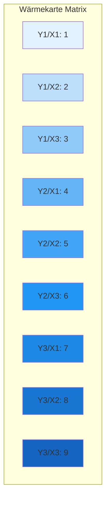

## Trichterdiagramm

Das Trichterdiagramm zeigt den Fluss von Nutzern durch einen Konversionsprozess.

### Vorteile
- Einfache Visualisierung von Prozessen, die es ermöglicht, den Fortschritt durch verschiedene Phasen eines Prozesses, wie z. B. Verkaufs- oder Marketingtrichter, klar darzustellen.
- Identifikation von Engpässen, da es sofort sichtbar macht, wo in einem Prozess die meisten Verluste oder Abbrüche auftreten.
- Intuitive Darstellung, die es den Betrachtern erleichtert, die Abnahme der Anzahl von Elementen (z. B. Leads, Kunden) von einer Phase zur nächsten zu verstehen.

### Nachteile
- Begrenzte Detailtiefe, da es oft keine genauen Werte anzeigen, sondern nur die relative Größe der einzelnen Phasen darstellen.
- Schwierigkeiten bei der Interpretation, wenn die Phasen nicht klar definiert sind oder wenn es viele Zwischenstufen gibt, was die Übersichtlichkeit beeinträchtigen kann.
- Nicht ideal für komplexe Prozesse, da es sich eher auf die Darstellung von linearen Abläufen konzentriert und weniger für nicht-lineare Prozesse geeignet ist.

### Anwendungsfälle
- Vertrieb und Marketing: Analyse des Verkaufsprozesses, um zu sehen, wie viele Leads in zahlende Kunden umgewandelt werden.
- Kundenakquise: Visualisierung der Schritte, die ein potenzieller Kunde durchläuft, von der ersten Kontaktaufnahme bis zum Kauf.
- Projektmanagement: Darstellung von Phasen in einem Projekt, um den Fortschritt und die Anzahl der abgeschlossenen Aufgaben in jeder Phase zu verfolgen.

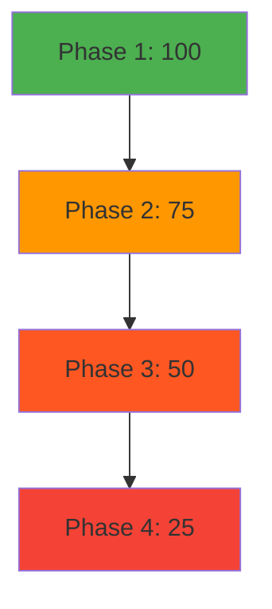

## Pareto-Diagramm

Das Pareto-Diagramm enthält sowohl Balken als auch ein Liniendiagramm, wobei Balken Einzelwerte darstellen und die Linie die kumulierte Summe angibt.

### Vorteile
- Einfache Identifikation von Hauptursachen, da es die wichtigsten Faktoren oder Probleme hervorhebt, die den größten Einfluss auf ein Ergebnis haben, basierend auf dem Pareto-Prinzip (80/20-Regel).
- Kombination von Balken- und Liniendiagramm, die es ermöglicht, sowohl die absoluten Werte als auch den kumulierten Prozentsatz der Gesamtwirkung darzustellen.
- Hilfreich für Priorisierungen, da es Entscheidungsträgern hilft, sich auf die kritischsten Bereiche zu konzentrieren, die verbessert werden müssen.

### Nachteile
- Begrenzte Detailtiefe, da es oft nur die wichtigsten Kategorien darstellt und weniger relevante Faktoren ignoriert werden können.
- Schwierigkeiten bei der Interpretation, wenn die Daten nicht klar kategorisiert sind oder wenn es viele kleine Kategorien gibt, die das Diagramm überladen.
- Nicht ideal für alle Datentypen, da es sich am besten für qualitative Daten eignet und weniger für quantitative Analysen.

### Anwendungsfälle
- Qualitätsmanagement: Analyse von Fehlerursachen in einem Produktionsprozess, um die häufigsten Probleme zu identifizieren und zu beheben.
- Kundenfeedback: Auswertung von Kundenbeschwerden oder -anfragen, um die häufigsten Anliegen zu erkennen und priorisieren zu können.
- Kostenanalyse: Identifikation der Hauptkostenfaktoren in einem Unternehmen, um gezielte Einsparungsmaßnahmen zu entwickeln.

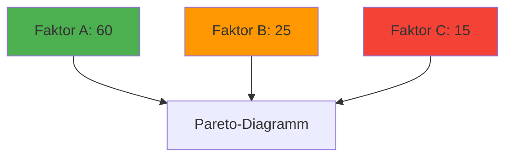
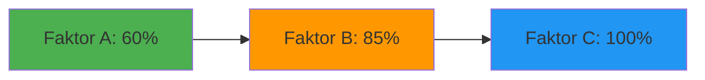

## Gestapeltes Balkendiagramm

Das gestapelte Balkendiagramm stellt verschiedene Kategorien von Daten in einem einzelnen Balken übereinandergestapelt dar, um die Verteilung und den Vergleich von Teilmengen innerhalb einer Gesamtmenge zu zeigen.

### Vorteile
- Visualisierung von Teil-Ganzes-Beziehungen, da es ermöglicht, sowohl die Gesamtwerte als auch die Anteile der einzelnen Kategorien auf einen Blick zu erfassen.
- Vergleich von Kategorien, da mehrere Gruppen in einem Diagramm dargestellt werden können, was den direkten Vergleich zwischen verschiedenen Datensätzen erleichtert.
- Einfache Identifikation von Trends, da Veränderungen in den einzelnen Kategorien über verschiedene Zeiträume oder Bedingungen hinweg leicht erkennbar sind.

### Nachteile
- Schwierigkeiten bei der genauen Ablesung, da die einzelnen Segmente in großen oder komplexen Diagrammen schwer zu unterscheiden sein können.
- Begrenzte Anzahl an Kategorien, da zu viele gestapelte Segmente das Diagramm überladen und die Lesbarkeit beeinträchtigen können.
- Verlust von Detailinformationen, da die genauen Werte der einzelnen Kategorien oft nicht direkt ablesbar sind und zusätzliche Daten benötigt werden, um die genauen Zahlen zu verstehen.

### Anwendungsfälle
- Verkaufsanalyse: Darstellung der Verkaufszahlen verschiedener Produkte innerhalb einer Kategorie über mehrere Zeiträume, um Trends und Veränderungen zu erkennen.
- Budgetverteilung: Visualisierung der Ausgaben in verschiedenen Abteilungen eines Unternehmens, um die Verteilung der finanziellen Mittel zu analysieren.
- Marktforschung: Vergleich der Marktanteile verschiedener Unternehmen in einer Branche, um die Wettbewerbslandschaft zu verstehen.

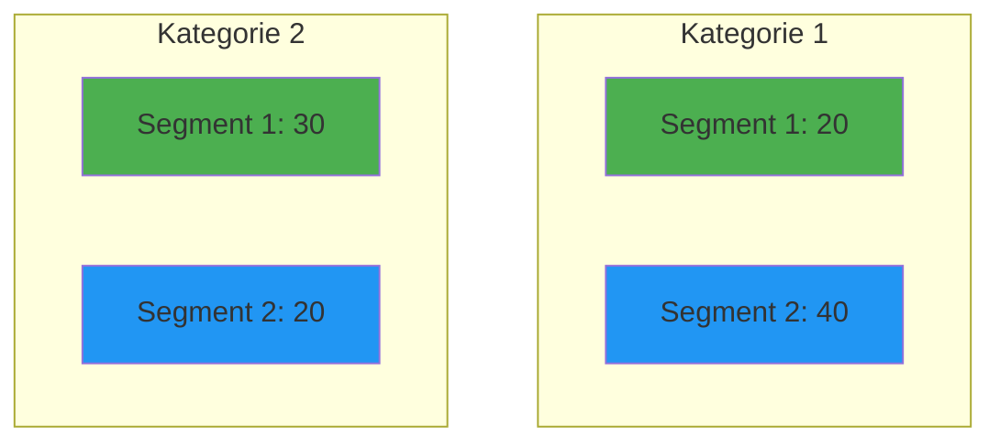

## Flussdiagramm

Das Flussdiagramm ist eine Darstellung eines Prozesses oder Workflows, die aus verschiedenen Symbolen und Pfeilen besteht, um die Schritte und deren Reihenfolge zu zeigen. Es hilft, komplexe Prozesse zu visualisieren, zu analysieren und zu optimieren.

### Vorteile
- Einfache Visualisierung von Prozessen, die es ermöglicht, komplexe Abläufe klar und verständlich darzustellen.
- Identifikation von Engpässen und Ineffizienzen, da der gesamte Prozess auf einen Blick betrachtet werden kann, was die Optimierung erleichtert.
- Förderung der Kommunikation, da Flussdiagramme als gemeinsames Verständnis für Teammitglieder dienen und Missverständnisse reduzieren.

### Nachteile
- Überladung von Informationen, wenn zu viele Schritte oder Entscheidungen dargestellt werden, was die Lesbarkeit und Verständlichkeit beeinträchtigen kann.
- Begrenzte Flexibilität, da Änderungen im Prozess oft eine vollständige Überarbeitung des Diagramms erfordern können.
- Subjektive Interpretation, da unterschiedliche Personen den gleichen Prozess unterschiedlich darstellen können, was zu Inkonsistenzen führen kann.

### Anwendungsfälle
- Softwareentwicklung: Visualisierung von Algorithmen oder Programmabläufen, um die Logik und Struktur des Codes zu verdeutlichen.
- Prozessoptimierung: Analyse von Geschäftsprozessen, um Verbesserungspotenziale zu identifizieren und die Effizienz zu steigern.
- Schulung und Einarbeitung: Verwendung in Schulungsunterlagen, um neuen Mitarbeitern die Abläufe und Verfahren im Unternehmen verständlich zu machen.

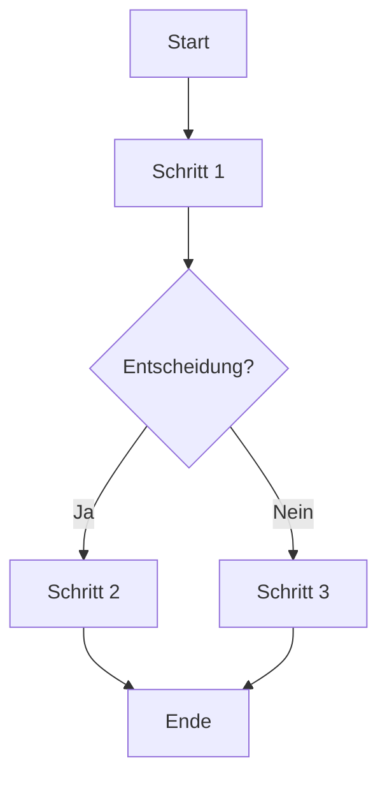

## Boxplot

Der Boxplot ist eine grafische Darstellung der Verteilung von Datenpunkten durch fünf Kennzahlen: Minimum, erstes Quartil, Median, drittes Quartil und Maximum. Er hilft bei der Identifikation von Ausreißern und der Visualisierung der Verteilung und Streuung von Daten in verschiedenen Gruppen.

### Vorteile
- Klarheit der Datenverteilung, da Box-Plots eine kompakte Übersicht über zentrale Tendenzen und Streuungen bieten.
- Identifikation von Ausreißern, da extreme Werte außerhalb der Box und Whisker deutlich sichtbar sind.
- Vergleich zwischen Gruppen, da mehrere Box-Plots nebeneinander dargestellt werden können, um Unterschiede in der Verteilung zu analysieren.

### Nachteile
- Verlust von Detailinformationen, da individuelle Datenpunkte nicht angezeigt werden, was die Interpretation erschweren kann.
- Schwierigkeiten bei der Interpretation, wenn die Datenverteilung stark asymmetrisch ist oder mehrere Gruppen verglichen werden.
- Begrenzte Aussagekraft bei kleinen Stichproben, da die Box-Plot-Darstellung bei wenigen Datenpunkten weniger aussagekräftig ist.

### Anwendungsfälle
- Statistische Analyse: Vergleich von Testergebnissen oder Messwerten in verschiedenen Gruppen, um Unterschiede in der Leistung zu erkennen.
- Qualitätskontrolle: Überwachung von Produktionsdaten, um die Konsistenz und Stabilität von Prozessen zu bewerten.
- Forschung: Visualisierung von Umfragedaten oder experimentellen Ergebnissen, um die Verteilung und Variabilität der Antworten zu analysieren.

```mermaid
graph TD
    subgraph "Boxplot Vergleich"
        subgraph "Gruppe 1"
            A1["Min: 10"]
            A2["Q1: 20"]
            A3["Median: 30"]
            A4["Q3: 40"] 
            A5["Max: 50"]
        end
        subgraph "Gruppe 2"
            B1["Min: 15"]
            B2["Q1: 25"]
            B3["Median: 35"]
            B4["Q3: 45"]
            B5["Max: 55"]
        end
    end
```

## Quellen

> https://piktochart.com/de/blog/diagramm-arten/