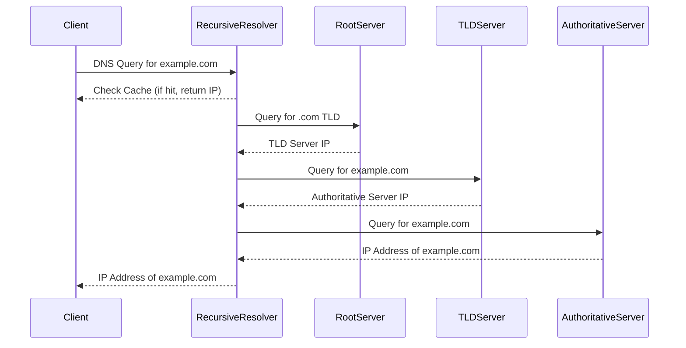

Das Domain Name System (DNS) ist ein zentrales Element des Internets, das die Umwandlung von Domainnamen in [IP-Adressen](/open-fidup/lerninhalte/ip) ermöglicht. Es fungiert als eine Art Telefonbuch für das Internet, indem es Benutzern erlaubt, Webseiten über leicht merkbare Namen anstelle von numerischen IP-Adressen zu erreichen.

## Hauptmerkmale

DNS weist eine hierarchische Struktur auf, die aus Root-DNS-Servern, Top-Level-Domains (TLDs) und Subdomains besteht. Die Daten sind über viele Server verteilt, was die Zuverlässigkeit und Verfügbarkeit erhöht.

## Anwendungsgebiete

DNS findet Anwendung in verschiedenen Bereichen:

- Umwandlung von Domainnamen in IP-Adressen für den Zugriff auf Webseiten.
- Verwendung von MX-Einträgen zur Bestimmung von E-Mail-Servern für das E-Mail-Routing.
- Nutzung von CNAME-Einträgen zur Verteilung des Datenverkehrs und Lastverteilung.

## Struktur des DNS

### DNS-Server-Typen

DNS-Server lassen sich in zwei Haupttypen unterteilen:

- Authoritative DNS-Server: Sie beherbergen die tatsächlichen DNS-Daten für eine Domain.
- Recursive DNS-Server: Sie leiten Anfragen an die entsprechenden autoritativen Server weiter.

### DNS-Einträge

Verschiedene Eintragstypen ermöglichen die Zuordnung von Domainnamen zu spezifischen Ressourcen:

- A-Eintrag: Verknüpft einen Domainnamen mit einer IPv4-Adresse.
- AAAA-Eintrag: Verknüpft einen Domainnamen mit einer IPv6-Adresse.
- CNAME-Eintrag: Dient als Alias für einen anderen Domainnamen.
- MX-Eintrag: Bestimmt den Mailserver für eine Domain.

Ein Beispiel für DNS-Einträge zeigt die praktische Anwendung:

```
example.com.    IN  A       192.0.2.1
www.example.com. IN  CNAME   example.com.
example.com.    IN  MX      10 mail.example.com.
```

## DNS-Auflösungsprozess

Der DNS-Auflösungsprozess beschreibt, wie eine Domain in eine IP-Adresse umgewandelt wird. Nachfolgend ist ein Sequenzdiagramm dargestellt:



## Vorteile und Herausforderungen

### Vorteile

DNS bietet mehrere Vorteile:

- Benutzerfreundlichkeit durch die Verwendung einprägsamer Domainnamen.
- Skalierbarkeit, die eine große Anzahl von Domains und Subdomains unterstützt.
- Redundanz durch die verteilte Struktur, die die Verfügbarkeit erhöht.

### Herausforderungen

Trotz seiner Stärken bringt DNS Herausforderungen mit sich:

- Sicherheitsrisiken, darunter Anfälligkeit für DNS-Spoofing und DDoS-Angriffe.
- Komplexität bei der Verwaltung, insbesondere für große Organisationen.
- Caching-Probleme, die Änderungen an DNS-Einträgen verzögern können.

## Best Practices

Zur Optimierung des DNS-Betriebs werden folgende Maßnahmen empfohlen:

- Regelmäßige Überprüfung: Führen Sie Audits Ihrer DNS-Einträge durch, um Aktualität sicherzustellen.
- Sicherheitsmaßnahmen: Implementieren Sie DNSSEC (Domain Name System Security Extensions) zur Erhöhung der Sicherheit.
- Monitoring: Nutzen Sie Monitoring-Tools, um die Verfügbarkeit und Leistung Ihrer DNS-Server zu überwachen.
- Backup: Erstellen Sie regelmäßige Backups Ihrer DNS-Konfigurationen.

## Quellen

AI Chat. (2024, September 19). Retrieved from https://duckduckgo.com/?q=DuckDuckGo+AI+Chat&ia=chat&duckai=1