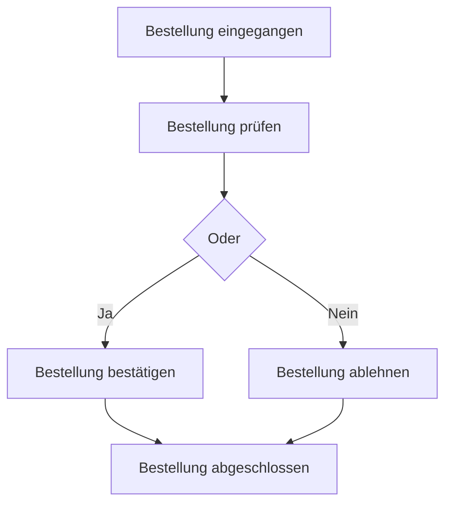

Die erweiterte Ereignisgesteuerte Prozesskette (eEPK) ist eine Methode zur Modellierung von [Geschäftsprozessen](/open-fidup/lerninhalte/geschaeftsprozess). Sie erweitert die Ereignisgesteuerte Prozesskette (EPK) um zusätzliche Elemente wie Organisationseinheiten, Daten und Anwendungssysteme. Die eEPK ermöglicht eine detaillierte Darstellung von Abläufen, Ressourcen und Verantwortlichkeiten in Prozessen.

## Regeln

1. Eine eEPK beginnt und endet mit einem Ereignis.
2. Ereignisse und Funktionen wechseln sich im Ablauf immer ab.
3. Sowohl Ereignisse als auch Funktionen haben jeweils nur einen Kontrollflußeingang und einen Kontrollflußausgang.
4. Ein Konnektor kann mehrere Kontrollflußeingänge und mehrere Kontrollflußausgänge haben.
5. Mehrere Teilabläufe werden durch die gleiche Art von Konnektor zusammengeführt, mit der sie aufgeteilt wurden.

## Elemente

Die Elemente der eEPK sind in der folgenden Tabelle dargestellt. Sie umfassen Symbole für Ereignisse, Funktionen, Konnektoren und weitere Komponenten, die den Prozessablauf und die Ressourcen beschreiben.

| Element | Beschreibung | Symbol (vereinfacht) |
|---------|-------------|----------------------|
| Ereignis | Start oder Ende eines Prozesses. Dient als Auslöser oder Ergebnis von Funktionen. | Rechteck mit abgerundeten Ecken |
| Funktion | Elementarer Arbeitsschritt. Transformiert Input zu Output. Wird durch ein Ereignis ausgelöst und hat ein Ereignis als Folge. | Rechteck |
| Oder-Konnektor / Operator | Teilt oder verbindet Abfolgen. Teilfolgen können alternativ oder alle durchlaufen werden. | Kreis mit "O" |
| XOR-Konnektor / Operator | Teilt oder verbindet Abfolgen. Teilfolgen können nur alternativ durchlaufen werden. | Kreis mit "X" |
| Und-Konnektor / Operator | Teilt oder verbindet Abfolgen. Alle Teilfolgen werden durchlaufen. | Kreis mit "∧" oder "&" |
| Kontrollfluss | Verbindet Ereignisse und Funktionen sowie Konnektoren. | Pfeil |
| Prozesswegweiser | Verweist auf einen kompletten Teilprozess, der separat modelliert ist. | Rechteck mit gestrichelter Linie |
| Organisationseinheit / Person | Beteiligte an einer Funktion. | Rechteck mit vertikaler Linie |
| Daten | Beschreibt, welche Daten von einer Funktion benötigt oder erzeugt werden. | Parallelogramm |
| Programm / Modul | Beschreibt, mit welchem Modul oder Programm die Funktion Daten transformiert. | Rechteck mit schräger Linie |
| Anwendungssystem | Beschreibt, mit welchem Anwendungssystem (mehreren Modulen oder Programmen) die Funktion Daten transformiert. | Rechteck mit doppelter Linie |

## Beispiele

Ein einfaches Beispiel für eine eEPK zeigt den Ablauf eines Bestellprozesses. Das Diagramm beginnt mit dem Ereignis "Bestellung eingegangen", gefolgt von der Funktion "Bestellung prüfen", die zu einem Oder-Konnektor führt, um alternative Pfade zu ermöglichen.

