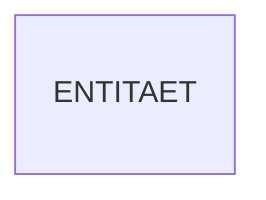
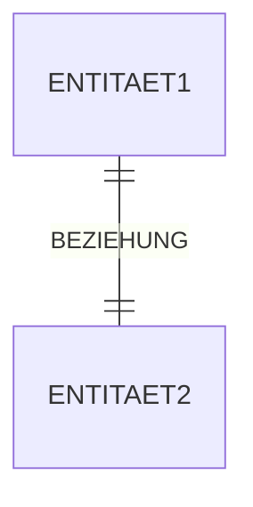
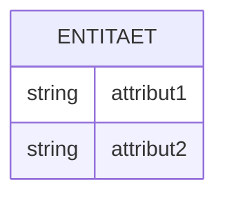
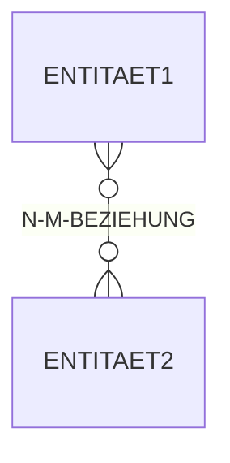

Das Entity-Relationship-Modell (ERM) ist ein konzeptionelles Werkzeug zur Darstellung von Datenstrukturen in der Datenbankentwicklung. Es findet Anwendung in der Konzeptionsphase für die Planung und in der Implementierungsphase für die Dokumentation. Das Modell umfasst drei Hauptelemente: Entitäten, Beziehungen und Attribute. Beziehungen zwischen Entitäten können verschiedene Kardinalitäten aufweisen, darunter 1:1, 1:n und n:m.

## Elemente

Das ERM basiert auf drei grundlegenden Elementen, die zur Abbildung realer Objekte und ihrer Verknüpfungen dienen.

- **Entität**: Eine Entität repräsentiert ein Objekt aus der realen Welt, über das Informationen gespeichert werden sollen.



- **Beziehung**: Eine Beziehung verbindet zwei oder mehr Entitäten miteinander.



- **Attribut**: Ein Attribut beschreibt eine Eigenschaft, aus der eine Entität zusammengesetzt ist.



## Beziehungen

Beziehungen im ERM definieren die Verknüpfungen zwischen Entitäten und können unterschiedliche Kardinalitäten haben. Diese bestimmen, wie viele Instanzen einer Entität mit Instanzen einer anderen Entität in Beziehung stehen können.

- **1:1**: Die Referenz kann auf einer beliebigen Seite der Beziehung stehen.

```mermaid
erDiagram
    ENTITAET1 ||--|| ENTITAET2 : 1-1-BEZIEHUNG
```

- **1:n**: Die n-Seite referenziert die 1-Seite.

```mermaid
erDiagram
    ENTITAET1 ||--o{ ENTITAET2 : 1-N-BEZIEHUNG
```

- **n:m**: Für diese Beziehung wird eine künstliche Tabelle eingeführt, um die Mehrfachverknüpfungen zu verwalten.

