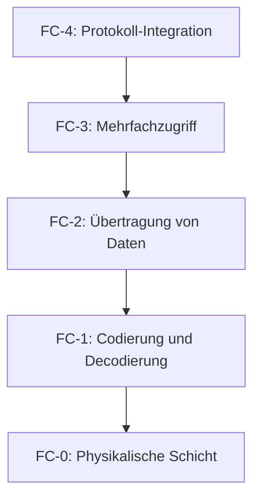

Fibre Channel ist ein Hochgeschwindigkeitsnetzwerkprotokoll, das primär zur Verbindung von Speichersystemen und Servern dient. Es bietet hohe Übertragungsraten bis zu 128 Gbit/s, geringe Latenzzeiten und unterstützt sowohl Block- als auch Datei-basierte Speicherprotokolle. Die Architektur basiert auf verschiedenen Topologien wie Punkt-zu-Punkt und Fabric sowie auf einem Schichtenmodell von FC-0 bis FC-4. Anwendungsgebiete umfassen Storage Area Networks und Datenzentren, wo es für Hochverfügbarkeitslösungen eingesetzt wird. Trotz Vorteilen wie hoher Bandbreite und Zuverlässigkeit bringt es Herausforderungen wie höhere Kosten und Komplexität mit sich.

## Definition

Fibre Channel (FC) ist ein Hochgeschwindigkeitsnetzwerkprotokoll, das hauptsächlich für die Verbindung von Speichersystemen und Servern verwendet wird.

## Hauptmerkmale

- Hohe Übertragungsraten bis zu 128 Gbit/s
- Geringe Latenzzeiten
- Unterstützt sowohl Block- als auch Datei-basierte Speicherprotokolle

## Architektur

Die Architektur von Fibre Channel umfasst verschiedene Topologien und Komponenten, die eine flexible und skalierbare Netzwerkstruktur ermöglichen.

### Topologien

Fibre Channel unterstützt mehrere Topologien, darunter Punkt-zu-Punkt, Fabric und Arbitrated Loop. Diese ermöglichen unterschiedliche Konfigurationen für verschiedene Anforderungen an Skalierbarkeit und Zuverlässigkeit. Weitere Details zu Netzwerktopologien finden sich in [Netzwerktopologie](/open-fidup/lerninhalte/netzwerktopologie).

### Komponenten

Zu den zentralen Komponenten gehören Host Bus Adapter (HBA), Switches und Speichersysteme. Diese arbeiten zusammen, um Daten effizient zu übertragen und das Netzwerk zu verwalten.

## Protokollschichten

Fibre Channel folgt einem Schichtenmodell, das die physikalische Übertragung bis zur Protokoll-Integration abdeckt. Dieses Modell ähnelt anderen Netzwerkprotokollen und ermöglicht eine modulare Struktur.

- **FC-0**: Physikalische Schicht, einschließlich Kabel und Stecker
- **FC-1**: Codierung und Decodierung der Daten
- **FC-2**: Übertragung von Daten durch Framing
- **FC-3**: Mehrfachzugriff, beispielsweise für Load Balancing
- **FC-4**: Protokoll-Integration, unterstützt Protokolle wie SCSI und IP

## Sicherheitsmerkmale

Fibre Channel bietet Sicherheitsfunktionen zur Segmentierung und Zugriffskontrolle. Dazu gehören Zonenbildung zur Netzwerksegmentierung sowie Authentifizierung und Zugriffskontrolle, um unbefugten Zugriff zu verhindern.

## Anwendungsgebiete

Fibre Channel findet Einsatz in verschiedenen Bereichen, insbesondere dort, wo hohe Leistung und Zuverlässigkeit erforderlich sind.

- Storage Area Network (SAN)
- Datenzentren
- Hochverfügbarkeitslösungen

## Vorteile

- Hohe Bandbreite und Zuverlässigkeit
- Unterstützung für lange Distanzen bis zu 10 km und mehr
- Geringe Störungen durch elektromagnetische Interferenzen

## Nachteile

- Höhere Kosten im Vergleich zu [Ethernet](/open-fidup/lerninhalte/ethernet)-basierten Lösungen
- Komplexität in der Einrichtung und Verwaltung

## Quellen

> DuckDuckGo. (2024, 18. September). _Konversation über das Fibre Channel Protokoll_. [https://duck.ai/](https://duck.ai/)