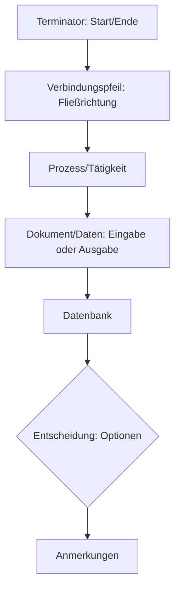

Ein Flussdiagramm ist eine grafische Darstellung, die einen Prozess oder Arbeitsablauf abbildet. Es dient der Dokumentation, Planung und Optimierung von Arbeitsprozessen, indem es Schritte, Entscheidungen und Verbindungen visuell strukturiert.

## Elemente

Ein Flussdiagramm besteht aus standardisierten Symbolen, die verschiedene Aspekte eines Prozesses repräsentieren. Diese Elemente ermöglichen eine klare und einheitliche Kommunikation.

- **Terminator**: Markiert den Start oder das Ende des Flussdiagramms.
- **Verbindungspfeil**: Verbindet Symbole und zeigt die Fließrichtung an.
- **Prozess/Tätigkeit**: Stellt eine auszuführende Aufgabe dar.
- **Dokument- und Datensymbol**: Zeigt benötigte Dokumente (Pfeil zeigt darauf) oder entstehende Dokumente (Pfeil führt davon weg) an.
- **Datenbank**: Repräsentiert Datenspeicher.
- **Entscheidung**: Bietet mindestens zwei Auswahloptionen.
- **Anmerkungen**: Ermöglichen zusätzliche Erläuterungen.

## Vorteile

Flussdiagramme bieten eine schnelle und einfache Möglichkeit, lineare Prozesse darzustellen. Sie geben einen Überblick über den Gesamtprozess und erleichtern die Identifizierung von Problemen sowie Verbesserungspotenzialen.

## Nachteile

Parallele Prozesse lassen sich in Flussdiagrammen schwer abbilden. Die Darstellung detaillierter, kleinschrittiger oder langer Prozesse ist problematisch. Komplexe Materialeinflüsse und Produktionsschritte sind ebenfalls schwer einzubauen.

## Quellen

> Flussdiagramm. (2023, December 21). Retrieved from https://studyflix.de/wirtschaft/flussdiagramm-7586