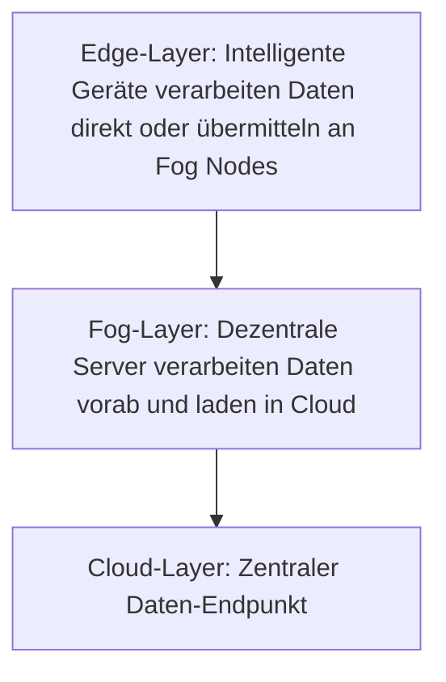

Fog-Computing bezeichnet eine Cloud-Technologie, bei der Endgeräte Daten zunächst in dezentralen Fog Nodes vorverarbeiten, bevor diese in die Cloud übertragen werden. Es umfasst drei Schichten: Edge, Fog und Cloud. Diese Architektur reduziert den Netzwerkverkehr und die Latenz, erfordert jedoch zusätzlichen Wartungsaufwand und höhere Hardwarekosten.

## Definition und Grundprinzip

Fog-Computing ist eine Erweiterung der [Cloud-Computing](/open-fidup/lerninhalte/cloud-computing)-Technologie. Endgeräte verarbeiten Daten vorab in Fog Nodes, die als dezentrale Minirechenzentren fungieren. Diese Nodes laden die vorverarbeiteten Daten bei Bedarf in die Cloud. Der Ansatz zielt darauf ab, Datenverarbeitung näher an den Quellen zu bringen, um Effizienz zu steigern.

## Schichtenmodell

Das Fog-Computing-Modell besteht aus drei Schichten:

1. **Edge-Layer**: Intelligente Geräte, sogenannte Edge-Devices, verarbeiten Daten direkt oder übermitteln sie an Fog Nodes.
2. **Fog-Layer**: Dezentrale, leistungsstarke Server nehmen Daten entgegen, verarbeiten sie vorab und laden sie bei Bedarf in die Cloud.
3. **Cloud-Layer**: Der zentrale Daten-Endpunkt, der die endgültige Speicherung und Verarbeitung übernimmt.

## Vorteile

- Weniger Netzwerk-Traffic zur Cloud, da Daten vorab verarbeitet werden.
- Geringe Latenz, da dezentrale Server näher an den Endgeräten platziert sein können.
- Verbesserte Datensicherheit, da die Vorverarbeitung lokal erfolgt und Daten anonymisiert werden können.

## Nachteile

- Steigender Wartungsbedarf durch die Verteilung von Verarbeitungs- und Speicherelementen.
- Höhere Hardware-Kosten aufgrund der lokalen Datenverarbeitung.
- Zusätzliche Anforderungen an die Netzwerksicherheit, da Daten an Fog Nodes abgegriffen werden können.

## Quellen

> Redaktion, I. (2024). Fog-Computing. IONOS Digital Guide. Retrieved from https://www.ionos.de/digitalguide/server/knowhow/fog-computing-definition-und-erklaerung/#content-was-ist-fog-computing-eine-definition