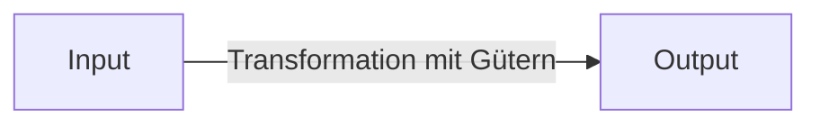

Ein Geschäftsprozess umfasst den Ablauf betrieblicher Funktionen, der zu einem vom Unternehmen gewünschten Ergebnis führt, beispielsweise in Form von Umsatz. Er wird durch ein definiertes Ereignis ausgelöst und transformiert Input durch den Einsatz materieller und immaterieller Güter zu Output. Zur Modellierung und Visualisierung solcher Prozesse werden standardisierte Notationen wie [BPMN](/open-fidup/lerninhalte/bpmn) und [eEPK](/open-fidup/lerninhalte/eepk) eingesetzt.

## Definition und Merkmale

- Ablauf von betrieblichen Funktionen, der zu einem gewünschten Ergebnis führt, etwa Umsatz.
- Auslösung durch ein definiertes Ereignis.
- Transformation von Input zu Output unter Einsatz materieller und immaterieller Güter.

## Bewertung von Risiken bei Änderungen

Bei Änderungen an Geschäftsprozessen erfolgt eine Bewertung der Risiken hinsichtlich Wahrscheinlichkeit und Auswirkungen.

### Wahrscheinlichkeit des Eintretens

Die Wahrscheinlichkeit, mit der ein Risiko eintritt, wird eingeschätzt. Methoden zur Ermittlung umfassen:

- Historische Datenanalyse
- Expertenmeinungen
- Risikoanalysen

### Auswirkungen auf das Unternehmen

Die Konsequenzen eines eintretenden Risikos werden bewertet. Mögliche Auswirkungen sind:

- Finanzielle Verluste
- Reputationsschäden
- Rechtliche Konsequenzen
- Störungen im operativen Geschäft

### Risikominderung und Kontrollmechanismen

Bestehende Maßnahmen zur Risikominderung werden analysiert. Wichtige Aspekte sind:

- Vorhandene Kontrollen und Strategien
- Effektivität der Risikominderungsmaßnahmen
- Anpassungsbedarf der bestehenden Prozesse

## Quellen

> Brell, C. (2021). Geschäftsprozess modellieren mit eEPK Geschäftsprozess. Bienen, Natur und Internet of Things. Retrieved from https://cbrell.de/blog/geschaeftsprozess-modellieren-mit-eepk