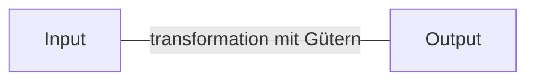

- **Ablauf** von betrieblichen **Funktionen**, der zu einem vom Unternehmen gewünschten **Ergebnis** führt -> **Umsatz** in irgend einer Form
- wird durch **definiertes Ereignis** ausgelöst
- transformiert **Input** durch Einsatz materieller und immaterieller Güter zu **Output**

## Bewertung von Risiken bei Änderungen an Geschäftsprozessen

1. **Wahrscheinlichkeit des Eintretens**
   - Einschätzung, wie wahrscheinlich ein Risiko eintritt.
   - Methoden zur Ermittlung:
     - Historische Datenanalyse
     - Expertenmeinungen
     - Risikoanalysen
2. **Auswirkungen auf das Unternehmen**
   - Bewertung der Konsequenzen eines eintretenden Risikos.
   - Mögliche Auswirkungen:
     - Finanzielle Verluste
     - Reputationsschäden
     - Rechtliche Konsequenzen
     - Störungen im operativen Geschäft
3. **Risikominderung und Kontrollmechanismen**
   - Analyse der bestehenden Maßnahmen zur Risikominderung.
   - Wichtige Aspekte:
     - Vorhandene Kontrollen und Strategien
     - Effektivität der Risikominderungsmaßnahmen
     - Anpassungsbedarf der bestehenden Prozesse

## Quellen

> Brell, C. (2021). Geschäftsprozess modellieren mit eEPK Geschäftsprozess. Bienen, Natur und Internet of Things. Retrieved from https://cbrell.de/blog/geschaeftsprozess-modellieren-mit-eepk