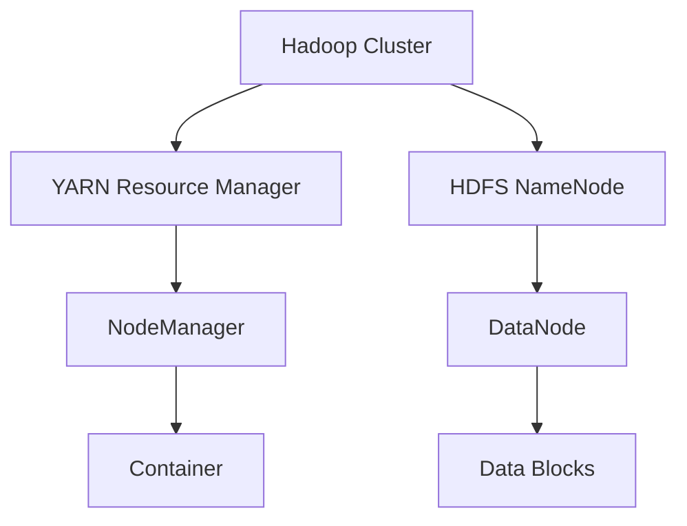

Apache Hadoop ist ein freies Framework für skalierbare, verteilte Software, das die Verarbeitung großer Datenmengen ermöglicht. Es basiert auf dem MapReduce-Algorithmus und dem Hadoop Distributed File System (HDFS) und wurde entwickelt, um Big-Data-Herausforderungen in Clustern zu bewältigen. Hadoop unterstützt die Speicherung und Analyse von Daten im Petabyte-Bereich und ist ein Kernbestandteil des Hadoop-Ökosystems.

## Geschichte

Hadoop entstand aus dem Bedarf, große Datenmengen effizient zu verarbeiten. Inspiriert von Googles MapReduce und Google File System, entwickelten Doug Cutting und Mike Cafarella 2004 das Projekt Nutch. 2006 wurde Hadoop als separates Apache-Projekt etabliert. Seitdem hat es sich zu einem der wichtigsten Big-Data-Tools entwickelt, mit Beiträgen von Unternehmen wie Yahoo und Facebook.

## Architektur

Hadoop verwendet eine verteilte Architektur mit einem zentralen Ressourcenmanager und mehreren Worker-Knoten zur effizienten Datenverarbeitung und -speicherung.

## Bestandteile

### Hadoop Distributed File System (HDFS)
HDFS ist ein hochverfügbares Dateisystem zur Speicherung großer Datenmengen auf mehreren Knoten. Dateien werden in Blöcke zerlegt und redundant gespeichert. Ein NameNode verwaltet Metadaten, während DataNodes die Daten speichern.

### Yet Another Resource Negotiator (YARN)
YARN verwaltet Ressourcen dynamisch im Cluster. Es trennt Ressourcenverwaltung von Datenverarbeitung und unterstützt verschiedene Anwendungen.

### MapReduce
MapReduce ist das ursprüngliche Verarbeitungsmodell, das Daten in Map- und Reduce-Phasen aufteilt. Es ermöglicht parallele Verarbeitung, gilt jedoch zunehmend als veraltet zugunsten von DAG-basierten Frameworks wie Apache Spark.

### Erweiterungen
Hadoop wird durch Tools wie Hive (SQL-Abfragen), Pig (Skripting), HBase (NoSQL-Datenbank) und Spark (In-Memory-Verarbeitung) erweitert.

## Anwendungen

Hadoop findet Einsatz in der Datenanalyse, Log-Verarbeitung und maschinellem Lernen. Es unterstützt Batch-Verarbeitung und ist skalierbar für Unternehmen wie Facebook und Yahoo.

## Vorteile und Herausforderungen

Vorteile sind Kosteneffizienz, Skalierbarkeit und Fehlertoleranz. Herausforderungen umfassen Latenz bei Echtzeitverarbeitung und Komplexität der Konfiguration.

## Quellen

> Apache Hadoop. (2024). Hadoop Documentation. Retrieved from https://hadoop.apache.org/docs/

> Wikipedia. (2025). Apache Hadoop. Retrieved from https://de.wikipedia.org/wiki/Apache_Hadoop
