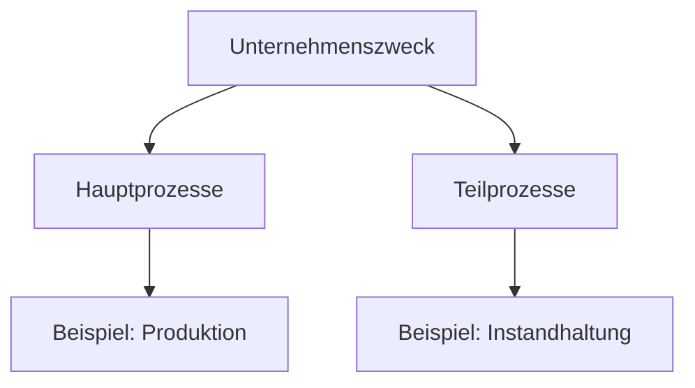

Hauptprozesse und Teilprozesse sind zentrale Konzepte in der Unternehmensorganisation. Hauptprozesse umfassen die Kernaktivitäten, die unmittelbar zur Wertschöpfung beitragen und den primären Zweck des Unternehmens erfüllen. Teilprozesse hingegen unterstützen diese Kernaktivitäten und sind für die Aufrechterhaltung der Betriebsabläufe erforderlich. Beide Arten von Prozessen tragen zur Definition des Unternehmenszwecks bei, der den Grund für die Gründung und das Bestehen des Unternehmens angibt.

## Hauptprozesse

Hauptprozesse sind Teil der [Wertschöpfungskette](/open-fidup/lerninhalte/wertschoepfungskette) und stellen die Aktivitäten dar, mit denen das Unternehmen seinen Umsatz erzielt. Sie definieren den Kernzweck des Unternehmens und umfassen typischerweise die zentralen Leistungen oder Produkte.

- Produktion: Die Herstellung von Gütern oder Dienstleistungen, die den Hauptumsatz generieren.

## Teilprozesse

Teilprozesse sind unterstützende Prozesse, die die Hauptprozesse flankieren und für deren reibungslosen Ablauf sorgen. Sie sind nicht direkt wertschöpfend, sondern ermöglichen die Effizienz und Stabilität der Kernaktivitäten.

- Instandhaltung: Die Wartung und Reparatur von Anlagen und Geräten, um Betriebsunterbrechungen zu vermeiden.

## Unternehmenszweck

Der Unternehmenszweck beschreibt, wofür das Unternehmen gegründet wurde und welchen Beitrag es zur Gesellschaft oder Wirtschaft leistet. Er steht in engem Zusammenhang mit den Hauptprozessen und bildet die Grundlage für strategische Entscheidungen.

