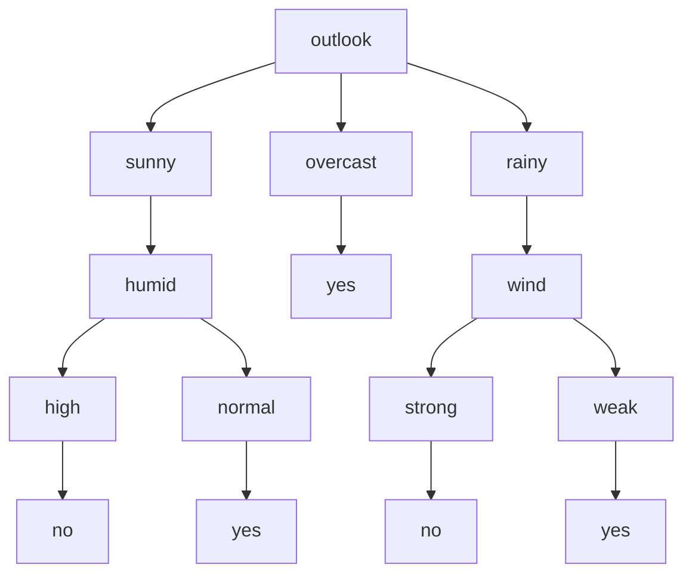

Der ID3-Algorithmus, kurz für Iterative Dichotomiser 3, ist ein Verfahren zur Konstruktion von Entscheidungsbäumen. Er arbeitet iterativ, indem er Attribute mit dem höchsten Informationsgewinn auswählt, um Daten zu klassifizieren. Der Algorithmus findet Anwendung bei großen Datensätzen mit zahlreichen Attributen und basiert auf der Berechnung von Entropien, um den besten Entscheidungsknoten zu bestimmen.

## Definition und Anwendung

Der ID3-Algorithmus dient der Entscheidungsfindung und wird insbesondere bei [Entscheidungsbäumen](/open-fidup/lerninhalte/entscheidungsbaum) eingesetzt. Er ist von Bedeutung für große Datenmengen mit vielen verschiedenen Attributen. Die Basisstruktur des Algorithmus ist iterativ: Er berechnet Entropien und wählt das Attribut mit dem höchsten [Informationsgewinn](/open-fidup/lerninhalte/entropie-und-informationsgewinn) oder der kleinsten Entropie aus. Das Verfahren terminiert, wenn jedem Blattknoten eine Klassifikation zugeordnet ist.

## Algorithmus

Der Algorithmus arbeitet mit einem Datensatz \( T \). Die Schritte sind wie folgt:

- Wenn alle Elemente aus \( T \) zu einer Klasse gehören:
  - Konstruiere ein Blatt mit der Klasse als Bezeichner.
- Andernfalls:
  - Wähle das Merkmal \( x_i \) mit dem höchsten Informationsgewinn.
  - Für alle vorkommenden Werte des Merkmals \( x_i \):
    - Konstruiere rekursiv Teilbäume mit den entsprechenden Teilmengen als Daten.
  - Konstruiere einen Baumknoten mit dem Bezeichner \( x_i \) und hänge alle erzeugten Teilbäume an.

## Beispiel

Ein Beispiel-Datensatz zur Vorhersage, ob ein Spiel stattfindet (Variable `play`), basiert auf Attributen wie Wetter, Temperatur, Luftfeuchtigkeit, Wind, Tag und Mondphase. Die Tabelle zeigt einen Ausschnitt der Daten:

| play | outlook | temp | humid | wind | day     | moon |
| ---- | ------- | ---- | ----- | ---- | ------- | ---- |
| no   | sunny   | hot  | high  | weak | tuesday | full |
| ...  | ...     | ...  | ...   | ...  | ...     | ...  |

Ein Entscheidungsbaum, der mit dem ID3-Algorithmus auf diesen Daten aufgebaut wird, könnte wie folgt aussehen:

## Quellen

Autoren der Wikimedia-Projekte. (2004, February 28). Iterative Dichotomiser 3 – Wikipedia. Retrieved from https://de.wikipedia.org/w/index.php?title=Iterative_Dichotomiser_3&oldid=209630820  
Example: How to train the ID3 classifier to perform classification (SPMF - Java). (2024, September 12). Retrieved from https://www.philippe-fournier-viger.com/spmf/ID3.php