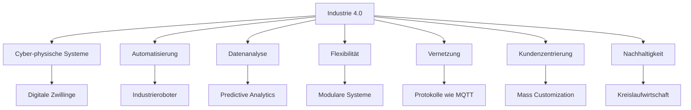

Industrie 4.0, auch als Smart Manufacturing bekannt, beschreibt die vierte industrielle Revolution. Sie integriert fortschrittliche Technologien wie das [Internet der Dinge](/open-fidup/lerninhalte/iot), [Cloud-Computing](/open-fidup/lerninhalte/cloud-computing), [Big Data](/open-fidup/lerninhalte/big-data) und [maschinelles Lernen](/open-fidup/lerninhalte/maschinelles-lernen) in die Fertigungsprozesse. Dadurch entstehen cyber-physische Systeme, die physische und digitale Elemente miteinander verbinden. Dies führt zu einer höheren Automatisierung, datenbasierten Entscheidungsfindung und effizienteren Produktion. Die Konzepte zielen auf Flexibilität, Vernetzung und Nachhaltigkeit ab, bergen jedoch Herausforderungen wie hohe Kosten und Sicherheitsrisiken.

## Technologien und Konzepte

Die folgenden Technologien und Konzepte bilden die Grundlage von Industrie 4.0. Sie ermöglichen eine Vernetzung von Maschinen, Geräten und Menschen, um Produktionsprozesse zu optimieren.

### Cyber-physische Systeme
Diese Systeme verbinden physische Prozesse mit digitalen Technologien. Beispiele sind digitale Zwillinge und Sensoren. Vorteile umfassen Echtzeitüberwachung und verbesserte Effizienz. Nachteile bestehen in hohen Implementierungskosten und Sicherheitsrisiken.

### Automatisierung
Der Einsatz von Robotern und automatisierten Systemen steigert die Effizienz. Beispiele sind Industrieroboter und autonome Fahrzeuge. Vorteile liegen in erhöhter Produktionsgeschwindigkeit und reduzierten menschlichen Fehlern. Nachteile umfassen potenzielle Arbeitsplatzverluste und hohe Anfangsinvestitionen.

### Datenanalyse
Daten werden zur Optimierung von Produktionsprozessen und Entscheidungsfindung genutzt. Beispiele sind Predictive Analytics und Business Intelligence-Tools. Vorteile sind bessere Entscheidungen und Identifikation von Verbesserungspotenzialen. Nachteile bestehen in Datenüberflutung und Datenschutzbedenken.

### Flexibilität
Produktionssysteme passen sich an veränderte Anforderungen an. Beispiele sind modulare Systeme und 3D-Druck. Vorteile umfassen schnelle Reaktionen auf Marktveränderungen und individuelle Kundenwünsche. Nachteile sind die Komplexität der Systeme und höhere Schulungsanforderungen.

### Vernetzung
Maschinen, Geräte und Menschen kommunizieren in Echtzeit. Beispiele sind Protokolle wie MQTT und OPC UA. Vorteile sind effiziente Zusammenarbeit und verbesserte Transparenz. Nachteile umfassen Abhängigkeit von stabilen Netzwerken und Cybersecurity-Risiken.

### Kundenzentrierung
Produkte und Dienstleistungen werden individualisiert durch direkte Kundeninteraktion. Beispiele sind Mass Customization und Kundenportale. Vorteile sind höhere Kundenzufriedenheit und Wettbewerbsvorteile. Nachteile bestehen in höheren Produktionskosten und komplexer Logistik.

### Nachhaltigkeit
Die Produktion wird ressourcenschonend gestaltet und Abfälle reduziert. Beispiele sind Kreislaufwirtschaft und energieeffiziente Maschinen. Vorteile umfassen geringere Umweltbelastung und Kosteneinsparungen durch Effizienz. Nachteile sind Anfangsinvestitionen in nachhaltige Technologien und mögliche Produktionsverzögerungen.

## Quellen

Ibm. (2023, December 19). Was ist Industrie 4.0 und wie funktioniert sie? | IBM. Retrieved from https://www.ibm.com/de-de/topics/industry-4-0