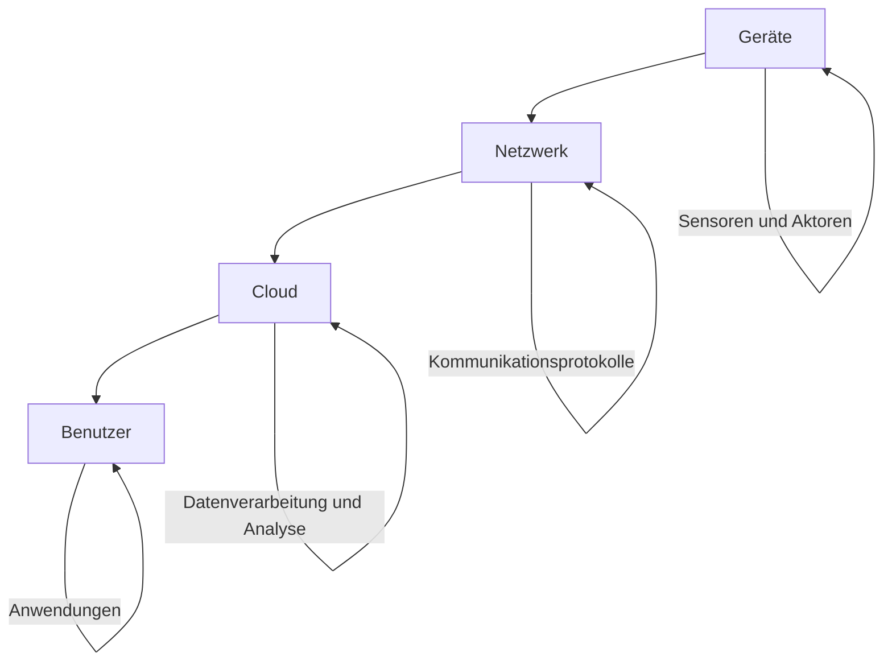

Das Internet der Dinge (IoT) bezeichnet ein Netzwerk von physischen Objekten, die mit Sensoren, Software und anderen Technologien ausgestattet sind. Diese Objekte sammeln Daten aus ihrer Umgebung und kommunizieren über das Internet mit anderen Geräten und Systemen. IoT findet breite Anwendung in Bereichen wie Smart Homes, Industrie 4.0 und Gesundheitswesen, wirft jedoch Fragen zu Sicherheit und Datenschutz auf.

## Architektur von IoT-Systemen

Die Architektur eines IoT-Systems umfasst mehrere Schichten, die den Datenaustausch und die Verarbeitung ermöglichen. Sie besteht typischerweise aus Geräten, Netzwerken, Cloud-Infrastrukturen und Benutzerschnittstellen.

- **Geräte:** Physische Objekte wie Sensoren, Aktoren oder Maschinen, die Daten erfassen oder Aktionen ausführen.
- **Netzwerk:** Infrastruktur für den Datenaustausch zwischen Geräten und Servern, beispielsweise über WLAN, 4G/5G oder Bluetooth.
- **Cloud:** Plattform zur Speicherung, Verarbeitung und Analyse der Daten sowie zur Bereitstellung von Schnittstellen.
- **Benutzer:** Personen, die über Anwendungen die Daten visualisieren, analysieren und Steuerungen vornehmen.

## Komponenten eines IoT-Systems

IoT-Systeme setzen sich aus verschiedenen Komponenten zusammen, die zusammenarbeiten, um Funktionalität zu gewährleisten.

- **Sensoren:** Erfassen Parameter der physischen Umgebung, etwa Temperatur, Bewegung oder Licht.
- **Aktoren:** Führen Aktionen auf Basis der Daten aus, beispielsweise die Steuerung von Motoren oder Heizungen.
- **Gateways:** Vermitteln zwischen IoT-Geräten und der Cloud, aggregieren Daten und leiten sie weiter.
- **Protokolle:** Ermöglichen die Kommunikation, darunter MQTT, HTTP oder CoAP.

## Anwendungsbereiche von IoT

IoT findet in zahlreichen Bereichen Anwendung, wo es Effizienz steigert und neue Möglichkeiten eröffnet.

- **Smart Home:** Vernetzte Geräte wie Thermostate, Beleuchtung oder Sicherheitskameras, die automatisiert gesteuert werden.
- **Industrie 4.0:** Vernetzung von Maschinen und Prozessen zur Steigerung der Effizienz, etwa durch [Predictive Maintenance](/open-fidup/lerninhalte/predictive-maintenance).
- **Smart Cities:** Einsatz von Sensoren für effizientere Verkehrssteuerung, Müllentsorgung und Energieversorgung.
- **Gesundheitswesen:** Vernetzte Geräte zur Patientenüberwachung, beispielsweise Wearables für Vitaldaten.
- **Landwirtschaft:** Sensoren zur Überwachung von Bodenqualität, Wetter und automatisierten Bewässerungssystemen.

## IoT-Protokolle

Protokolle sind essenziell für die Kommunikation in IoT-Systemen. Sie sind auf die Ressourcenbeschränkungen der Geräte abgestimmt.

| Protokoll | Beschreibung |
|-----------|--------------|
| MQTT (Message Queuing Telemetry Transport) | Leichtgewichtiges Protokoll für Geräte mit begrenzten Ressourcen und Netzwerke mit hoher Latenz. |
| CoAP (Constrained Application Protocol) | Ähnlich HTTP, optimiert für ressourcenarme Geräte. |
| HTTP/HTTPS | Standardprotokoll für Webanwendungen, geeignet für IoT-Geräte ohne Echtzeitbedarf. |

## Herausforderungen und Risiken von IoT

Trotz der Vorteile bringt IoT Herausforderungen mit sich, die adressiert werden müssen.

- **Sicherheit:** Geräte sind anfällig für Cyberangriffe, oft aufgrund mangelnder Verschlüsselung oder unsicherer Standardpasswörter.
- **Skalierbarkeit:** Das Wachstum der Geräteanzahl erfordert robuste Infrastrukturen für Datenverarbeitung und -speicherung.
- **Interoperabilität:** Inkompatible Protokolle und Standards verschiedener Hersteller erschweren die Integration.
- **Datenschutz:** Der Umgang mit großen Datenmengen erfordert strenge Vorkehrungen, etwa die Einhaltung der DSGVO.

## Schritte zur Entwicklung eines IoT-Systems

Die Entwicklung folgt einem strukturierten Prozess, um Funktionalität und Sicherheit zu gewährleisten.

1. **Anforderungsanalyse:** Identifizierung der zu erfassenden Daten und erforderlichen Aktionen.
2. **Geräteauswahl:** Auswahl geeigneter Sensoren, Aktoren und Protokolle.
3. **Netzwerkinfrastruktur:** Planung der Kommunikationsarchitektur, beispielsweise WLAN oder 5G.
4. **Datenverarbeitung:** Entscheidung zwischen lokaler Verarbeitung ([Edge Computing](/open-fidup/lerninhalte/fog-computing)) oder [Cloud Computing](/open-fidup/lerninhalte/cloud-computing).
5. **Sicherheitskonzepte:** Implementierung von Verschlüsselung, Authentifizierung und Zugriffskontrollen.
6. **Benutzeroberfläche:** Entwicklung von Anwendungen zur Visualisierung und Steuerung.

## Edge Computing vs. Cloud Computing in IoT

In IoT-Systemen werden Datenverarbeitungsmethoden gewählt, die auf die Anforderungen abgestimmt sind.

- **Edge Computing:** Verarbeitung nahe der Datenquelle, etwa am Gerät oder Gateway, um Latenz zu reduzieren und Bandbreite zu sparen.
- **Cloud Computing:** Zentrale Verarbeitung, Analyse und Speicherung der Daten; vorteilhaft bei großen Datenmengen oder rechenintensiven Aufgaben.

## Relevante Begriffe

- **Smart Devices:** Intelligente Geräte mit Sensoren und Internetverbindung.
- **Wearables:** Tragbare IoT-Geräte, häufig für Gesundheitsüberwachung, wie Fitness-Tracker.
- **Digital Twin:** Virtuelles Modell eines physischen Objekts zur Echtzeitüberwachung.
- **IoT-Plattformen:** Software zur Verwaltung und Analyse von IoT-Daten, beispielsweise AWS IoT oder Microsoft Azure IoT Hub.

## Quellen

> ChatGPT. (2024, September 20). Retrieved from https://chatgpt.com/c/66ed3ccd-34d4-800b-a198-dee9a0d61710 [Beleg erforderlich]