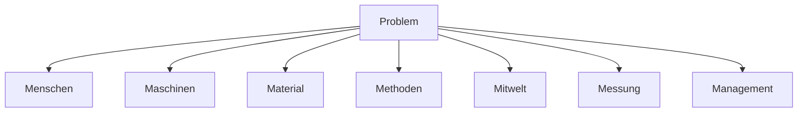

Das Ishikawa-Diagramm, auch als Fischgrätendiagramm bekannt, dient der systematischen Identifikation und Analyse von Ursachen eines Problems. Es strukturiert die Untersuchung in sieben Bereichen, die mit den Buchstaben M beginnen und als die „7 M's“ bezeichnet werden. Diese Methode unterstützt Teams bei der Problemlösung, indem sie eine visuelle Darstellung der Ursachen-Wirkungs-Beziehungen ermöglicht und zur Entwicklung gezielter Maßnahmen beiträgt.

## Die sieben Bereiche

Das Diagramm untersucht systematisch sieben Bereiche, um potenzielle Ursachen eines Problems zu identifizieren. Jeder Bereich umfasst spezifische Aspekte, die zur Problementstehung beitragen können.

### Menschen
Dieser Bereich fokussiert auf menschliche Faktoren, die das Problem beeinflussen:
- Ausbildungsstand und Qualifikationen
- Teamzusammensetzung und -dynamik
- Kommunikationsfähigkeiten
- Stressresistenz und Belastbarkeit
- Kreativität und Problemlösungsfähigkeiten
- Gesundheitszustand und Work-Life-Balance
- Kulturelle Diversität im Team

### Maschinen
Hier werden technische und infrastrukturelle Aspekte betrachtet:
- Alter und Zustand der Produktionsanlagen
- Wartungsintervalle und -qualität
- Technologiestand der eingesetzten Software
- Ergonomie der Arbeitsplätze
- Verfügbarkeit von Ersatzteilen
- Automatisierungsgrad der Prozesse
- IT-Infrastruktur und Netzwerkstabilität

### Material
Dieser Bereich analysiert die Ressourcen und Lieferketten:
- Qualität der Rohstoffe
- Lagerungsbedingungen
- Lieferantenbeziehungen und -zuverlässigkeit
- Materialeigenschaften und Verarbeitbarkeit
- Verfügbarkeit und Lieferzeiten
- Kostenentwicklung der Materialien
- Nachhaltigkeit und Umweltverträglichkeit

### Methoden
Hier werden prozessuale und organisatorische Ansätze untersucht:
- Standardisierung von Prozessen
- [Lean-Management](/open-fidup/lerninhalte/lean-management)-Ansätze
- Qualitätsmanagementsysteme
- [Projektmanagement](/open-fidup/lerninhalte/projektmanagement)-Methodiken
- Informationsfluss und Dokumentation
- Entscheidungsfindungsprozesse
- Innovationsmanagement und Ideenfindung

### Mitwelt
Dieser Bereich berücksichtigt externe Umweltfaktoren:
- Gesetzliche Rahmenbedingungen und Regulierungen
- Wettbewerbssituation in der Branche
- Technologische Trends und Innovationen
- Gesellschaftliche Wertvorstellungen und Erwartungen
- Wirtschaftliche Faktoren wie Inflation oder Wechselkurse
- Politische Stabilität und internationale Beziehungen
- Klimawandel und Umweltschutzauflagen

### Messung
Hier werden Aspekte der Datenerfassung und -analyse betrachtet:
- Genauigkeit und Kalibrierung von Messinstrumenten
- Statistische Methoden zur Datenanalyse
- Frequenz und Zeitpunkt der Datenerhebung
- Repräsentativität der Stichproben
- Validität und Reliabilität der Messmethoden
- Dateninterpretation und Berichterstattung
- Automatisierte vs. manuelle Datenerfassung

### Management
Dieser Bereich analysiert Führungs- und strategische Faktoren:
- Strategische Ausrichtung und Zielsetzung
- Ressourcenallokation und Budgetierung
- Personalentwicklung und Talentmanagement
- Risikomanagement und Compliance
- Change-Management-Fähigkeiten
- Kommunikationsstrategie und Transparenz
- Ethische Grundsätze und Unternehmenskultur

## Auswertung

Nach der Identifikation der Ursachen in den sieben Bereichen erfolgt eine Auswertung, um diejenigen Ursachen zu bestimmen, die den größten Einfluss auf das Problem haben. Dies ermöglicht eine Priorisierung von Maßnahmen zur Problemlösung.

## Ziele des Ishikawa-Diagramms

Das Ishikawa-Diagramm verfolgt mehrere Ziele zur Verbesserung der Problemlösung:
1. **Ursachenidentifikation**: Systematische Analyse der Ursachen eines Problems, um die Wurzel des Problems zu finden.
2. **Verbesserung der Problemlösungsfähigkeiten**: Förderung eines strukturierten Ansatzes zur Problemlösung innerhalb des Teams oder Unternehmens.
3. **Teamarbeit und Kommunikation**: Verbesserung der Zusammenarbeit und Kommunikation zwischen verschiedenen Abteilungen, indem alle relevanten Perspektiven einbezogen werden.
4. **Prävention von Problemen**: Identifikation potenzieller Probleme im Voraus, um präventive Maßnahmen zu ergreifen und zukünftige Fehler zu vermeiden.
5. **Dokumentation und Nachverfolgbarkeit**: Bereitstellung einer klaren Dokumentation der Ursachenanalyse, die für zukünftige Referenzen und Schulungen genutzt werden kann.

## Quellen

ZumFachwirt. (2017, February 06). Ishikawa Diagramm Erklärung & Beispiel (Unternehmensführung Fachwirt IHK) -Fischgrätendiagramm. Youtube. Retrieved from https://www.youtube.com/watch?v=3_LM2uK8AU0  
Ishikawa-Diagramm: Ursachenanalyse und Problemlösung. (2023, January 20). Retrieved from https://blog.hubspot.de/sales/ishikawa-diagramm