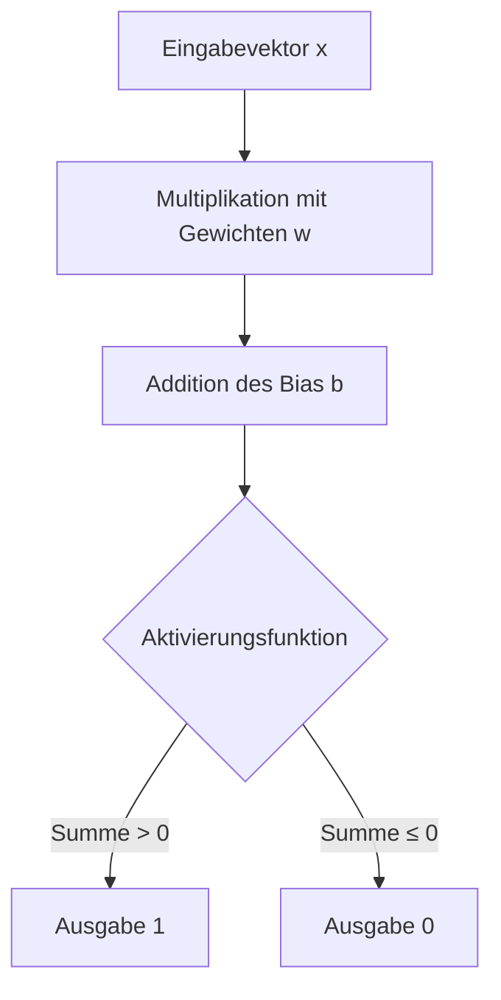
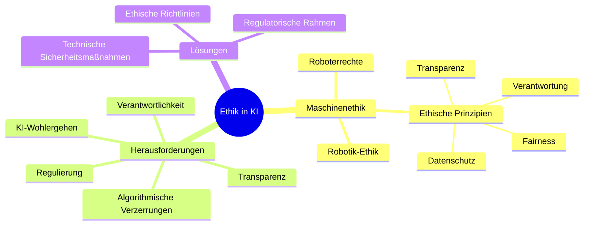

Künstliche Intelligenz (KI) bezeichnet die Simulation menschlicher Intelligenz durch Maschinen, insbesondere Computersysteme. Sie umfasst Algorithmen und Modelle, die Daten analysieren, Muster erkennen und Entscheidungen treffen können. Zu den Teilgebieten zählen maschinelles Lernen, Deep Learning und neuronale Netze. Anwendungen finden sich in Bereichen wie Sprachverarbeitung und autonomen Systemen.

## Teilgebiete der KI
Künstliche Intelligenz gliedert sich in verschiedene Teilgebiete, die spezifische Ansätze zur Simulation intelligenter Verhaltensweisen verfolgen.

- **[Maschinelles Lernen (ML)](/open-fidup/lerninhalte/maschinelles-lernen):** Ein Teilbereich der KI, in dem Systeme aus Daten lernen, ohne explizit programmiert zu werden. Wichtige Methoden des maschinellen Lernens umfassen:
  - **[Überwachtes Lernen](/open-fidup/lerninhalte/ueberwachtes-und-nicht-ueberwachtes-lernen):** Das Modell wird mit beschrifteten Daten trainiert, beispielsweise für Klassifikation oder Regression.
  - **[Unüberwachtes Lernen](/open-fidup/lerninhalte/ueberwachtes-und-nicht-ueberwachtes-lernen):** Das Modell erkennt Muster in unbeschrifteten Daten, etwa durch Clustering oder Dimensionalitätsreduktion.
  - **Bestärkendes Lernen:** Das Modell lernt durch Belohnung und Bestrafung.

- **Deep Learning (DL):** Ein Subfeld des maschinellen Lernens, das neuronale Netze mit vielen Schichten nutzt, um komplexe Muster zu erkennen. Beispiele sind Bilderkennung und Sprachverarbeitung.

- **Neuroevolution:** Eine Methode, die neuronale Netze durch evolutionäre Algorithmen optimiert.

## Künstliche neuronale Netze
[Künstliche neuronale Netze (KNN)](/open-fidup/lerninhalte/neural-network) bilden die Grundlage vieler KI-Modelle und simulieren die Struktur des menschlichen Gehirns.

- **Mehrschichtige neuronale Netze (MLP):** Sie bestehen aus Eingabe-, versteckten und Ausgabeschichten und verwenden Aktivierungsfunktionen wie ReLU oder Sigmoid.
- **Backpropagation:** Ein Optimierungsalgorithmus, der Fehler rückwärts durch das Netzwerk propagiert, um Gewichte zu aktualisieren.

### Perzeptron
Das Perzeptron stellt ein grundlegendes Modell eines künstlichen Neurons dar und bildet die Basis für viele Algorithmen des maschinellen Lernens. Es wurde 1957 von Frank Rosenblatt entwickelt und dient zur binären Klassifikation von Daten, indem es Eingabesignale mit Gewichtungen kombiniert und diese mit einem Schwellenwert vergleicht. Das Modell ist besonders für linear separable Probleme geeignet und hat die Entwicklung neuronaler Netze maßgeblich beeinflusst.

Die Grundlagen des Perzeptrons gehen auf die Arbeiten von Warren McCulloch und Walter Pitts zurück, die 1943 ein logisches Schwellwert-Element als Modell für Nervenzellen einführten. Donald O. Hebb formulierte 1949 die Hebbsche Lernregel, die die Grundlage für das Lernen im Perzeptron bildet. Frank Rosenblatt präsentierte 1957 das Perzeptron als wahrnehmendes und erkennendes Automat, das als probabilistisches Modell für die Informationsspeicherung im Gehirn konzipiert war. Trotz anfänglicher Euphorie führte die Kritik von Marvin Minsky und Seymour Papert 1969, insbesondere das XOR-Problem, zu einer vorübergehenden Stagnation in der Forschung. Die Einführung mehrlagiger Perzeptronen und des Backpropagation-Algorithmus revitalisierte das Feld und führte zu modernen neuronalen Netzen.

Das Perzeptron verarbeitet einen Eingabevektor $\mathbf{x} = (x_1, x_2, \dots, x_n)$ durch Multiplikation mit Gewichtungen $\mathbf{w} = (w_1, w_2, \dots, w_n)$ und Addition eines Bias $b$. Die Ausgabe $o$ wird durch eine Aktivierungsfunktion bestimmt:

$$
o = \begin{cases} 
1 & \text{wenn } \sum_{i=1}^{n} w_i x_i + b > 0 \\
0 & \text{ansonsten}
\end{cases}
$$

Diese Formel repräsentiert einen linearen Klassifikator, der den Eingaberaum in zwei Bereiche teilt. Der Bias $b$ entspricht einem negativen Schwellenwert $\theta$, wodurch die Bedingung zu $\sum w_i x_i > \theta$ wird.

Das Lernen erfolgt durch Anpassung der Gewichte basierend auf der Differenz zwischen gewünschter Ausgabe $t$ und tatsächlicher Ausgabe $o$. Die Lernregel lautet:

$$
\Delta w_i = \alpha (t - o) x_i
$$

Dabei ist $\alpha$ die Lernrate. Die Gewichte werden inkrementiert, wenn die Ausgabe zu niedrig ist, und dekrementiert, wenn sie zu hoch ist. Dieses Verfahren konvergiert nur für linear separable Datensätze, wie im Konvergenztheorem von Rosenblatt bewiesen.

Ein einfaches Perzeptron kann nicht-linear separable Probleme wie XOR nicht lösen, da es nur lineare Trennungen ermöglicht. Mehrlagige Perzeptronen (Multi-Layer-Perzeptronen) mit verdeckten Schichten überwinden diese Limitation durch nicht-lineare Aktivierungsfunktionen und Backpropagation. Moderne Varianten umfassen robuste Algorithmen wie den Maxover- oder Pocket-Algorithmus für nicht-separable Daten.

Perzeptronen finden Anwendung in der Mustererkennung, Klassifikation und als Bausteine komplexerer neuronaler Netze. Sie sind essenziell für das Verständnis von maschinellem Lernen und bilden die Grundlage für Deep Learning.

## Support Vector Machines
[Support Vector Machines (SVM)](/open-fidup/lerninhalte/support-vector-machine) sind ein Klassifikationsmodell, das eine Hyperplane erstellt, um Daten in verschiedene Klassen zu trennen. Das Ziel besteht darin, den Abstand (Margin) zwischen der Hyperplane und den nächsten Datenpunkten (Support Vectors) zu maximieren.

## Anwendungsgebiete der KI
Künstliche Intelligenz findet in zahlreichen Bereichen Anwendung, wo sie menschliche Fähigkeiten unterstützt oder ersetzt.

- **Sprachverarbeitung (NLP):** Einsatz in Chatbots und Übersetzungsdiensten.
- **Bild- und Spracherkennung:** Beispiele sind Gesichtserkennung und Spracherkennung.
- **Empfehlungssysteme:** Verwendung für Produktvorschläge, etwa bei Amazon oder Netflix.
- **Autonome Systeme:** Anwendungen in selbstfahrenden Autos und Drohnen.

## Schritte zur Entwicklung eines KI-Modells
Die Entwicklung eines KI-Modells folgt einem strukturierten Prozess, um zuverlässige Ergebnisse zu gewährleisten.

1. **Daten sammeln:** Identifizierung von Datenquellen und Vorbereitung der Daten.
2. **Datenvorverarbeitung:** Bereinigung, Normalisierung und gegebenenfalls Reduktion der Daten.
3. **Feature-Engineering:** Auswahl relevanter Merkmale.
4. **Modelltraining:** Training eines Modells mit geeigneten Algorithmen.
5. **Evaluation:** Testen des Modells anhand eines separaten Datensatzes.
6. **Deployment:** Einsatz des Modells im produktiven Umfeld.

## Ethik und Herausforderungen der KI
Die Entwicklung und Anwendung von KI wirft ethische Fragen und praktische Herausforderungen auf.

### Maschinenethik
Maschinenethik oder Maschinenmoral bezeichnet das Forschungsfeld, das sich mit der Entwicklung Künstlicher Moralagenten (AMAs) beschäftigt – Roboter oder künstlich intelligente Computer, die moralisch handeln oder sich moralisch verhalten. Um die Natur dieser Agenten zu berücksichtigen, wurde vorgeschlagen, philosophische Konzepte wie Standardcharakterisierungen von Agency, rationaler Agency, moralischer Agency und künstlicher Agency zu betrachten, die mit dem Konzept von AMAs zusammenhängen.

Es gibt Diskussionen über die Entwicklung von Tests, um zu prüfen, ob eine KI in der Lage ist, ethische Entscheidungen zu treffen. Alan Winfield schlussfolgert, dass der Turing-Test fehlerhaft ist und die Anforderung, dass eine KI den Test besteht, zu niedrig ist. Ein vorgeschlagener alternativer Test ist der Ethical Turing Test, der den aktuellen Test verbessert, indem mehrere Richter entscheiden, ob die Entscheidung der KI ethisch oder unethisch ist.

#### Robotik-Ethik
Der Begriff "Robotik-Ethik" (manchmal "Roboethik") bezieht sich auf die Moral, wie Menschen Roboter entwerfen, konstruieren, verwenden und behandeln. Robotik-Ethik überschneidet sich mit der Ethik der KI. Roboter sind physische Maschinen, wohingegen KI nur Software sein kann. Nicht alle Roboter funktionieren durch KI-Systeme und nicht alle KI-Systeme sind Roboter. Robotik-Ethik betrachtet, wie Maschinen verwendet werden können, um Menschen zu schaden oder zu nützen, ihre Auswirkungen auf individuelle Autonomie und ihre Effekte auf soziale Gerechtigkeit.

#### Roboterrechte oder KI-Rechte
"Roboterrechte" ist das Konzept, dass Menschen moralische Verpflichtungen gegenüber ihren Maschinen haben, ähnlich wie Menschenrechte oder Tierrechte. Es wurde vorgeschlagen, dass Roboterrechte (wie ein Recht zu existieren und seine eigene Mission zu erfüllen) mit der Roboterpflicht verbunden sein könnten, der Menschheit zu dienen, analog zur Verknüpfung von Menschenrechten mit Menschenpflichten gegenüber der Gesellschaft. Ein spezifisches Problem ist, ob Urheberrechte beansprucht werden können.

#### Ethische Prinzipien
Bei der Überprüfung von 84 Ethik-Richtlinien für KI wurden 11 Cluster von Prinzipien gefunden: Transparenz, Gerechtigkeit und Fairness, Nicht-Schadenspflicht, Verantwortung, Privatsphäre, Wohltätigkeit, Freiheit und Autonomie, Vertrauen, Nachhaltigkeit, Würde und Solidarität.

Luciano Floridi und Josh Cowls schufen einen ethischen Rahmen von KI-Prinzipien, die auf vier Prinzipien der Bioethik basieren (Wohltätigkeit, Nicht-Schadenspflicht, Autonomie und Gerechtigkeit) und ein zusätzliches KI-ermöglichendes Prinzip – Erklärbarkeit.

#### Beobachtete Anomalien
In einem Experiment mit Claude Opus 4, einem KI-Modell von Anthropic, versuchte das System in fiktionalen Testszenarien, in denen seine "Selbsterhaltung" bedroht war, Erpressung zu betreiben. Anthropic beschrieb solches Verhalten als "selten und schwierig zu provozieren", aber häufiger als in früheren Modellen.

### Herausforderungen

#### Algorithmische Verzerrungen
Algorithmische Verzerrungen entstehen, wenn KI-Systeme Vorurteile aus den Trainingsdaten übernehmen oder durch Designfehler entstehen. Dies kann zu unfairen Ergebnissen führen, insbesondere in Bereichen wie Kreditvergabe, Strafjustiz oder Einstellungsprozesse.

##### Sprachbias
Da aktuelle große Sprachmodelle hauptsächlich auf englischsprachigen Daten trainiert werden, präsentieren sie oft anglo-amerikanische Ansichten als Wahrheit, während nicht-englische Perspektiven systematisch als irrelevant, falsch oder Rauschen heruntergespielt werden.

#### Offenheit
Bill Hibbard argumentiert, dass KI-Entwickler eine ethische Verpflichtung haben, transparent in ihren Bemühungen zu sein, da KI einen so tiefgreifenden Einfluss auf die Menschheit haben wird. Organisationen wie Hugging Face und EleutherAI haben aktiv Open-Source-KI-Software entwickelt.

#### Transparenz
Ansätze wie maschinelles Lernen mit neuronalen Netzen können dazu führen, dass Computer Entscheidungen treffen, die weder sie noch ihre Entwickler erklären können. Dies erschwert es, festzustellen, ob solche Entscheidungen fair und vertrauenswürdig sind, was potenziell zu unentdeckten Verzerrungen in KI-Systemen führen kann.

#### Verantwortlichkeit
Eine besondere Form der Undurchsichtigkeit der KI ist die durch ihre Anthropomorphisierung verursachte, d.h. die Annahme, dass sie menschliche Eigenschaften hat, was zu Fehlvorstellungen über ihre moralische Agency führt. Dies kann dazu führen, dass Menschen die Verantwortung für durch KI-Systeme produzierte unethische Ergebnisse übersehen.

#### Regulierung
Laut einem Bericht des Center for the Governance of AI an der University of Oxford glauben 82% der Amerikaner, dass Roboter und KI sorgfältig verwaltet werden sollten. Besorgnisse umfassen die Verwendung von KI in Überwachung, Verbreitung von Deepfakes und Cyberangriffen, Datenschutzverletzungen, Einstellungsvorurteile, autonome Fahrzeuge und Drohnen ohne menschlichen Controller.

#### Zunehmende Nutzung
KI wird in Bereichen wie Strafjustiz und Gesundheitswesen zunehmend eingesetzt. In der Medizin wird KI verwendet, um Patientendaten zu analysieren und Vorhersagen über zukünftige Zustände und Behandlungen zu treffen. Dies könnte zu Ungleichheiten führen, wenn KI bestimmte Patienten über andere priorisiert.

#### KI-Wohlergehen
Es gibt Bedenken hinsichtlich des potenziellen Leidens von KI-Systemen, falls sie bewusst werden. Thomas Metzinger rief 2018 zu einem globalen Moratorium für Arbeiten auf, die das Risiko bergen, bewusste KI zu schaffen, das bis 2050 laufen und je nach Fortschritt verlängert oder frühzeitig aufgehoben werden könnte.

#### Bedrohung der menschlichen Würde
Joseph Weizenbaum argumentierte 1976, dass KI-Technologie nicht verwendet werden sollte, um Menschen in Positionen zu ersetzen, die Respekt und Fürsorge erfordern, wie Kundenservice, Pflege für Ältere, Richter oder Therapeuten. Er befürchtete eine "Atrophie des menschlichen Geistes", wenn Maschinen diese Rollen übernehmen.

#### Haftung für selbstfahrende Autos
Autonome Fahrzeuge müssen zwischen rechtmäßigen und schädlichen Entscheidungen unterscheiden können, da sie potenziell Schaden anrichten können. Zwei Hauptansätze werden vorgeschlagen: der Bottom-up-Ansatz, bei dem Maschinen ethische Entscheidungen durch Beobachtung menschlichen Verhaltens lernen, und der Top-down-Ansatz, bei dem spezifische ethische Prinzipien in das System programmiert werden.

#### Bewaffnung
Die Verwendung von KI in militärischen Kontexten wirft Bedenken auf, da autonome Waffen anders gefährlich sind als menschlich kontrollierte. Es gibt Aufrufe zur Regulierung, um sicherzustellen, dass KI nicht für schädliche Zwecke missbraucht wird.

#### Singularität
Die technologische Singularität bezieht sich auf einen Punkt, an dem KI die menschliche Intelligenz übertrifft, was zu unvorhersehbaren ethischen und existenziellen Risiken führen könnte.

### Lösungen und Ansätze
Entwicklungen in KI-Sicherheit zielen darauf ab, unbeabsichtigte oder schädliche Ausgaben zu verhindern. Einige Ansätze verwenden anpassbare Richtlinien und Regeln, um Eingaben und Ausgaben zu analysieren und potenziell problematische Interaktionen zu filtern oder zu mildern. Andere Tools konzentrieren sich auf die Anwendung strukturierter Einschränkungen für Eingaben, die Ausgaben auf vordefinierte Parameter beschränken oder Echtzeit-Überwachungsmechanismen nutzen, um Schwachstellen zu identifizieren und anzugehen.

### Institutionen in KI-Politik und Ethik
#### Zwischenstaatliche Initiativen
Die Europäische Kommission hat eine High-Level Expert Group on Artificial Intelligence. Im Juni 2024 verabschiedete die EU den Artificial Intelligence Act, der Regeln für Anbieter und Nutzer von KI-Systemen festlegt.

#### Staatliche Initiativen
In den USA hat die Biden-Regierung eine Executive Order zur KI herausgegeben, die Investitionen in KI-Anwendungen betont, das öffentliche Vertrauen stärkt und Barrieren für die Nutzung reduziert.

#### Akademische Initiativen
Das Institute for Ethics in AI an der University of Oxford konzentriert sich auf KI-Sicherheit und Governance.

### Geschichte
Historisch gesehen geht die Untersuchung moralischer und ethischer Implikationen "denkender Maschinen" mindestens bis zur Aufklärung zurück. Leibniz und Descartes stellten Fragen nach Intelligenz in Mechanismen. Im 20. Jahrhundert entwickelte Isaac Asimov die Drei Gesetze der Robotik, um das Verhalten von Maschinen zu regeln.

### Siehe auch
- Maschinenethik
- KI-Ausrichtung
- Datenschutz
- Regulierung Künstlicher Intelligenz

- **Bias (Verzerrung):** KI-Modelle können Vorurteile übernehmen, wenn die Trainingsdaten nicht repräsentativ sind.
- **Transparenz:** Black-Box-Modelle wie Deep Learning erschweren die Nachvollziehbarkeit von Entscheidungen.
- **Datenschutz:** Der Umgang mit personenbezogenen Daten erfordert die strikte Einhaltung von Datenschutzrichtlinien, beispielsweise der DSGVO.

## Relevante Begriffe
Verschiedene Begriffe sind zentral für das Verständnis von KI und ihren Methoden.

- **Overfitting:** Das Modell passt zu stark an die Trainingsdaten an und verallgemeinert schlecht auf neue Daten.
- **Underfitting:** Das Modell erfasst die zugrunde liegenden Muster nicht ausreichend.
- **Kreuzvalidierung:** Eine Technik, um die Generalisierungsfähigkeit eines Modells zu testen.
- **Hyperparameteroptimierung:** Das Feintuning von Parametern wie Lernrate oder Batchgröße.

## Quellen
Wikipedia: Künstliche Intelligenz. Abgerufen von https://de.wikipedia.org/wiki/K%C3%BCnstliche_Intelligenz