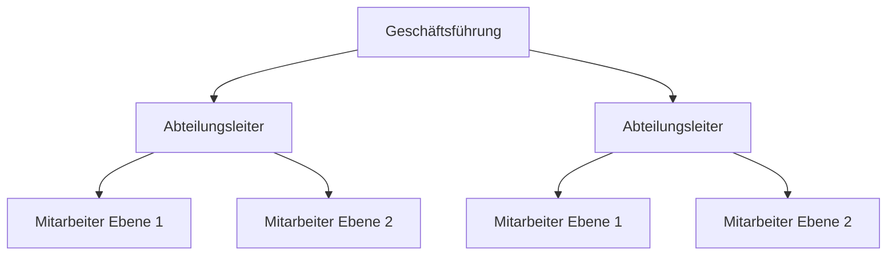

Lean Management ist ein Managementansatz, der darauf abzielt, Unternehmensprozesse zu verschlanken, um optimale Ergebnisse zu erreichen, ohne Ressourcen zu verschwenden. Es betont Kundenorientierung, die Identifikation von Prozessen und das Pull-Prinzip, um nachhaltige Erfolge zu fördern.

## Ziele
Die Ziele von Lean Management umfassen die Vermeidung von Ressourcenverschwendung, den Ausschluss von Fehlleistungen, die effiziente Nutzung des Kapitals sowie den Ausschluss von Überproduktion. Zudem fördert es eine bessere Kommunikation durch flache Hierarchien.

## Leitlinien
Lean Management folgt mehreren Leitlinien, die auf eine effiziente Produktion ausgerichtet sind.

- **Kundenorientierte Produktion**: Der betriebliche Herstellungsprozess orientiert sich an den Bedürfnissen des Konsumenten hinsichtlich Zeit, Ort und Qualität.
- **Prozessidentifikation**: Die gesamten Prozesse werden durchleuchtet, von der Beschaffung von Materialien bis zur Lieferung des Produkts, um Kosteneinsparungen und zeitliche Optimierungen zu identifizieren.
- **Flussprinzip**: Der Produktionsprozess wird im Fluss gehalten, um Engpässe und Überproduktion zu vermeiden und eine flexible, auftragsbezogene Produktion zu erreichen.
- **Pullprinzip**: Die Produktionsleistung wird erst erbracht, wenn der Kunde sie anfordert.
- **Stillstand vermeiden**: Prozesse werden kontinuierlich auf dem neuesten Stand gehalten, unter Einbeziehung neuer Technologien und Maschinen. Dies unterstützt den Ansatz der kontinuierlichen Verbesserung, wie er in [Kaizen](/open-fidup/lerninhalte/kaizen) beschrieben ist.

## Vorteile
Lean Management bietet mehrere Vorteile, die zu einer effizienteren Unternehmensführung beitragen.

1. **Ressourcenschonung**: Es zielt darauf ab, Verschwendung zu minimieren, was zu einer effizienteren Nutzung von Ressourcen führt.
2. **Kostenreduktion**: Durch die Eliminierung von Überproduktion und Fehlleistungen können Unternehmen ihre Kosten erheblich senken.
3. **Verbesserte Qualität**: Die Fokussierung auf die Bedürfnisse der Kunden führt zu einer höheren Produktqualität und Kundenzufriedenheit.
4. **Flexibilität**: Die Einführung des Pull-Prinzips ermöglicht eine anpassungsfähige Produktion, die auf die tatsächliche Nachfrage reagiert.
5. **Bessere Kommunikation**: Flache Hierarchien fördern die Kommunikation und Zusammenarbeit innerhalb des Unternehmens.
6. **Nachhaltige Erfolge**: Durch kontinuierliche Verbesserung und Prozessoptimierung werden langfristige Erfolge gesichert.

## Nachteile
Trotz seiner Vorteile bringt Lean Management auch Herausforderungen mit sich.

1. **Implementierungsaufwand**: Die Einführung erfordert Zeit, Schulung und möglicherweise eine grundlegende Umstrukturierung der Prozesse.
2. **Widerstand der Mitarbeiter**: Veränderungen können auf Widerstand stoßen, insbesondere wenn Mitarbeiter an bestehenden Prozessen festhalten möchten.
3. **Risiko der Überoptimierung**: Eine zu starke Fokussierung auf Effizienz kann zu einer Vernachlässigung anderer wichtiger Aspekte wie Innovation oder Mitarbeiterzufriedenheit führen.
4. **Abhängigkeit von Lieferanten**: Das Pull-Prinzip kann die Abhängigkeit von Lieferanten erhöhen, was bei Lieferengpässen problematisch sein kann.
5. **Mangelnde Flexibilität bei plötzlichen Änderungen**: In dynamischen Märkten kann es schwierig sein, sich schnell an Veränderungen anzupassen, wenn die Prozesse zu stark standardisiert sind.

## Quellen
- Lean Management » Definition, Erklärung & Beispiele + Übungsfragen. (2022, May 10). Abgerufen von https://www.bwl-lexikon.de/wiki/lean-management