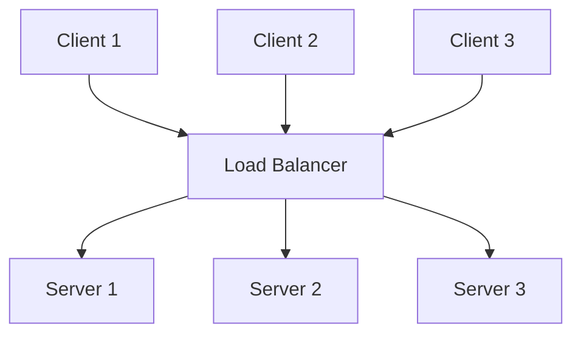

Load Balancing bezeichnet die Verteilung von Rechenlasten auf zwei oder mehr Computer. Diese Methode reduziert die Belastung jedes einzelnen Servers, wodurch die Effizienz gesteigert wird. Dadurch verbessert sich die Gesamtperformance und die Latenz verringert sich.

## Funktionsweise
Load Balancing kann hardware- oder softwarebasiert erfolgen. Dabei werden eingehende Anfragen bestimmten Servern zugewiesen. Die Zuweisung basiert auf Algorithmen, die statisch oder dynamisch sein können.

### Statische Algorithmen
Statische Algorithmen verteilen die Lasten, ohne den aktuellen Zustand des Systems zu berücksichtigen. Sie lassen sich schnell einrichten, können jedoch zu Ineffizienzen führen. Ein Beispiel ist Round-Robin-DNS, bei dem der DNS-Server die A-Adressen der angefragten Domain rotiert.

- **Vorteile**: Einfache Implementierung.
- **Nachteile**: DNS- und clientseitiges Caching kann dazu führen, dass ein Server überlastet wird.

### Dynamische Algorithmen
Dynamische Algorithmen berücksichtigen die aktuelle Verfügbarkeit, Arbeitslast und den Zustand der einzelnen Server.

- **Vorteile**: Sie können Traffic von schlecht performenden Servern auf weniger ausgelastete Server verlagern, wodurch der Traffic gleichmäßiger und effizienter verteilt wird.
- **Nachteile**: Sie sind schwieriger zu konfigurieren.

Beispiele umfassen Least Connection, Weighted Least Connection sowie ressourcenbasiertes und geolokalisiertes Load Balancing.

## Beispiel
Das folgende Diagramm veranschaulicht ein einfaches Load-Balancing-Szenario, bei dem Anfragen von Clients über einen Load Balancer an mehrere Server verteilt werden.

## Quellen
Was ist Lastverteilung? | So funktionieren Load Balancer. (2024, September 18). Abgerufen von https://www.cloudflare.com/de-de/learning/performance/what-is-load-balancing