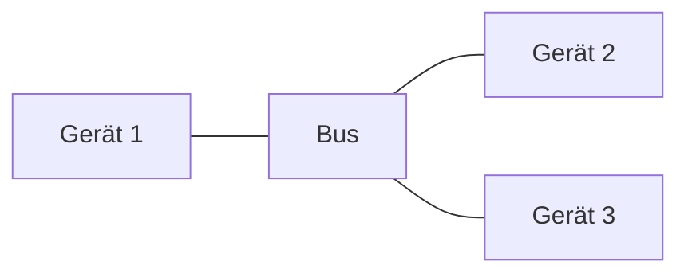
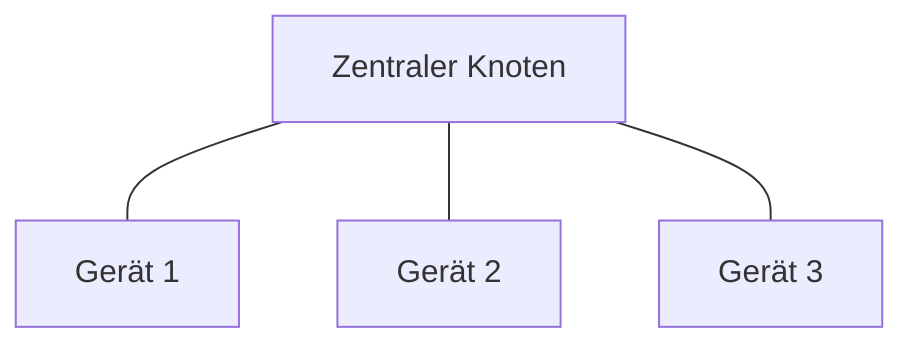
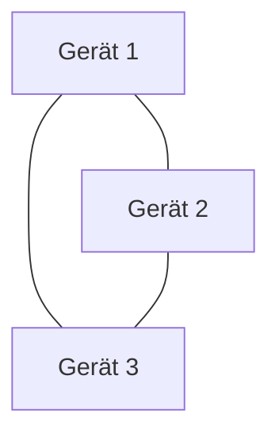
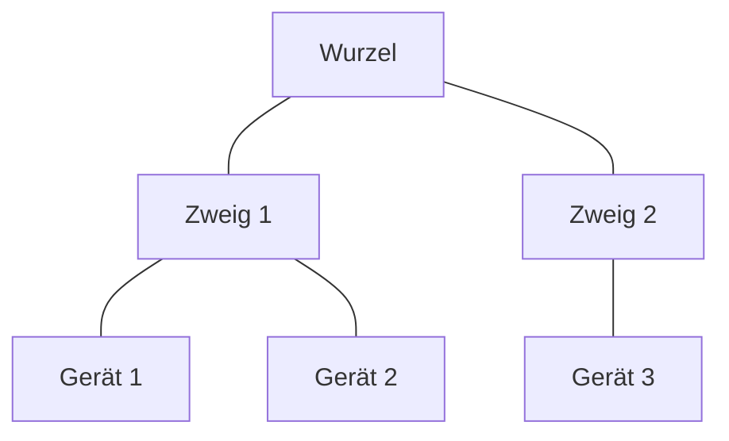

Netzwerkkonzepte beschreiben die Struktur, Organisation und Sicherheitsmechanismen von Computernetzen. Sie unterscheiden sich nach Typen wie Personal Area Networks (PAN), Local Area Networks (LAN), Metropolitan Area Networks (MAN), Wide Area Networks (WAN) und Global Area Networks (GAN). Diese Typen variieren in Reichweite, Datenübertragungsraten und Technologien. Zudem spielen Topologien wie Bus, Stern, Ring, Vermaschung und Baum eine Rolle für die physische und logische Anordnung von Geräten. Sicherheitsaspekte, einschließlich Verschlüsselung und Zugriffskontrollen, sind integraler Bestandteil, um Risiken wie Man-in-the-Middle-Angriffe zu minimieren.

## Netzwerktypen

### PAN
- **P**ersonal **A**rea **N**etwork
- Geräte in unmittelbarer Nähe.
- Kabelgebunden (FireWire, USB) oder kabellos (Bluetooth, ZigBee, Infrarot, NFC).
- Typische Teilnehmer: Laptops, Smartphones, Tablets.
- Datenübertragungsrate: Gering, abhängig von der Technologie (z. B. Bluetooth 1–3 Mbit/s, ZigBee bis zu 250 kbit/s).
- Ausdehnung: Wenige Meter (ca. 1–10 m).
- Sicherheitsaspekte: Verschlüsselung häufig über einfache Verfahren wie Preshared Key (Bluetooth) oder spezielle Standards wie AES bei ZigBee.

### LAN
- **L**ocal **A**rea **N**etwork
- Ethernet-basierte Übertragung über Kupfer- und Glasfaserkabel.
- Datenübertragungsrate: Hohe Übertragungsraten (10 Mbit/s bis 2,5 Gbit/s, in Rechenzentren auch 100 Gbit/s).
- Ausdehnung: Typischerweise auf ein Gebäude oder einen Campus beschränkt, nicht mehr als $(1 \text{ km}^2)$.
- Sicherheitsaspekte: Zugriffsbeschränkungen über [VLANs](/open-fidup/lerninhalte/vlan), Firewalls und Verschlüsselungstechnologien wie WPA3 für WLAN.

#### WLAN
- Wireless LAN
- Datenübertragungsrate: Variiert je nach Standard (Wi-Fi 5 bis zu 1,3 Gbit/s, Wi-Fi 6 bis zu 9,6 Gbit/s).
- Sicherheitsaspekte:
  - Verschlüsselung: WPA2, WPA3 (aktueller Standard), basierend auf Preshared Key (PSK) oder RADIUS-Authentifizierung.
  - Preshared Key (PSK): Gemeinsamer Schlüssel für alle Teilnehmer, einfach einzurichten, aber weniger sicher bei großen Netzwerken.
  - RADIUS: Zentralisiertes Authentifizierungsprotokoll für größere Netzwerke, bietet höhere Sicherheit durch individuelle Authentifizierung.
  - Absicherung: Über Firewalls, VPN für Remote-Zugriffe und Netzwerksicherheitsprotokolle wie [IPsec](/open-fidup/lerninhalte/ipsec).

#### VLAN
- Virtual LAN: Logische Trennung innerhalb eines physischen Netzwerks, z. B. zur Isolierung von Abteilungen in einem Unternehmen.
- Sicherheitsaspekte: Ermöglicht die logische Segmentierung, um den Netzwerkverkehr zu kontrollieren und die Angriffsfläche zu verringern.

### MAN
- **M**etropolitan **A**rea **N**etwork
- Verbindung zwischen Standorten in einer Stadt oder Region, z. B. zwischen Niederlassungen eines Unternehmens oder Fakultäten einer Universität.
- Datenübertragungsrate: Hohe Geschwindigkeit über Glasfaser (bis zu 100 Gbit/s).
- Ausdehnung: Bis zu 100 km.
- Sicherheitsaspekte: Nutzung von [VPNs](/open-fidup/lerninhalte/vpn-modelle) oder speziellen Sicherheitslösungen zur sicheren Übertragung zwischen den Standorten.

### WAN
- **W**ide **A**rea **N**etwork
- Bereitgestellt durch WAN-Provider (z. B. Telekommunikationsunternehmen).
- Technologien: MPLS, Frame Relay, VPN, DSL, Glasfaser, Satelliten.
- Datenübertragungsrate: Variiert stark, z. B. DSL 1–100 Mbit/s, Glasfaser 100 Mbit/s bis 100 Gbit/s.
- Ausdehnung: Über Länder und Kontinente hinweg.
- Sicherheitsaspekte: Datenverschlüsselung über VPN oder IPsec, oft in Kombination mit Firewalls.

### GAN
- **G**lobal **A**rea **N**etwork
- Zusammenschluss vieler WANs, um das Internet oder globale Firmennetze zu bilden.
- Verbindungsmethoden: Unterseekabel (Glasfaser) und Satelliten.
- Datenübertragungsrate: Abhängig von der Infrastruktur (Glasfaser > 100 Gbit/s, Satelliten bis zu 1 Gbit/s).
- Ausdehnung: Weltweit.
- Sicherheitsaspekte: Verschlüsselungstechnologien wie IPsec, TLS und Sicherheitsprotokolle zur Absicherung globaler Verbindungen.

## Sicherheitskonzepte und -risiken

### Verschlüsselungstechnologien
- WPA2/WPA3 (Wi-Fi Protected Access): Verschlüsselungsprotokolle für drahtlose Netzwerke.
  - WPA2: Nutzt AES (Advanced Encryption Standard) zur Sicherung von WLAN-Verbindungen.
  - WPA3: Verbesserte Sicherheit gegenüber WPA2, mit Features wie SAE (Simultaneous Authentication of Equals) zur Vermeidung von Brute-Force-Angriffen.
- Preshared Key (PSK): Einfaches Verfahren zur Verschlüsselung, bei dem ein gemeinsamer Schlüssel verwendet wird, geeignet für kleine Netzwerke.
- RADIUS (Remote Authentication Dial-In User Service): Authentifizierungsprotokoll für größere Netzwerke, bietet zentrale Authentifizierung und individuelle Nutzeranmeldungen.
- IPsec (Internet Protocol Security): Verschlüsselt den Datenverkehr auf Netzwerkebene, wird häufig bei VPNs verwendet.
- TLS (Transport Layer Security): Verschlüsselung für den Schutz von Daten während der Übertragung, besonders bei Webverbindungen (HTTPS).

### Sicherheitsrisiken
- Man-in-the-Middle-Angriffe (MitM): Ein Angreifer schaltet sich zwischen die Kommunikation zweier Parteien, um Daten abzufangen oder zu manipulieren.
- Unverschlüsselte Netzwerke: Ohne ausreichende Verschlüsselung können Angreifer leicht auf vertrauliche Daten zugreifen.
- Schwachstellen in drahtlosen Netzwerken: Schwache oder unsichere Passwörter und veraltete Verschlüsselungsstandards wie WEP oder unsichere WPA-Implementierungen erhöhen das Risiko von Angriffen.
- Rogue Access Points: Falsche, bösartige WLAN-Zugangspunkte, die eingerichtet werden, um unbefugten Zugriff auf ein Netzwerk zu erlangen.

### Sicherheitsmaßnahmen
- Firewalls: Blockieren unautorisierten Netzwerkverkehr, schützen vor externen Angriffen.
- VPN (Virtual Private Network): Verschlüsselt die Internetverbindung und verbirgt den Standort des Benutzers, besonders nützlich für Remote-Zugriffe.
- Netzsegmentierung (z. B. durch VLANs): Trennung von Netzwerkbereichen zur Kontrolle des Datenverkehrs und Minimierung von Sicherheitsrisiken.
- Zugriffskontrollen: Berechtigungen basierend auf Nutzerrollen (z. B. über RADIUS), um sicherzustellen, dass nur autorisierte Benutzer auf das Netzwerk zugreifen können.
- Regelmäßige Updates und Patches: Schließen von Sicherheitslücken in Betriebssystemen und Netzwerkgeräten.
- Starke Passwortrichtlinien: Verwendung komplexer und einzigartiger Passwörter, regelmäßige Passwortwechsel.
- Intrusion Detection Systems (IDS) und Intrusion Prevention Systems (IPS): Überwachen Netzwerke auf verdächtige Aktivitäten und reagieren darauf.

## Netzwerktopologien

### Bustopologie

- Merkmale: Alle Geräte sind über ein gemeinsames Kabel (Bus) verbunden.
- Vorteile: Einfach und kostengünstig zu implementieren.
- Nachteile: Bei Kabelbruch fällt das gesamte Netzwerk aus, begrenzte Bandbreite durch geteilte Verbindung.
- Ausdehnung: Begrenzt, typischerweise in kleineren Netzwerken.

### Sterntopologie

- Merkmale: Alle Geräte sind mit einem zentralen Knoten (Hub/Switch) verbunden.
- Vorteile: Hohe Ausfallsicherheit, da bei Ausfall eines Geräts das Netzwerk weiter funktioniert.
- Nachteile: Fällt der zentrale Knoten aus, ist das gesamte Netzwerk betroffen.
- Ausdehnung: Abhängig von der Anzahl der Verbindungen zum zentralen Knoten.

### Ringtopologie

- Merkmale: Geräte sind in einem Ring angeordnet, jedes Gerät ist mit zwei Nachbarn verbunden.
- Vorteile: Datenpakete zirkulieren in eine Richtung, daher geringe Kollisionen.
- Nachteile: Fällt ein Gerät oder ein Kabel aus, kann das Netzwerk unterbrochen werden.
- Ausdehnung: Geeignet für Netzwerke mit mäßiger Größe.

### Vermaschte Topologie

- Merkmale: Jedes Gerät ist mit mehreren anderen Geräten verbunden, oft in vollständig oder teilweise vermaschter Form.
- Vorteile: Sehr hohe Ausfallsicherheit, da mehrere Verbindungen existieren.
- Nachteile: Hoher Verkabelungsaufwand und kostenintensive Implementierung.
- Ausdehnung: Sehr große Netzwerke, typischerweise WANs.

### Baumtopologie

- Merkmale: Kombination aus Stern- und Bustopologie, Geräte sind hierarchisch angeordnet.
- Vorteile: Erweiterbar und relativ flexibel.
- Nachteile: Fällt eine zentrale Verbindung aus, können große Teile des Netzwerks ausfallen.
- Ausdehnung: Gut skalierbar für größere Netzwerke.

## Quellen

> Dalwigk, F. (2021, October 20). PAN vs. LAN vs. MAN vs. WAN vs. GAN vs. VPN ... Netzwerktypen einfach erklärt | Netzwerktechnik. Youtube. Retrieved from https://www.youtube.com/watch?v=JbGSAhl7ptI
> ChatGPT. (2024, September 18). Netzwerktypen und Sicherheitskonzepte. OpenAI. https://chat.openai.com