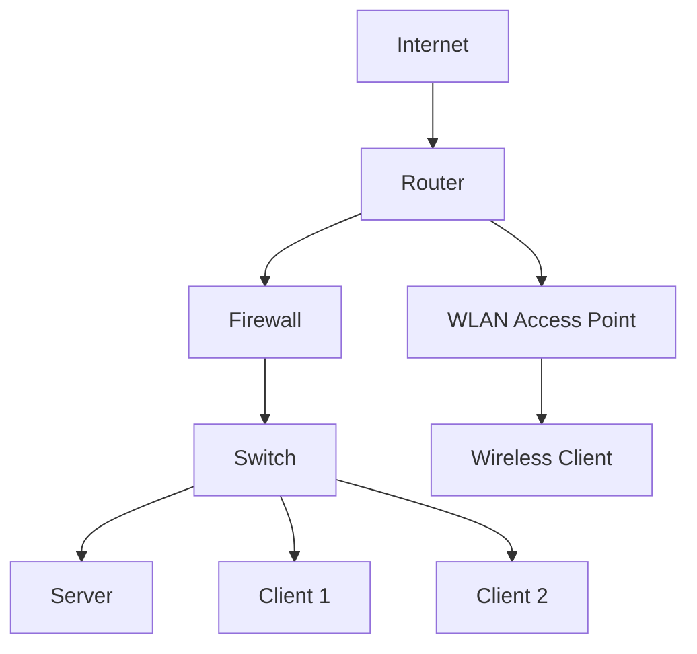
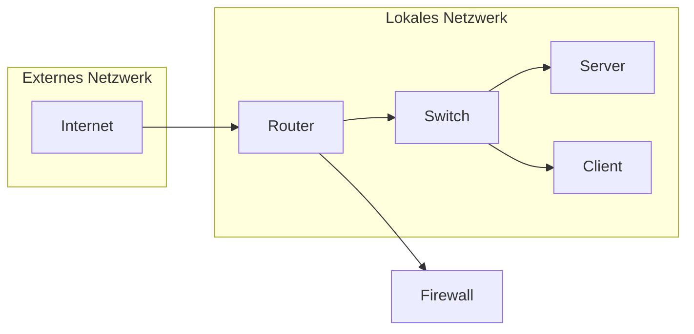

Ein Netzwerkplan ist eine schematische Darstellung der Netzwerkarchitektur, die die verschiedenen Komponenten eines Netzwerks und deren Verbindungen zeigt. Er dient als Leitfaden für die Planung, Implementierung und Verwaltung von Netzwerken.

## Wichtige Elemente eines Netzwerkplans

### Netzwerkgeräte
- **Router**: Leitet Daten zwischen verschiedenen Netzwerken.
- **Switches**: Verbindet Geräte innerhalb eines Netzwerks und leitet Datenpakete weiter.
- **Firewalls**: Schützen das Netzwerk vor unbefugtem Zugriff.
- **Server**: Stellen Dienste und Ressourcen für Clients bereit.
- **Clients**: Endgeräte, die auf die Dienste der Server zugreifen.

### Verbindungen
- **Kabeltypen**: Ethernet (Kupfer), Glasfaser (für hohe Bandbreiten).
- **Drahtlose Verbindungen**: WLAN, Bluetooth.

### IP-Adressierung
Die Zuweisung von IP-Adressen zu Geräten im Netzwerk erfolgt, wobei zwischen statischen und dynamischen IP-Adressen unterschieden wird. Dies unterstützt die effiziente Kommunikation innerhalb des Netzwerks.

### Sicherheitsmaßnahmen
Die Implementierung umfasst Firewalls, VPNs und Zugangskontrollen, um das Netzwerk zu schützen.

