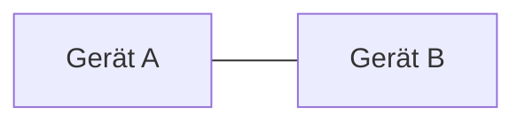
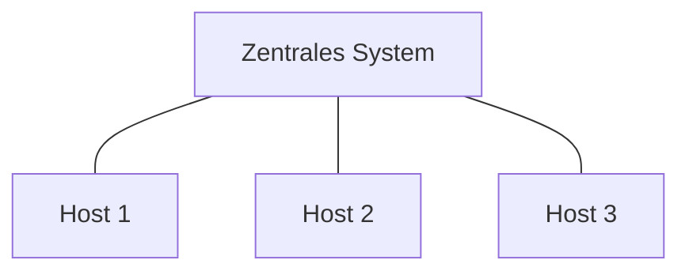
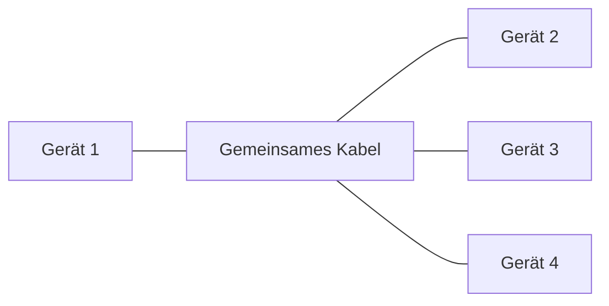
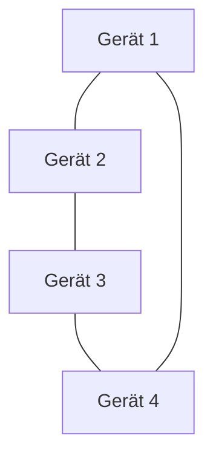
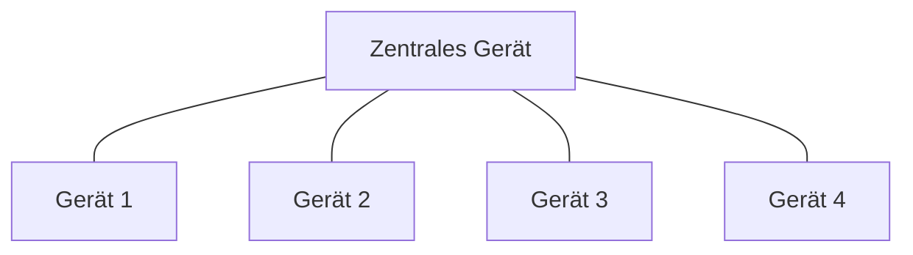
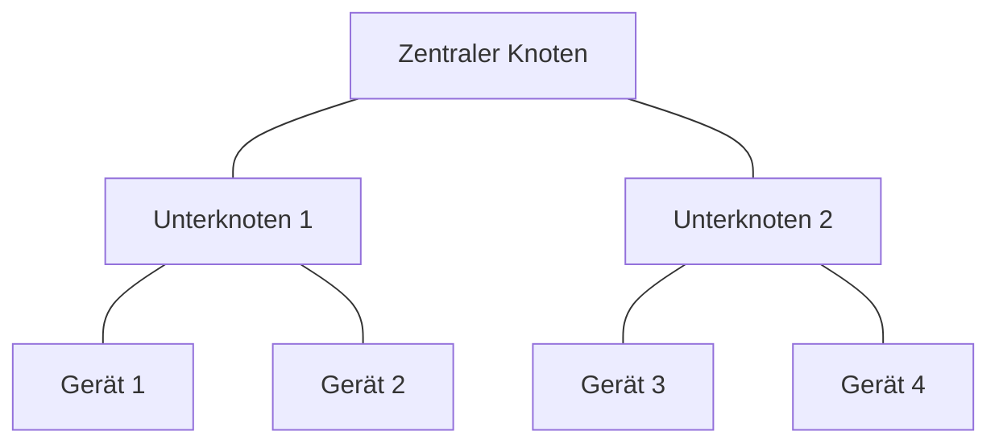
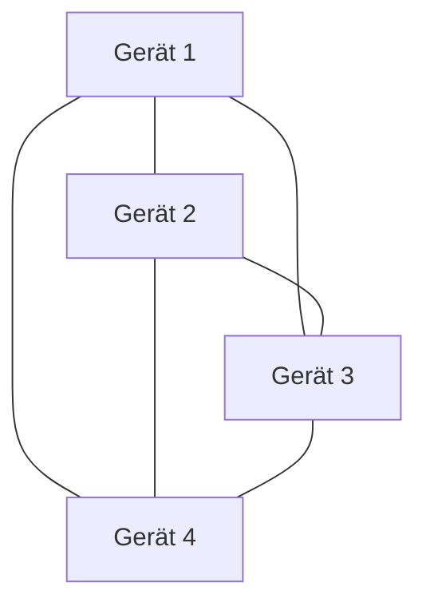

Netzwerktopologie bezeichnet die physische oder logische Anordnung von Geräten in einem Netzwerk. Sie bestimmt, wie Daten übertragen werden und beeinflusst Faktoren wie Kosten, Zuverlässigkeit und Wartungsaufwand. Häufige Topologien umfassen Point-to-Point, Point-to-Multipoint, Line- oder Chain-Topologie, Bus, Ring, Stern, Baum und Mesh. Jede Variante bietet spezifische Vorteile und Nachteile, die bei der Planung von [Netzwerkkonzepten](/open-fidup/lerninhalte/netzwerkkonzepte) berücksichtigt werden sollten.

## Point-to-Point

Diese Topologie besteht aus einer einfachen, direkten Verbindung zwischen zwei Geräten. Beide können die Verbindung für die gegenseitige Kommunikation nutzen.

- **Vorteile**:
  - Hohe Übertragungsgeschwindigkeit.
  - Einfache Implementierung und Wartung.
  - Geringe Latenzzeit.
- **Nachteile**:
  - Begrenzte Reichweite.
  - Hohe Kosten bei vielen Verbindungen.
  - Ausfall eines Geräts unterbricht die Kommunikation.

## Point-to-Multipoint

In dieser Topologie werden mehrere Hosts von einem zentralen System versorgt. Alle Hosts verfügen über eine eigene Leitung zum zentralen System.

- **Vorteile**:
  - Effiziente Nutzung der Ressourcen.
  - Einfache Erweiterung durch Hinzufügen neuer Hosts.
  - Zentrale Verwaltung und Kontrolle.
- **Nachteile**:
  - Das zentrale System kann zum Engpass werden.
  - Ausfall des zentralen Systems führt zu Kommunikationsausfall.
  - Höhere Komplexität in der Verkabelung.

## Line- oder Chain-Topologie

Bei dieser Topologie werden Leitungen von Host zu Host verlegt, wodurch eine lineare Kette entsteht.

- **Vorteile**:
  - Einfache Installation und Erweiterung.
  - Geringe Kosten für Verkabelung.
  - Geeignet für kleine Netzwerke.
- **Nachteile**:
  - Ausfall eines Hosts kann das gesamte Netzwerk beeinträchtigen.
  - Begrenzte Anzahl anschließbarer Hosts.
  - Schwierigkeiten bei der Fehlersuche.

## Bus-Topologie

Alle Geräte sind über ein gemeinsames Kabel verbunden.

- **Vorteile**:
  - Geringe Kosten für Verkabelung.
  - Einfache Installation.
  - Geeignet für kleine Netzwerke.
- **Nachteile**:
  - Ausfall des Hauptkabels führt zum Ausfall des gesamten Netzwerks.
  - Begrenzte Anzahl anschließbarer Geräte.
  - Schwierigkeiten bei der Fehlersuche.

## Ring-Topologie

Jedes Gerät ist mit zwei anderen verbunden, wodurch ein geschlossener Ring entsteht.

- **Vorteile**:
  - Datenübertragung in eine Richtung reduziert Kollisionen.
  - Einfache Datenübertragung und -verwaltung.
  - Vorhersehbare Leistung.
- **Nachteile**:
  - Ausfall eines Geräts kann das gesamte Netzwerk beeinträchtigen.
  - Schwierige Fehlersuche.
  - Höhere Kosten für Verkabelung.

## Stern-Topologie

Alle Geräte sind über ein zentrales Gerät, wie einen Switch oder Hub, verbunden.

- **Vorteile**:
  - Einfache Fehlersuche und Wartung.
  - Ausfall eines Geräts beeinträchtigt nicht das gesamte Netzwerk.
  - Hohe Leistung und Skalierbarkeit.
- **Nachteile**:
  - Abhängigkeit vom zentralen Gerät.
  - Höhere Kosten für zentrale Geräte und Verkabelung.
  - Komplexität bei der Verkabelung.

## Baum-Topologie

Diese Topologie kombiniert Elemente der Stern- und Bus-Topologie in einer hierarchischen Struktur.

- **Vorteile**:
  - Flexibel und erweiterbar.
  - Gute Organisation der Netzwerkstruktur.
  - Einfache Fehlersuche in Teilbereichen.
- **Nachteile**:
  - Komplexität in der Implementierung.
  - Ausfall des Hauptkabels kann große Teile des Netzwerks beeinträchtigen.
  - Höhere Kosten für Verkabelung und zentrale Geräte.

## Mesh-Topologie

Jedes Gerät ist mit mehreren anderen verbunden, was eine netzartige Struktur ergibt.

- **Vorteile**:
  - Hohe Redundanz und Ausfallsicherheit.
  - Daten können mehrere Wege nehmen, was die Leistung verbessert.
  - Gute Skalierbarkeit.
- **Nachteile**:
  - Hohe Kosten für Verkabelung und Hardware.
  - Komplexe Implementierung und Wartung.
  - Schwierigkeiten bei der Fehlersuche.