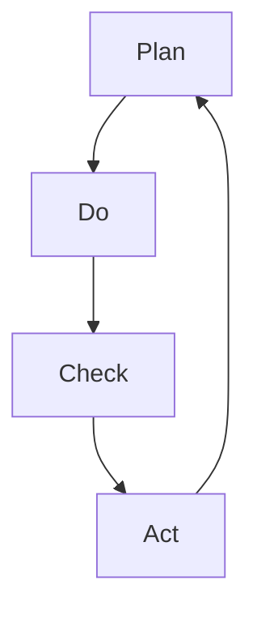

PDCA ist ein zyklisches Vorgehensmodell, das im Rahmen des [kontinuierlichen Verbesserungsprozesses](/open-fidup/lerninhalte/kontinuierlicher-verbesserungsprozess) eingesetzt wird. Es dient der systematischen Weiterentwicklung von Produkten und Dienstleistungen sowie der Analyse von Fehlern. Das Modell besteht aus vier Schritten: Planen, Umsetzen, Überprüfen und Handeln.

## Schritte

1. **Plan** (Planen): Ziele formulieren, das Problem definieren, Ressourcen festlegen, eine Lösung entwickeln und Kriterien für den Erfolg bestimmen.
2. **Do** (Umsetzen): Den Plan in die Praxis umsetzen.
3. **Check** (Überprüfen): Einen [Soll-Ist-Vergleich](/open-fidup/lerninhalte/soll-ist-vergleich) durchführen und prüfen, ob der Plan umgesetzt wurde.
4. **Act** (Handeln): Auf das Ergebnis reagieren und die Situation verbessern.

## PDSA

PDSA ist eine Variante des PDCA-Modells, bei der der dritte Schritt nicht nur einen reinen Soll-Ist-Vergleich umfasst, sondern auch das Lernen aus der Umsetzung betont.

3. **Study** (Studieren): Kein reiner Soll-Ist-Vergleich, sondern das Ziehen von Erkenntnissen aus der umgesetzten Maßnahme.

## Vorteile

- Der einfache Aufbau erfordert wenig Anleitung.
- Die kreisförmige Konzeption fördert eine ständige Verbesserung.
- Der iterative Ansatz ermöglicht Kontrollen und Analysen.

## Nachteile

- Unklare Definitionen der Schritte können zu Fehlausführungen führen.
- Verbesserungen müssen langfristig bedacht werden.
- Es handelt sich eher um einen reaktiven als um einen proaktiven Ansatz.

## Quellen

> Was ist ein PDCA-Zyklus? Plan-Do-Check-Act einfach erklärt. (2024, September 10). Retrieved from https://der-prozessmanager.de/aktuell/wissensdatenbank/pdca-zyklus