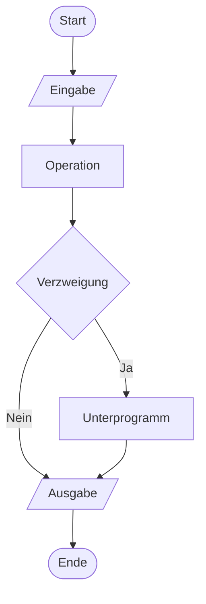
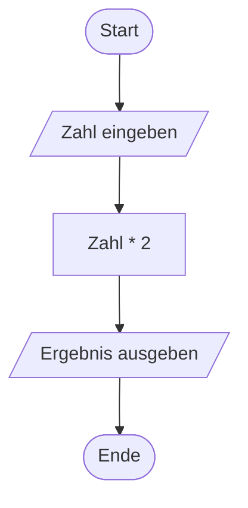

Der Programmablaufplan, auch als Programmablaufdiagramm bekannt, ist ein grafisches Werkzeug zur Darstellung von [Ablaufdiagrammen](/open-fidup/lerninhalte/flussdiagramm) für Computerprogramme und Algorithmen. Er verwendet standardisierte Symbole, um den Ablauf von Prozessen visuell zu verdeutlichen, einschließlich Start- und Endpunkten, Operationen, Verzweigungen sowie Ein- und Ausgaben. Dies unterstützt die Analyse, das Debugging und die Kommunikation von Programmstrukturen.

## Elemente

Der Programmablaufplan nutzt eine Reihe von Symbolen, die jeweils spezifische Funktionen repräsentieren. Diese Symbole sind in der Regel rechteckig oder oval und werden durch Pfeile verbunden, um den Kontrollfluss anzuzeigen. Nachfolgend sind die gängigen Elemente aufgeführt:

- **Anfangs-/Endpunkt**: Ein Oval, das den Beginn oder das Ende eines Programms markiert.
- **Kontrollfluss**: Ein Pfeil, der die Richtung des Ablaufs zwischen Symbolen angibt.
- **Operation**: Ein Rechteck, das eine Tätigkeit oder Berechnung darstellt.
- **Unterprogramm**: Ein Rechteck mit doppelten vertikalen Linien, das eine Folge von nicht näher definierten Anweisungen repräsentiert.
- **Verzweigung**: Eine Raute, die eine Entscheidung oder Bedingung symbolisiert, mit zwei oder mehr ausgehenden Pfaden.
- **Ein- und Ausgabe**: Ein Parallelogramm, das Dateninput oder -output anzeigt.

Das folgende Mermaid-Diagramm veranschaulicht diese Symbole in einem einfachen Beispiel:

## Beispiel

Ein einfaches Beispiel für einen Programmablaufplan zeigt den Ablauf eines Programms, das eine Zahl einliest, sie verdoppelt und das Ergebnis ausgibt. Das folgende Mermaid-Diagramm stellt dies dar:

## Quellen

> Autoren der Wikimedia-Projekte. (2004, March 22). Programmablaufplan – Wikipedia. Retrieved from https://de.wikipedia.org/w/index.php?title=Programmablaufplan&oldid=245655720