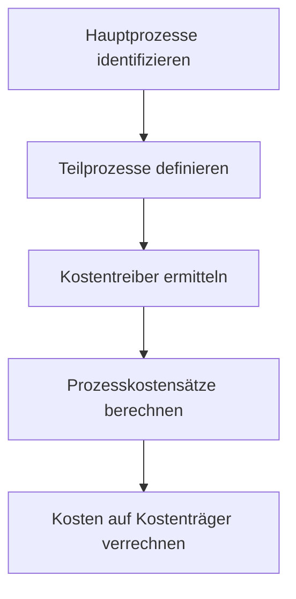

Die Prozesskostenrechnung ist ein Verfahren der Kostenrechnung, das Gemeinkosten beanspruchungsgerecht auf Kostenträger verteilt, indem Prozesse und Kostentreiber analysiert werden. Sie basiert auf dem Activity Based Costing und zielt auf eine genauere Kalkulation ab.

## Geschichte

Die Prozesskostenrechnung entwickelte sich aus der Notwendigkeit, steigende Gemeinkosten in Unternehmen besser zu verrechnen. Bei Siemens wurde bereits 1975 ein erster Ansatz entwickelt. In den 1980er Jahren griffen Miller und Vollmann sowie Cooper und Kaplan die Idee auf, wobei Kaplan maßgeblich am Activity Based Costing beteiligt war. In Deutschland adaptierten Horváth und Mayer das Konzept an die lokalen Gegebenheiten.

## Prinzip

Das Prinzip der Prozesskostenrechnung liegt in der Identifizierung von Prozessen und deren Kostentreibern. Statt Gemeinkosten pauschal zuzuschlagen, werden sie den Prozessen zugeordnet, die sie verursachen. Kostentreiber sind Maßgrößen wie Anzahl der Aufträge oder bearbeitete Stunden, die die Inanspruchnahme der Ressourcen widerspiegeln.

Prozesse werden in Haupt- und Teilprozesse unterteilt. Leistungsmengeninduzierte (lmi) Prozesse variieren mit der Ausbringungsmenge, leistungsmengenneutrale (lmn) sind fix. Der Prozesskostensatz ergibt sich aus den Kosten dividiert durch die Prozessmenge.

## Vorgehensweise

Die Implementierung folgt einem strukturierten Ansatz:

1. Definition von Hauptprozessen pro Kostenstelle.
2. Unterteilung in Teilprozesse und Aktivitäten.
3. Erfassung der Zeiten je Teilprozess.
4. Klassifizierung als lmi oder lmn.
5. Erfassung der Kostentreiber für lmi-Prozesse.
6. Verteilung der Kosten und Berechnung der Prozesskostensätze.
7. Erstellung einer Preisliste der Prozesse.
8. Abrechnung von Aufträgen basierend auf durchlaufenen Prozessen.

## Anwendung

Prozesskostenrechnung findet Anwendung in Unternehmen mit hohen Gemeinkostenanteilen, wie in der Fertigungsindustrie, Dienstleistungen und Verwaltung. Sie unterstützt die Kalkulation, Preisbildung und Entscheidungen über Produktlinien oder Outsourcing.

## Vorteile und Nachteile

Vorteile umfassen eine verursachungsgerechtere Kostenverteilung, bessere Entscheidungsgrundlagen und Identifizierung ineffizienter Prozesse. Nachteile sind der hohe Implementierungsaufwand, die Notwendigkeit detaillierter Daten und mögliche Fehlinterpretationen ohne Leistungsbeurteilung.

## Quellen

- Horváth, P., & Mayer, R. (1989). Prozesskostenrechnung. In: Controlling, 1(1), 214-219.
- Cooper, R., & Kaplan, R. S. (1988). Measure costs right: Make the right decisions. Harvard Business Review, 96-103.
- Wikipedia: Prozesskostenrechnung. Abgerufen von https://de.wikipedia.org/wiki/Prozesskostenrechnung
