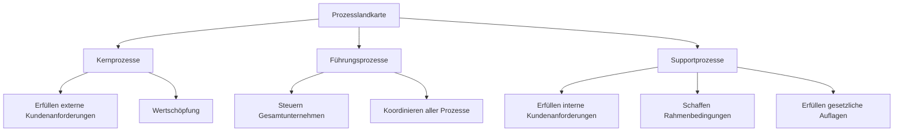

Prozesslandkarten sind eine Darstellungsform der Ablauforganisation eines Unternehmens. Sie zeigen, was im Unternehmen geschieht, und sind nicht normiert. Diese Karten gliedern die Prozesse in drei Hauptbereiche: Leistungs- oder Kernprozesse, Führungs- oder Managementprozesse sowie Unterstützungs- oder Supportprozesse. Dadurch schaffen sie Übersicht über interne Abläufe und Wertschöpfung.

## Gliederung

Prozesslandkarten unterteilen sich in folgende Kategorien:

1. **Leistungs- oder Kernprozesse**  
   Diese Prozesse erfüllen externe Kundenanforderungen und stellen die Wertschöpfung dar. Beispiele umfassen die Ermittlung von Kundenanforderungen, die Entwicklung neuer Produkte und die Produktion der Ware.

2. **Führungs- oder Managementprozesse**  
   Sie steuern das Gesamtunternehmen, legen generelle Richtlinien fest und koordinieren alle Prozesse im Prozessmodell.

3. **Unterstützungs- oder Supportprozesse**  
   Diese erfüllen interne Kundenanforderungen, schaffen erforderliche Rahmenbedingungen – wie IT-Prozesse oder Personal-Prozesse – und erfüllen gesetzliche Auflagen, beispielsweise im Rechnungswesen.

Die folgende Visualisierung zeigt die Struktur einer Prozesslandkarte in schematischer Form:

## Quellen

BPM&O GmbH. (2021, June 09). Prozesslandkarte (Definition | Darstellung | Beispiel). Youtube. Retrieved from https://www.youtube.com/watch?v=zuLm4jd-rK0  
caesar. academy. (2022, November 29). Prozesslandkarte - 👨🏼‍🎓 EINFACH ERKLÄRT 👩🏼‍🎓. Youtube. Retrieved from https://www.youtube.com/watch?v=dO4A359BTB8