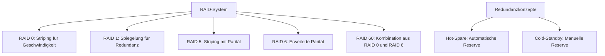
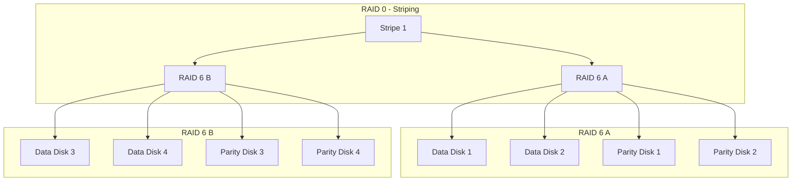

RAID, kurz für Redundant Array of Independent Disks, bezeichnet eine Technologie zur Kombination mehrerer Festplatten in einem System, um Leistung, Kapazität und Datensicherheit zu verbessern. Es erfordert einen RAID-Controller zur Verwaltung. Verschiedene RAID-Levels bieten unterschiedliche Ansätze, von reiner Geschwindigkeitssteigerung bis hin zu Redundanz gegen Ausfälle. Zusätzliche Konzepte wie Hot-Spare und Cold-Standby unterstützen die Zuverlässigkeit.

## Definition und Überblick

RAID kombiniert mehrere Festplatten zu einem Array, um Daten effizient zu speichern und zu schützen. Die Kapazität richtet sich nach der kleinsten Festplatte im Array. Ein RAID-Controller ist notwendig, um die Datenverteilung und -sicherung zu steuern.

## RAID-Levels

### RAID 0

RAID 0 erfordert mindestens zwei Festplatten. Daten werden in gleichgroße Blöcke aufgeteilt und abwechselnd auf die Festplatten geschrieben, was als Striping bezeichnet wird. Die Blockgröße beträgt in der Regel 64 kByte. Die Kapazität des Arrays entspricht der Summe der Kapazitäten aller Festplatten, begrenzt durch die kleinste Festplatte.

Vorteile:
- Verarbeitung großer Datenmengen.
- Schnellere Lese- und Schreibprozesse.

Nachteile:
- Hohe Ausfallwahrscheinlichkeit, da kein Schutz vor Festplattenausfällen besteht.

Formel für die Kapazität:
$$Kapazität = (Anzahl \space Festplatten) \times Festplattenkapazität$$

### RAID 1

RAID 1 erfordert mindestens zwei Festplatten. Daten werden parallel auf zwei Festplatten geschrieben, was eine Spiegelung ermöglicht. Die Kapazität des Arrays entspricht der Kapazität der kleinsten Festplatte.

Vorteile:
- Hohes Maß an Datensicherheit; ein Ausfall kann toleriert werden.
- Lesegeschwindigkeit kann bei intelligentem RAID-Controller erhöht werden.

Nachteile:
- Doppelte Speicherkapazität erforderlich.
- Hohe Kosten.

Formel für die Kapazität:
$$Kapazität = \left(\dfrac{Anzahl \space Festplatten}{2}\right) \times Festplattenkapazität$$

### RAID 5

RAID 5 erfordert mindestens drei Festplatten. Es kombiniert Striping mit Paritätsinformationen, die mittels XOR-Verknüpfung berechnet werden. Die Kapazität des Arrays entspricht der Summe der Kapazitäten minus einer Festplatte für Parität, begrenzt durch die kleinste Festplatte.

Vorteile:
- Hohes Maß an Datensicherheit.
- Optimale Speicherkapazitätsnutzung im Vergleich zu RAID 1.

Nachteile:
- Schreibvorgänge sind langsamer aufgrund der Paritätsberechnung.
- Paritätsinformationen beanspruchen zusätzlichen Speicherplatz.

Formel für die Kapazität:
$$Kapazität = (Anzahl \space Festplatten - 1) \times Festplattenkapazität$$

Bei RAID 6, einer Erweiterung mit doppelter Parität, gilt:
$$Kapazität = (Anzahl \space Festplatten - 2) \times Festplattenkapazität$$

### RAID 60

RAID 60 ist eine Kombination aus RAID 0 und RAID 6, die eine hohe Ausfallsicherheit mit gesteigertem Datendurchsatz bietet. Es handelt sich um ein redundantes Array unabhängiger Festplatten, das Daten über mehrere RAID-6-Verbünde streift und dabei eine doppelte Paritätsinformation verwendet.

RAID 60 kombiniert die Prinzipien von RAID 0 (Striping) und RAID 6 (Block-Level Striping mit doppelter Paritätsinformation). Dabei werden mehrere RAID-6-Arrays zu einem übergeordneten RAID-0-Verbund zusammengefasst. Die Daten werden in Streifen (Stripes) aufgeteilt und über die einzelnen RAID-6-Arrays verteilt, wobei jedes RAID-6-Array eine doppelte Parität für Fehlerkorrektur berechnet.

Ein RAID-60-Verbund benötigt mindestens acht Festplatten, typischerweise zwei RAID-6-Arrays mit je vier Festplatten. Die nutzbare Kapazität ergibt sich aus der Formel: (Anzahl der RAID-6-Arrays) × (Anzahl der Datenplatten pro RAID-6-Array) × Kapazität der kleinsten Festplatte. Bei zwei RAID-6-Arrays mit je vier Festplatten (zwei Datenplatten und zwei Paritätsplatten pro Array) beträgt die nutzbare Kapazität somit zwei Arrays × zwei Datenplatten × Kapazität.

Vorteile:
- Hohe Ausfallsicherheit, da es den gleichzeitigen Ausfall von bis zu zwei beliebigen Festplatten pro RAID-6-Array tolerieren kann.
- Gesteigerter Datendurchsatz durch Striping über mehrere Arrays.

Nachteile:
- Geringere nutzbare Kapazität im Vergleich zu einfacheren RAID-Levels.
- Zeitaufwändige Rekonstruktion nach Ausfällen.

Anwendungsbereiche:
- Rechenzentren, Datenbanken und Archivierungssysteme, die hohe Leistung und Redundanz erfordern.

Zusätzlich zu den RAID-Levels unterstützen Konzepte wie Hot-Spare und Cold-Standby die Redundanz in [redundanten Systemen](/open-fidup/lerninhalte/redundante-systeme).

### MTTDL-Berechnung

Die Mean Time To Data Loss (MTTDL) ist eine Kennzahl, die die erwartete Zeit bis zum Datenverlust in einem RAID-System angibt. Sie misst die Zuverlässigkeit redundanter Speichersysteme und hilft bei der Planung von Datensicherheitsmaßnahmen.

## Definition

MTTDL bezeichnet die mittlere Zeitspanne, die vergeht, bis ein RAID-Array Daten verliert. Dies tritt ein, wenn die Anzahl der ausgefallenen Festplatten die Toleranz des RAID-Levels überschreitet, beispielsweise bei RAID 5, wenn zwei Festplatten gleichzeitig ausfallen. Im Gegensatz zur Mean Time Between Failures (MTBF), die die Zuverlässigkeit einzelner Komponenten beschreibt, fokussiert sich MTTDL auf das Gesamtsystem.

## Berechnung

Die MTTDL wird basierend auf der MTBF der einzelnen Festplatten, der Anzahl der Festplatten \(n\) und der Zeit für den Wiederaufbau (Rebuild-Zeit \(T_{rebuild}\)) berechnet. Eine Näherungsformel für RAID 5 lautet:

$$ MTTDL = \frac{MTBF^2}{(n-1) \times T_{rebuild}} $$

Hierbei gilt:
- $MTBF$: Mittlere Zeit zwischen Ausfällen einer einzelnen Festplatte (in Stunden).
- $(n$: Anzahl der Festplatten im Array.
- $(T_{rebuild}$: Zeit, die für den Wiederaufbau des Arrays nach einem Ausfall benötigt wird (in Stunden).

Diese Formel berücksichtigt die Wahrscheinlichkeit, dass während des Rebuilds eine zweite Festplatte ausfällt, was zu Datenverlust führt.

Für andere RAID-Levels variiert die Formel. Bei RAID 1 mit \(n\) Festplatten beträgt die MTTDL \( MTTDL = \frac{MTBF}{n} \), da der Ausfall aller Festplatten erforderlich ist.

## Beispiele

Angenommen, ein RAID-5-Array besteht aus 5 Festplatten mit einer MTBF von 100.000 Stunden. Die Rebuild-Zeit beträgt 10 Stunden. Dann ergibt sich:

$$ MTTDL = \frac{100000^2}{(5-1) \times 10} = \frac{10.000.000.000}{40} = 250.000.000 \text{ Stunden} $$

Das entspricht etwa 28.500 Jahren, was eine hohe Zuverlässigkeit anzeigt.

Bei RAID 6, das zwei Ausfälle toleriert, ist die MTTDL höher, da drei Ausfälle erforderlich sind. Die Formel wird komplexer und berücksichtigt die Wahrscheinlichkeit von Dreifachausfällen.

## Bedeutung

MTTDL ist entscheidend für die Dimensionierung von RAID-Systemen in Unternehmensumgebungen. Sie hilft, das Risiko von Datenverlust zu quantifizieren und Entscheidungen über Redundanzlevel, Hot-Spare-Laufwerke oder Backup-Strategien zu treffen. Hohe MTTDL-Werte deuten auf robuste Systeme hin, während niedrige Werte zusätzliche Schutzmaßnahmen erfordern.

### Hot-Spare

Ein Hot-Spare ist eine zusätzliche Festplatte, die in einem RAID-System bereitgehalten wird, um im Falle eines Festplattenausfalls sofort einspringen zu können.

Vorteile:
- Automatischer Wechsel bei Ausfall, was die Ausfallzeit minimiert.
- Keine manuelle Intervention erforderlich.

Nachteile:
- Die Festplatte kann nicht für Daten verwendet werden, solange sie im Standby-Modus ist.
- Erhöhte Kosten durch zusätzliche Hardware.

### Cold-Standby

Ein Cold-Standby ist eine zusätzliche Festplatte, die nicht aktiv im RAID-System integriert ist, aber im Falle eines Ausfalls manuell hinzugefügt werden kann.

Vorteile:
- Kostengünstiger, da keine permanente Hardware benötigt wird.
- Flexibilität, da die Festplatte bei Bedarf hinzugefügt werden kann.

Nachteile:
- Längere Ausfallzeiten, da eine manuelle Intervention erforderlich ist.
- Erhöhtes Risiko von Datenverlust, wenn der Ausfall nicht schnell genug behoben wird.

## Quellen

Coleman, L. (2024). PITS Globale Datenrettungsdienste. PITS Globale Datenrettungsdienste. Abgerufen von https://www.pitsdatenrettung.de/blog/raid-level-  
Boekhoven, P. (2024, 18. Februar). RAID-Systeme: Effiziente Speicherorganisation einfach erklärt! Youtube. Abgerufen von https://www.youtube.com/watch?v=za8ZJgIWMKQ  
Formeln RAID - Fachinformatiker Systemintegration. (2024, 18. September). Abgerufen von https://www.karteikarte.com/lesson/69679/formeln-raid  
Patterson, D. A., Gibson, G. A., & Katz, R. H. (1988). A case for redundant arrays of inexpensive disks (RAID). ACM SIGMOD Record, 17(3), 109-116.  
Chen, P. M., Lee, E. K., Gibson, G. A., Katz, R. H., & Patterson, D. A. (1994). RAID: High-performance, reliable secondary storage. ACM Computing Surveys, 26(2), 145-185.