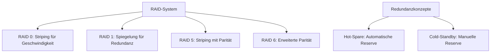

RAID, kurz für Redundant Array of Independent Disks, bezeichnet eine Technologie zur Kombination mehrerer Festplatten in einem System, um Leistung, Kapazität und Datensicherheit zu verbessern. Es erfordert einen RAID-Controller zur Verwaltung. Verschiedene RAID-Levels bieten unterschiedliche Ansätze, von reiner Geschwindigkeitssteigerung bis hin zu Redundanz gegen Ausfälle. Zusätzliche Konzepte wie Hot-Spare und Cold-Standby unterstützen die Zuverlässigkeit.

## Definition und Überblick

RAID kombiniert mehrere Festplatten zu einem Array, um Daten effizient zu speichern und zu schützen. Die Kapazität richtet sich nach der kleinsten Festplatte im Array. Ein RAID-Controller ist notwendig, um die Datenverteilung und -sicherung zu steuern.

## RAID-Levels

### RAID 0

RAID 0 erfordert mindestens zwei Festplatten. Daten werden in gleichgroße Blöcke aufgeteilt und abwechselnd auf die Festplatten geschrieben, was als Striping bezeichnet wird. Die Blockgröße beträgt in der Regel 64 kByte. Die Kapazität des Arrays entspricht der Summe der Kapazitäten aller Festplatten, begrenzt durch die kleinste Festplatte.

Vorteile:
- Verarbeitung großer Datenmengen.
- Schnellere Lese- und Schreibprozesse.

Nachteile:
- Hohe Ausfallwahrscheinlichkeit, da kein Schutz vor Festplattenausfällen besteht.

Formel für die Kapazität:
$$Kapazität = (Anzahl \space Festplatten) \times Festplattenkapazität$$

### RAID 1

RAID 1 erfordert mindestens zwei Festplatten. Daten werden parallel auf zwei Festplatten geschrieben, was eine Spiegelung ermöglicht. Die Kapazität des Arrays entspricht der Kapazität der kleinsten Festplatte.

Vorteile:
- Hohes Maß an Datensicherheit; ein Ausfall kann toleriert werden.
- Lesegeschwindigkeit kann bei intelligentem RAID-Controller erhöht werden.

Nachteile:
- Doppelte Speicherkapazität erforderlich.
- Hohe Kosten.

Formel für die Kapazität:
$$Kapazität = \left(\dfrac{Anzahl \space Festplatten}{2}\right) \times Festplattenkapazität$$

### RAID 5

RAID 5 erfordert mindestens drei Festplatten. Es kombiniert Striping mit Paritätsinformationen, die mittels XOR-Verknüpfung berechnet werden. Die Kapazität des Arrays entspricht der Summe der Kapazitäten minus einer Festplatte für Parität, begrenzt durch die kleinste Festplatte.

Vorteile:
- Hohes Maß an Datensicherheit.
- Optimale Speicherkapazitätsnutzung im Vergleich zu RAID 1.

Nachteile:
- Schreibvorgänge sind langsamer aufgrund der Paritätsberechnung.
- Paritätsinformationen beanspruchen zusätzlichen Speicherplatz.

Formel für die Kapazität:
$$Kapazität = (Anzahl \space Festplatten - 1) \times Festplattenkapazität$$

Bei RAID 6, einer Erweiterung mit doppelter Parität, gilt:
$$Kapazität = (Anzahl \space Festplatten - 2) \times Festplattenkapazität$$

## Redundanzkonzepte

Zusätzlich zu den RAID-Levels unterstützen Konzepte wie Hot-Spare und Cold-Standby die Redundanz in [redundanten Systemen](/open-fidup/lerninhalte/redundante-systeme).

### Hot-Spare

Ein Hot-Spare ist eine zusätzliche Festplatte, die in einem RAID-System bereitgehalten wird, um im Falle eines Festplattenausfalls sofort einspringen zu können.

Vorteile:
- Automatischer Wechsel bei Ausfall, was die Ausfallzeit minimiert.
- Keine manuelle Intervention erforderlich.

Nachteile:
- Die Festplatte kann nicht für Daten verwendet werden, solange sie im Standby-Modus ist.
- Erhöhte Kosten durch zusätzliche Hardware.

### Cold-Standby

Ein Cold-Standby ist eine zusätzliche Festplatte, die nicht aktiv im RAID-System integriert ist, aber im Falle eines Ausfalls manuell hinzugefügt werden kann.

Vorteile:
- Kostengünstiger, da keine permanente Hardware benötigt wird.
- Flexibilität, da die Festplatte bei Bedarf hinzugefügt werden kann.

Nachteile:
- Längere Ausfallzeiten, da eine manuelle Intervention erforderlich ist.
- Erhöhtes Risiko von Datenverlust, wenn der Ausfall nicht schnell genug behoben wird.

## Quellen

Coleman, L. (2024). PITS Globale Datenrettungsdienste. PITS Globale Datenrettungsdienste. Abgerufen von https://www.pitsdatenrettung.de/blog/raid-level-  
Boekhoven, P. (2024, 18. Februar). RAID-Systeme: Effiziente Speicherorganisation einfach erklärt! Youtube. Abgerufen von https://www.youtube.com/watch?v=za8ZJgIWMKQ  
Formeln RAID - Fachinformatiker Systemintegration. (2024, 18. September). Abgerufen von https://www.karteikarte.com/lesson/69679/formeln-raid