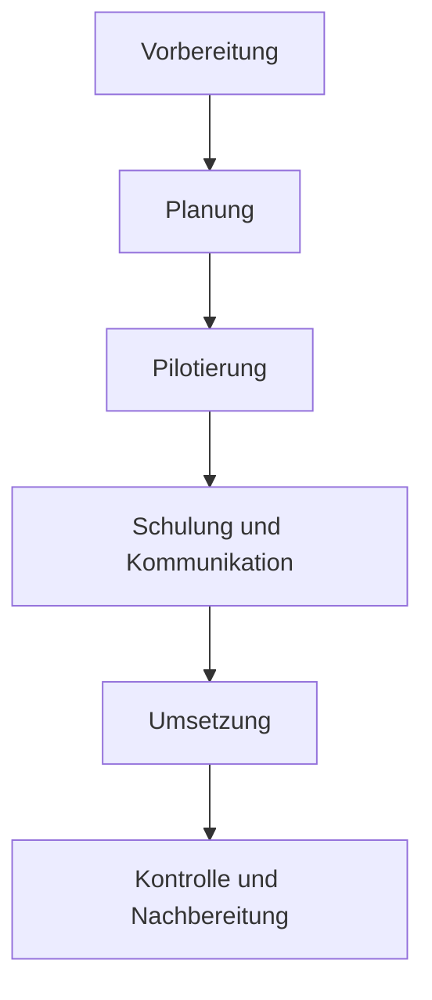

Der Roll-out des Sollprozesses beschreibt die systematische Einführung und Umsetzung eines neu definierten oder optimierten Prozesses in einer Organisation. Er zielt darauf ab, neue Arbeitsabläufe effizient zu implementieren, Widerstände zu minimieren und eine einheitliche Ausführung sicherzustellen, um die definierten Ziele zu erreichen.

## Ziele des Prozess-Roll-outs
- Effiziente Implementierung neuer Arbeitsabläufe
- Minimierung von Widerständen und Störungen
- Sicherstellung einer einheitlichen Prozessausführung
- Erreichung der definierten Prozessziele

## Phasen des Roll-outs
Der Roll-out erfolgt in mehreren aufeinanderfolgenden Phasen, die eine strukturierte Umsetzung gewährleisten.

1. Vorbereitung
2. Planung
3. Pilotierung
4. Schulung und Kommunikation
5. Umsetzung
6. Kontrolle und Nachbereitung

## Wichtige Elemente zur Unterstützung des Roll-outs
Zur Unterstützung des Roll-outs sind verschiedene Elemente erforderlich, die in Kategorien unterteilt werden können.

1. Change Management
   - [Stakeholder-Analyse](/open-fidup/lerninhalte/stakeholder-analyse)
   - Kommunikationsplan
   - Widerstandsmanagement
2. Schulungskonzept
   - Bedarfsanalyse
   - Schulungsmaterialien
   - Train-the-Trainer-Konzepte
3. Technische Unterstützung
   - IT-Systeme und Tools
   - Prozessdokumentation
   - Arbeitsanweisungen
4. Prozess-Governance
   - Rollen und Verantwortlichkeiten
   - Eskalationswege
   - Prozess-Controlling

## Erfolgsfaktoren für den Roll-out
- Klare Zielsetzung und Nutzendarstellung
- Unterstützung durch das Top-Management
- Frühzeitige Einbindung der Mitarbeiter
- Ausreichende Ressourcenbereitstellung
- Flexible Anpassung an Feedback und Erfahrungen

## Herausforderungen beim Roll-out
- Widerstand gegen Veränderungen
- Komplexität des neuen Prozesses
- Unzureichende Schulung und Kommunikation
- Technische Probleme bei der Umsetzung
- Mangelnde Akzeptanz der neuen Arbeitsweisen

## Best Practices für einen erfolgreichen Roll-out
1. Pilotierung in einem begrenzten Bereich
2. Schrittweise Einführung (wenn möglich)
3. Regelmäßige Feedbackschleifen
4. Klare Kommunikation von Meilensteinen und Erfolgen
5. Bereitstellung von Support und Ansprechpartnern
6. Kontinuierliche Verbesserung des Prozesses

### Messung des Roll-out-Erfolgs
- Prozess-[KPIs](/open-fidup/lerninhalte/kpi) (Key Performance Indicators)
- Mitarbeiterzufriedenheit
- Kundenrückmeldungen
- Effizienzsteigerungen
- Fehlerreduktion

### Nachbereitung und kontinuierliche Verbesserung
- Regelmäßige Prozessaudits
- Lessons Learned Workshops
- Anpassung und Optimierung des Prozesses
- Förderung einer kontinuierlichen Verbesserungskultur