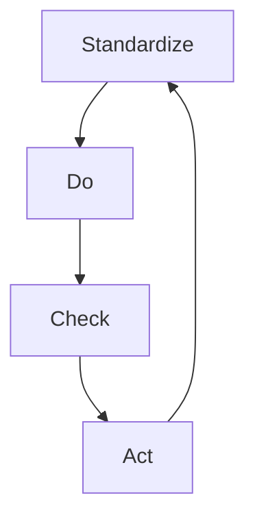

Der SDCA-Zyklus stellt ein Modell für kontinuierliche Verbesserung dar, das dem [PDCA-Zyklus](/open-fidup/lerninhalte/pdca) ähnelt. Er zielt darauf ab, Lösungen zu standardisieren, zu testen und zu implementieren, um Prozesse effizienter zu gestalten. Der Zyklus besteht aus vier Schritten, die iterativ angewendet werden.

## Schritte des SDCA-Zyklus

1. **Standardize**: Die Lösung verstehen und in einen Standard überführen.
2. **Do**: Testen mit schnellen und einfachen Mitteln.
3. **Check**: Das Resultat mit der Erwartung überprüfen.
4. **Act**: Die Umsetzung freigeben oder an der Standardisierung weiterarbeiten.

## Quellen
> SDCA-Zyklus. (2024, September 10). Retrieved from https://www.leanprinzip.de/woerterbuch/sdcazyklus