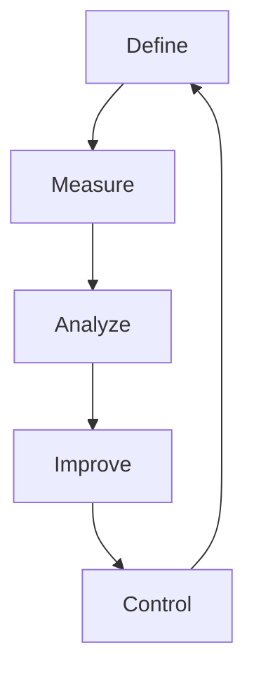

Six Sigma ist eine systematische Methode zur Prozessoptimierung, die auf mathematischen und statistischen Ansätzen beruht. Sie zielt darauf ab, Fehlerquoten zu minimieren, die Leistung von Prozessen messbar zu machen und Kausalzusammenhänge zu identifizieren, um Qualitätsverbesserungen zu erzielen. Die Methode integriert verschiedene Management-Techniken und fördert eine Kultur des kontinuierlichen Lernens.

## Vorteile
Six Sigma bietet mehrere Vorteile für Unternehmen, die auf Nachhaltigkeit und Effizienz ausgerichtet sind. Dazu gehören eine klare Strukturierung von Prozessen, die als Grundlage für kontinuierliche Korrekturen und Anpassungen an Marktbedingungen dient. Die Methode legt einen starken Fokus auf die Kundensicht, wodurch Kundenwünsche besser verstanden und erfüllt werden können, was zu einer Steigerung des Unternehmenswerts führt. Zudem verbessert sie die Kommunikation zwischen Management und Mitarbeitern und unterstützt die Entwicklung einer lernenden Organisation, in der [lebenslanges Lernen](/open-fidup/lerninhalte/lebenslanges-lernen) eine zentrale Rolle spielt.

## Anwendung
Six Sigma findet Anwendung in der Qualitäts- und Prozessoptimierung und umfasst ein breites Spektrum an Management-Techniken, die als Six Sigma Toolkit bezeichnet werden. Es kann sowohl auf bestehende als auch auf neue Prozesse angewendet werden.

### DMAIC-Zyklus
Der DMAIC-Zyklus (Define, Measure, Analyze, Improve, Control) bildet den Kern der Six Sigma-Methode für die Optimierung bestehender Prozesse. Bei neuen Prozessen wird stattdessen der DMADV-Zyklus verwendet, der ähnliche Schritte umfasst, aber den Schwerpunkt auf Entwicklung legt. Der Zyklus verläuft wie folgt:

1. **Define (Definieren)**: Identifikation des zu verbessernden Prozesses, Dokumentation des Problems und des Prozesses sowie Festlegung von Zielgrößen und Projektumfang.
2. **Measure (Messen)**: Untersuchung relevanter Qualitätsmerkmale und Erhebung der aktuellen Prozessleistung.
3. **Analyze (Analysieren)**: Herausarbeitung von Ursachen und kausalen Zusammenhängen.
4. **Improve (Verbessern)**: Verbesserung des Prozesses, gegebenenfalls unter Einbeziehung externer Methoden.
5. **Control (Überwachen)**: Überwachung des Prozesses durch statistische Auswertungen, um nachhaltige Verbesserungen sicherzustellen.

Bei neuen Prozessen ersetzt Schritt 4 den Schritt "Engineer (Entwickeln)", um den Fokus auf die Neuentwicklung zu legen [Beleg erforderlich].

## Rollen
Six Sigma definiert spezifische Rollen mit unterschiedlichen Verantwortlichkeiten und Zertifizierungsstufen, die zur Umsetzung der Methode beitragen. Diese Rollen sind in einer Hierarchie organisiert und fördern die Expertise in der Organisation.

| Rolle              | Beschreibung                                                                 |
|--------------------|-----------------------------------------------------------------------------|
| Gelber Gürtel     | Einstiegszertifizierung mit Überblick über Grundlagen; unterstützt Projekte als Experte in einem Fachbereich oder Manager, der weitere Zertifizierungen anstrebt. |
| Grüner Gürtel     | Tiefgehende methodische Kenntnisse; leitet Verantwortungsbereiche in Projekten. |
| Schwarzer Gürtel  | Leitet komplexe Projekte; verfügt über tiefe fachliche Expertise und hohe Sozialkompetenz, um Veränderungsprozesse umzusetzen; fungiert als Motivator und ist maßgeblich für den Projekterfolg. |
| Schwarzer Meistergürtel | Übernimmt Prozessverantwortung und strategische Ausrichtung von Six Sigma in der Organisation; legt Standards fest. |
| Champion          | Mitglied des mittleren oder oberen Managements, nicht im Tagesgeschäft eingebunden; wählt Projekte aus, initiiert und überwacht sie. |

## Quellen
Redaktion, I. (2019). Six-Sigma-Methode: Wie sie funktioniert und was sie bewirkt. IONOS Startup Guide. Abgerufen von https://www.ionos.de/startupguide/unternehmensfuehrung/six-sigma-methode.