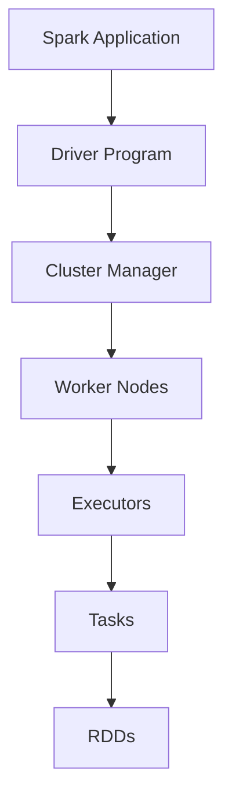

Apache Spark ist ein Open-Source-Framework für Cluster-Computing, das schnelle, skalierbare Datenverarbeitung ermöglicht. Es verwendet In-Memory-Verarbeitung und Resilient Distributed Datasets (RDDs) für effiziente Analysen. Spark unterstützt Batch-, Streaming- und interaktive Verarbeitung und ist Teil des Hadoop-Ökosystems.

## Geschichte

Spark entstand 2009 am AMPLab der University of California, Berkeley, als Alternative zu MapReduce. 2010 wurde es Open-Source veröffentlicht. Seit 2013 wird es von der Apache Software Foundation betreut und ist seit 2014 ein Top-Level-Projekt. Spark hat Hadoop in vielen Anwendungen ersetzt.

## Architektur

Spark basiert auf einem gerichteten azyklischen Graphen (DAG) für Aufgabenplanung und verwendet RDDs als Datenstruktur.

## Komponenten

### Spark Core
Der Kern bietet grundlegende Funktionen wie Scheduling und I/O. RDDs sind die zentrale Datenstruktur, die Transformationen und Aktionen unterstützt.

### Spark SQL
Ermöglicht SQL-Abfragen auf DataFrames, integriert mit Hive und unterstützt verschiedene Datenformate.

### Spark Streaming
Verarbeitet Datenströme in Echtzeit, indem sie in Mikro-Batches unterteilt werden.

### MLlib/SparkML
Bibliothek für maschinelles Lernen mit Algorithmen für Klassifikation, Regression und Clustering.

### GraphX
Framework für Graph-Verarbeitung und -Analyse.

## Anwendungen

Spark wird für Datenanalyse, maschinelles Lernen und Echtzeit-Streaming eingesetzt. Es ist schneller als Hadoop MapReduce durch In-Memory-Verarbeitung.

## Vorteile

Vorteile sind Geschwindigkeit, Einfachheit und Unterstützung für mehrere Sprachen (Scala, Java, Python). Es integriert gut mit Hadoop.

## Quellen

> Apache Spark. (2025). Spark Documentation. Retrieved from https://spark.apache.org/docs/

> Wikipedia. (2024). Apache Spark. Retrieved from https://de.wikipedia.org/wiki/Apache_Spark
