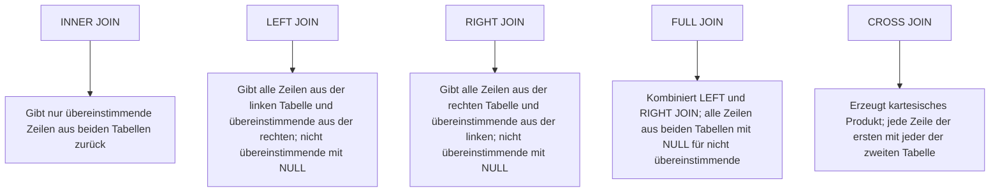

SQL ist eine standardisierte Abfragesprache zur Verwaltung relationaler Datenbanken. Sie basiert auf dem relationalen Modell, das Daten in Tabellen mit fester Struktur organisiert und Beziehungen zwischen diesen Tabellen durch Schlüssel herstellt. SQL unterstützt verschiedene Datentypen, Integritätsregeln sowie Operationen zur Datenmanipulation und -abfrage. Zu den gängigen Datenbanksystemen, die SQL verwenden, gehören MySQL, PostgreSQL und Oracle.

## Grundlagen relationaler Datenbanken

Relationale Datenbanken speichern Daten in Tabellen mit fester Struktur. Beziehungen zwischen Tabellen werden durch Schlüssel hergestellt. SQL dient als Schnittstelle zur Interaktion mit diesen Datenbanken und ermöglicht die Definition von Schemata, die Manipulation von Daten sowie komplexe Abfragen.

## Datentypen in SQL

SQL unterstützt verschiedene Datentypen zur Speicherung unterschiedlicher Datenarten. Diese umfassen:

- **Boolean:** Wahrheitswerte wie TRUE oder FALSE.
- **Integer:** Ganzzahlen, beispielsweise INT oder BIGINT.
- **Float/Double:** Gleitkommazahlen für approximative Berechnungen.
- **Decimal/Numeric:** Festkommazahlen für präzise Berechnungen.
- **Date/Time:** Datums- und Zeitwerte.
- **Char/Varchar:** Texte fester oder variabler Länge.
- **Text/CLOB:** Große Textmengen.
- **BLOB:** Binäre Daten, etwa Bilder.
- **Geometry:** Für Geodaten, nicht in allen [DBMS](/open-fidup/lerninhalte/dbms) verfügbar.

## Integrität und Schlüssel

Integritätsregeln gewährleisten die Konsistenz der Daten in relationalen Datenbanken. Der Primärschlüssel identifiziert Datensätze eindeutig. Fremdschlüssel verweisen auf Primärschlüssel anderer Tabellen und unterstützen referenzielle Integrität.

### Referenzielle Integrität

Referenzielle Integrität stellt gültige Beziehungen zwischen Tabellen sicher. Aktualisierungs- und Löschweitergaben können definiert werden, um Änderungen in verknüpften Tabellen zu propagieren.

```sql
FOREIGN KEY (spalte) REFERENCES tabelle(spalte)
  ON UPDATE CASCADE
  ON DELETE CASCADE
```

### Primärschlüssel

Primärschlüssel dienen der eindeutigen Identifikation von Datensätzen.

```sql
PRIMARY KEY (spalte)
```

### Fremdschlüssel

Fremdschlüssel verweisen auf Primärschlüssel anderer Tabellen.

```sql
FOREIGN KEY (spalte) REFERENCES tabelle(spalte)
```

## Datenbankoperationen

SQL ermöglicht die Erstellung und Änderung von Tabellenstrukturen sowie die Manipulation und Abfrage von Daten. Indizes verbessern die Abfrageleistung.

### Tabellenstruktur

Tabellen werden mit CREATE TABLE erstellt und mit ALTER TABLE modifiziert.

```sql
CREATE TABLE tabelle (
  spalte1 datentyp,
  spalte2 datentyp,
  ...
);

ALTER TABLE tabelle ADD spalte datentyp;
```

### Index erstellen

Indizes beschleunigen Abfragen auf bestimmten Spalten.

```sql
CREATE INDEX idx_name ON tabelle (spalte);
```

### Datenmanipulation

Daten werden mit INSERT, UPDATE und DELETE bearbeitet.

```sql
INSERT INTO tabelle (spalte1, spalte2) VALUES (wert1, wert2);
UPDATE tabelle SET spalte = wert WHERE bedingung;
DELETE FROM tabelle WHERE bedingung;
```

### Datenabfrage

Abfragen erfolgen mit SELECT, optional mit WHERE-Bedingungen.

```sql
SELECT spalte1, spalte2 FROM tabelle WHERE bedingung;
```

### Sortieren und Gruppieren

Ergebnisse können sortiert oder gruppiert werden.

```sql
SELECT spalte FROM tabelle ORDER BY spalte;
SELECT spalte, COUNT(*) FROM tabelle GROUP BY spalte HAVING COUNT(*) > 5;
```

## Komplexe Abfragen

Komplexe Abfragen nutzen Unterabfragen und Joins zur Kombination von Daten aus mehreren Tabellen.

### Unterabfragen

Unterabfragen sind verschachtelte SELECT-Anweisungen.

```sql
SELECT spalte FROM tabelle WHERE spalte IN (SELECT spalte FROM andere_tabelle);
```

### Tabellenverknüpfung (JOIN)

Joins kombinieren Zeilen aus zwei oder mehr Tabellen basierend auf einer Bedingung.

```sql
SELECT t1.spalte, t2.spalte 
FROM tabelle1 t1
JOIN tabelle2 t2 ON t1.id = t2.fremdschluessel;
```

#### JOIN-Typen

Verschiedene JOIN-Typen bestimmen, welche Zeilen in das Ergebnis einbezogen werden.



##### INNER JOIN

Gibt nur übereinstimmende Zeilen aus beiden Tabellen zurück.

```sql
SELECT columns 
FROM table1 
INNER JOIN table2 
ON table1.column = table2.column;
```

##### LEFT JOIN (oder LEFT OUTER JOIN)

Gibt alle Zeilen aus der linken Tabelle und übereinstimmende Zeilen aus der rechten Tabelle zurück. Nicht übereinstimmende Zeilen aus der rechten Tabelle werden mit NULL-Werten gefüllt.

##### RIGHT JOIN (oder RIGHT OUTER JOIN)

Funktioniert wie LEFT JOIN, behält jedoch alle Zeilen aus der rechten Tabelle.

##### FULL JOIN (oder FULL OUTER JOIN)

Kombiniert Ergebnisse von LEFT und RIGHT JOIN. Gibt alle Zeilen aus beiden Tabellen zurück, mit NULL-Werten für nicht übereinstimmende Zeilen.

##### CROSS JOIN

Erzeugt das kartesische Produkt beider Tabellen. Jede Zeile aus der ersten Tabelle wird mit jeder Zeile aus der zweiten Tabelle kombiniert.

## Ausdrücke und Bedingungen

SQL verwendet Operatoren und Funktionen zur Formulierung von Bedingungen in Abfragen.

- Vergleichsoperatoren: =, <>, <, >, <=, >=
- Logische Operatoren: AND, OR, NOT
- LIKE für Textmuster: 'A%' (beginnt mit A), '%A%' (enthält A)
- BETWEEN für Wertebereiche
- IN für Mengenzugehörigkeit

## Aggregatfunktionen

Aggregatfunktionen berechnen Werte über mehrere Zeilen hinweg, oft in Kombination mit GROUP BY und HAVING.

### SUM()

Berechnet die Summe aller Werte in einer numerischen Spalte.

```sql
SELECT SUM(verkaufspreis) AS Gesamteinnahmen 
FROM verkauf;
```

Dies berechnet die gesamte Summe aller Verkaufspreise in der Tabelle "verkauf".

### AVG()

Berechnet den Durchschnitt aller Werte in einer numerischen Spalte.

```sql
SELECT AVG(alter) AS Durchschnittsalter 
FROM kunden;
```

Dies berechnet das durchschnittliche Alter aller Kunden.

### COUNT()

Zählt die Anzahl der Zeilen oder nicht-NULL-Werte in einer Spalte.

```sql
SELECT COUNT(*) AS AnzahlKunden 
FROM kunden;
```

Dies zählt die gesamte Anzahl der Kunden.

```sql
SELECT COUNT(bestellnummer) AS AnzahlBestellungen 
FROM bestellungen;
```

Dies zählt die Anzahl der Bestellungen, wobei NULL-Werte in der Spalte "bestellnummer" ignoriert werden.

### MAX()

Findet den größten Wert in einer Spalte.

```sql
SELECT MAX(gehalt) AS HoehestesGehalt 
FROM mitarbeiter;
```

Dies findet das höchste Gehalt unter den Mitarbeitern.

### MIN()

Findet den kleinsten Wert in einer Spalte.

```sql
SELECT MIN(geburtstag) AS JuengsterMitarbeiter 
FROM mitarbeiter;
```

Dies findet das Geburtsdatum des jüngsten Mitarbeiters.

### Weitere Beispiele und Kombinationen

Aggregatfunktionen werden häufig mit GROUP BY kombiniert, um Ergebnisse nach Kriterien zu gruppieren.

```sql
SELECT land, AVG(verkaufspreis) AS DurchschnittlicherVerkaufspreis
FROM verkauf
GROUP BY land;
```

Dies berechnet den durchschnittlichen Verkaufspreis für jedes Land.

Mit HAVING können Gruppen basierend auf Bedingungen gefiltert werden.

```sql
SELECT abteilung, COUNT(*) AS AnzahlMitarbeiter
FROM mitarbeiter
GROUP BY abteilung
HAVING COUNT(*) > 10;
```

Dies zählt die Mitarbeiter pro Abteilung und zeigt nur Abteilungen mit mehr als 10 Mitarbeitern an.

### Wichtige Hinweise

- Aggregatfunktionen ignorieren normalerweise NULL-Werte, außer COUNT(*), das alle Zeilen zählt.
- COUNT(DISTINCT) zählt die Anzahl eindeutiger Werte in einer Spalte.
- SUM(CASE WHEN ... THEN ... ELSE ... END) ermöglicht bedingte Summierungen.

Beispiel für eine Kombination:

```sql
SELECT AVG(gehalt) AS durchschnittsgehalt
FROM mitarbeiter
GROUP BY abteilung;
```