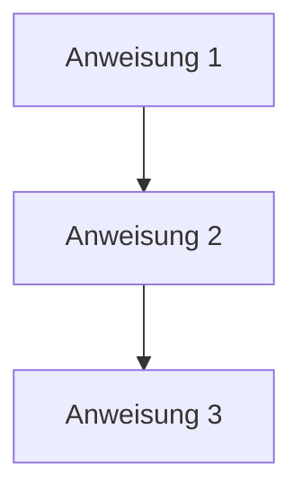
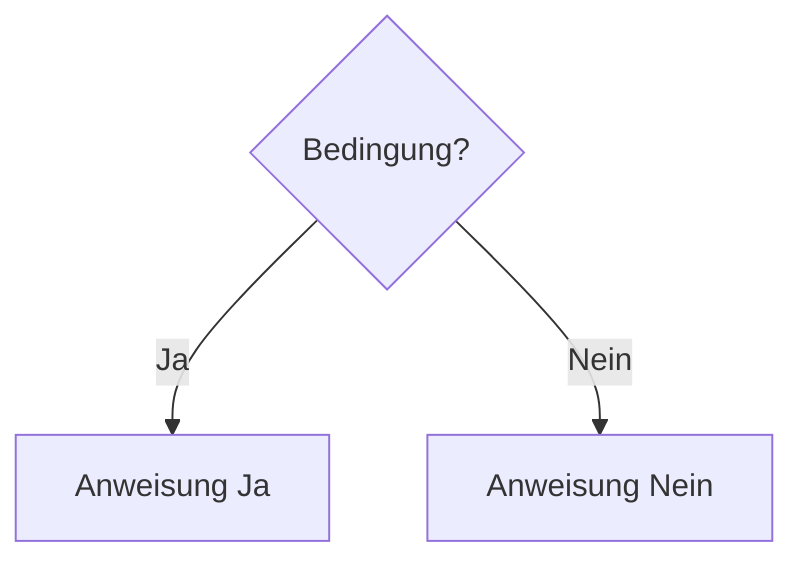
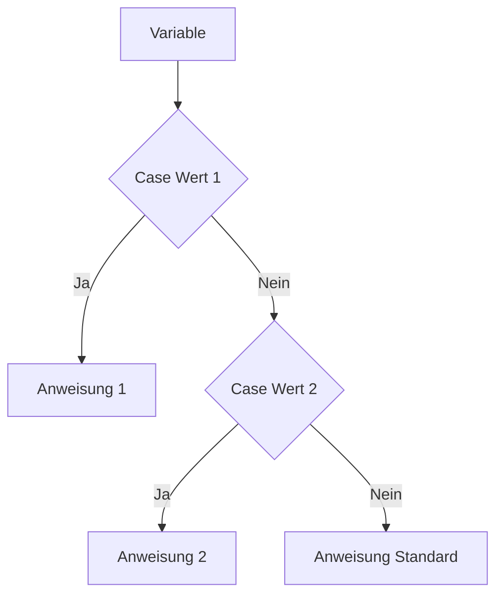
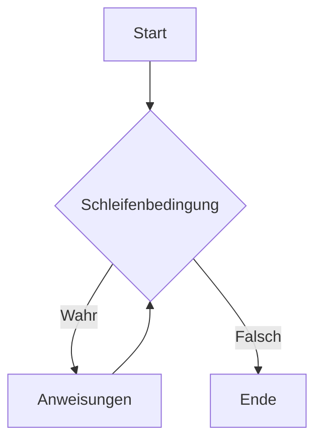
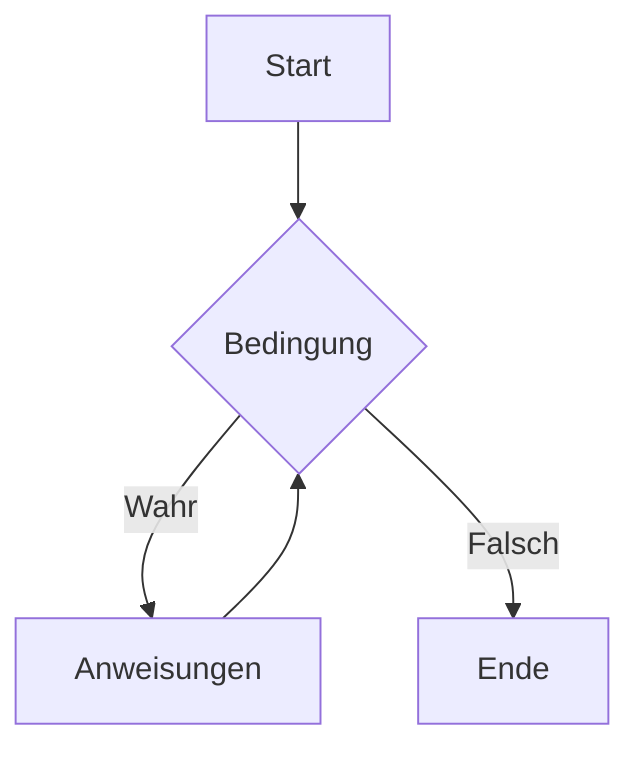
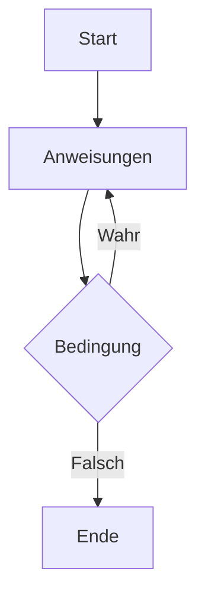
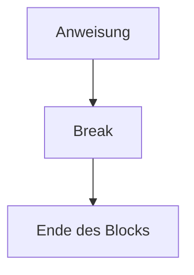
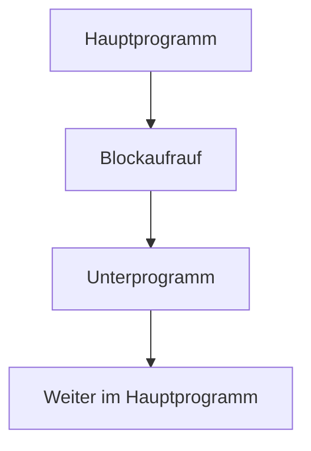
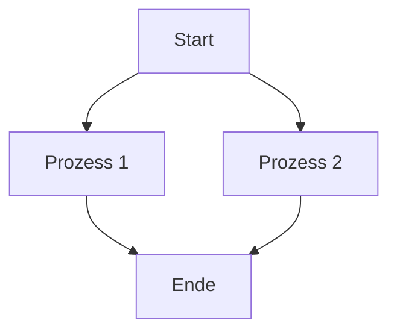

Das Struktogramm, auch als Nassi-Shneiderman-Diagramm bekannt, ist ein grafisches Hilfsmittel zur Darstellung von Algorithmen und Programmabläufen. Es unterstützt die Zerlegung komplexer Gesamtprobleme in kleinere, handhabbare Teilprobleme durch den Ansatz der Top-down-Programmierung. Dabei wird das Gesamtkonzept schrittweise verfeinert. Struktogramme bestehen aus standardisierten Elementen, die den Ablauf von Programmen visuell strukturieren und die Lesbarkeit fördern.

## Elemente

Struktogramme verwenden verschiedene Symbole, um unterschiedliche Programmkonstrukte darzustellen. Diese Elemente werden hierarchisch angeordnet, wobei jedes Symbol einen bestimmten Teil des Ablaufs repräsentiert. Im Folgenden sind die wichtigsten Elemente mit ihren visuellen Darstellungen aufgeführt.

### Anweisungen

Anweisungen stellen einfache Operationen oder Befehle dar, die sequentiell ausgeführt werden. Sie bilden die Grundbausteine des Struktogramms.

### Bedingungen

Bedingungen ermöglichen Verzweigungen im Ablauf. Abhängig von einer Bedingung wird entweder der eine oder der andere Pfad verfolgt.

### Case-Statement

Das Case-Statement erlaubt Mehrfachverzweigungen basierend auf dem Wert einer Variablen. Es entspricht einer switch-Anweisung in Programmiersprachen.

### Iteration

Iterationen repräsentieren Schleifen, die einen Block von Anweisungen wiederholen, solange eine Bedingung erfüllt ist.

### Kopfgesteuerte Schleife

Bei der kopfgesteuerten Schleife wird die Bedingung vor der Ausführung des Schleifenkörpers geprüft. Ist die Bedingung nicht erfüllt, wird die Schleife nicht ausgeführt.

### Fußgesteuerte Schleife

Die fußgesteuerte Schleife prüft die Bedingung nach der Ausführung des Schleifenkörpers. Der Körper wird mindestens einmal ausgeführt.

### Break

Break beendet die Ausführung eines Programmteils vorzeitig, beispielsweise innerhalb einer Schleife oder eines Blocks.

### Blockaufrauf

Der Blockaufrauf dient dem Aufruf eines Unterprogramms oder einer Funktion, um Modularität zu gewährleisten.

### Parallelausführung

Parallelausführung stellt nebenläufige Abläufe dar, bei denen mehrere Prozesse gleichzeitig ausgeführt werden können.

## Quellen

> AI Chat. (2024, September 19). Retrieved from https://duckduckgo.com/?q=DuckDuckGo+AI+Chat&ia=chat&duckai=1  
> Autoren der Wikimedia-Projekte. (2004, February 17). Nassi-Shneiderman-Diagramm – Wikipedia. Retrieved from https://de.wikipedia.org/w/index.php?title=Nassi-Shneiderman-Diagramm&oldid=245429298