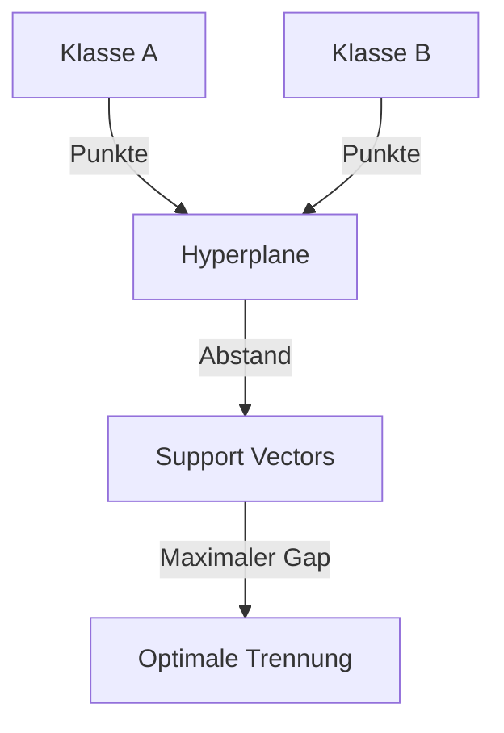
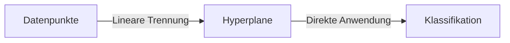
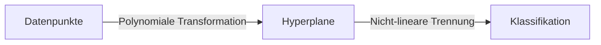
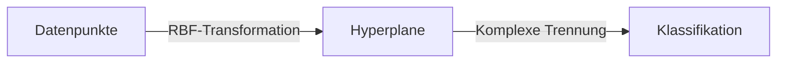

Die Support Vector Machine (SVM) ist ein [überwachter Lernalgorithmus](/open-fidup/lerninhalte/ueberwachtes-und-nicht-ueberwachtes-lernen), der zur [Klassifikation](/open-fidup/lerninhalte/klassifikation) von Objekten eingesetzt wird. Sie eignet sich besonders für Text- und Bildklassifizierung sowie für kleinere Datensätze mit klarer Trennbarkeit. Die Methode zielt darauf ab, einen optimalen Hyperplane zu finden, der die Klassen trennt, und verwendet den Kernel-Trick, um nicht-lineare Daten zu handhaben.

## Vorteile
- Effizientes Training: Schneller trainierbar im Vergleich zu [neuronalen Netzen](/open-fidup/lerninhalte/neural-network).
- Gute Leistung mit wenigen Trainingsdaten.
- Anwendbar auf lineare und nicht-lineare Daten mit Hilfe des Kernel-Tricks.

## Nachteile
- Funktioniert standardmäßig nur mit linear separierbaren Daten.
- Bei nicht-linearen Daten erfordert sie eine Kernel-Funktion, was den Rechenaufwand erhöht.

## Funktionsweise

### Lineare Klassifikation
Das Ziel der SVM besteht darin, einen Hyperplane zu finden, der zwei Klassen von Datenpunkten optimal trennt. Der Hyperplane ist eine Trennlinie in zweidimensionalen Räumen oder eine Trennebene in höherdimensionalen Räumen, die die Daten so trennt, dass der Abstand zwischen den nächsten Punkten jeder Klasse und dem Hyperplane maximal ist.

#### Begriffe
- **Hyperplane**: Im p-dimensionalen Raum handelt es sich um einen flachen Unterraum mit p-1 Dimensionen.
  - In 1D: Ein Punkt.
  - In 2D: Eine Linie.
  - In 3D: Eine Ebene.
  - Formel: $w^T x + b = 0$, wobei $w$ der Gewichtungsvektor, $x$ die Datenpunkte und $b$ der Bias sind.
- **Support Vectors**: Die Punkte, die dem Hyperplane am nächsten liegen und seine Lage bestimmen. Sie sind entscheidend für die Berechnung des Hyperplanes und helfen, Overfitting zu vermeiden.
- **Maximaler Abstand**: Der Abstand der nächsten Punkte jeder Klasse zum Hyperplane. Je größer der Abstand, desto besser die Trennung der Klassen. Der Abstand ist proportional zu $\frac{1}{\|w\|}$, sodass ein kleiner Wert von $w$ den maximalen Abstand ergibt.

### Nicht-lineare Klassifikation
Wenn Daten nicht linear trennbar sind, reicht ein einfacher Hyperplane nicht aus. Hier kommt der Kernel-Trick zum Einsatz.

## Kernel-Trick
Der Kernel-Trick ermöglicht es, Datenpunkte in einen höherdimensionalen Raum zu transformieren, wo sie durch einen linearen Hyperplane trennbar werden. Anstatt die Daten direkt zu übertragen, berechnet er die inneren Produkte der Datenpunkte im neuen Raum mithilfe einer mathematischen Funktion, ohne die tatsächliche Transformation durchzuführen. Dies reduziert den Rechenaufwand.

#### Häufig verwendete Kernel-Funktionen
- **Linearer Kernel**: Für linear trennbare Daten.

- **Polynomieller Kernel**: Für nicht-lineare Daten, die durch eine polynomiale Trennung separierbar sind.

- **Radial Basis Function (RBF)**: Ein häufig verwendeter Kernel zur Klassifikation von Daten mit nicht-linearen Mustern. Er transformiert die Daten in einen sehr hohen, theoretisch unendlichen dimensionalen Raum.

### Vorteile des Kernel-Tricks
- Effiziente Transformation: Die Methode vermeidet den Aufwand der Berechnung eines höherdimensionalen Raums.
- Anwendung auf komplexe Daten: Sie erzielt gute Ergebnisse auch bei hochkomplexen und nicht-linearen Daten.

### Nachteile des Kernel-Tricks
- Erhöhter Rechenaufwand: Bei großen Datensätzen und komplexen Kernel-Funktionen kann der Aufwand erheblich steigen.
- Auswahl des richtigen Kernels: Die Wahl des geeigneten Kernels und seiner Parameter kann schwierig sein, um optimale Ergebnisse zu erzielen.

## Zusammenfassung
Die SVM ist ein leistungsstarker Klassifikationsalgorithmus, der sich besonders für lineare Daten eignet. Bei nicht-linearen Daten kommt der Kernel-Trick zum Einsatz, um die Daten trennbar zu machen. Die Support Vectors bestimmen die Lage des Hyperplanes und vermeiden Overfitting. Der Abstand wird maximiert, um eine möglichst klare Trennung zwischen den Klassen zu erreichen.

## Quellen
- Support Vector Machine (SVM) - einfach erklärt! | Data Basecamp. (2024, September 19). Abgerufen von https://databasecamp.de/ki/support-vector-machine-svm
- Science, P. D. (2018, July 09). Einführung in die Datenanalyse: Support Vector Machine. Youtube. Abgerufen von https://www.youtube.com/watch?v=Xn1-0it0f5g
- Explained, V. (2022, May 09). The Kernel Trick in Support Vector Machine (SVM). Youtube. Abgerufen von https://www.youtube.com/watch?v=Q7vT0--5VII
- Explained, V. (2021, September 09). Support Vector Machine (SVM) in 2 minutes. Youtube. Abgerufen von https://www.youtube.com/watch?v=_YPScrckx28&t=77s