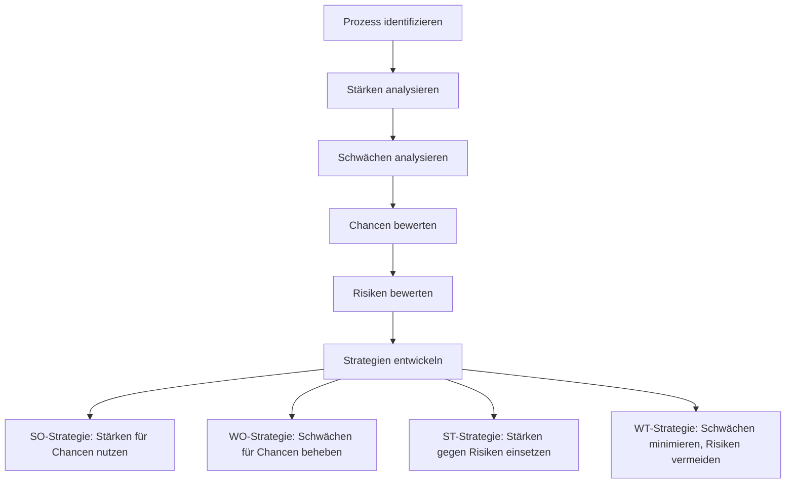

Die SWOT-Analyse ist ein strategisches Instrument zur Beurteilung der internen und externen Faktoren eines Unternehmens. Sie hilft bei der Entwicklung von Strategien durch die Kombination der Faktoren und ist einfach anzuwenden, obwohl sie subjektiv und nicht quantitativ ist.

## Kategorien

Die SWOT-Analyse umfasst vier Kategorien:

- **Stärken** (_Strengths_): Interne Vorteile, die eine Organisation auszeichnen.
- **Schwächen** (_Weaknesses_): Interne Nachteile, die den Erfolg der Organisation hemmen.
- **Chancen** (_Opportunities_): Externe Möglichkeiten zur Verbesserung.
- **Risiken** (_Threats_): Externe Gefahren, die den Erfolg beeinträchtigen könnten.

## Strategieentwicklung

Durch die Kombination der internen und externen Faktoren lassen sich Strategien entwickeln. Die folgende Tabelle zeigt die möglichen Kombinationen und die daraus resultierenden Strategien:

| Extern/Intern | Stärken | Schwächen |
| ------------- | ------- | --------- |
| Chancen | *S-O-Strategie (Matching)* **Stärken nutzen, um Chancen zu ergreifen** | *W-O-Strategie (Umwandlung)* **Schwächen ausbessern, um Chancen zu nutzen** |
| Risiken | *S-T-Strategie (Neutralisierung)* **Stärken nutzen, um Risiken zu neutralisieren** | *W-T-Strategie (Verteidigung)* **Schwächen reduzieren, um Risiken zu entgehen** |

## Vorteile

Die SWOT-Analyse bietet mehrere Vorteile:

- Sie ist einfach durchzuführen.
- Sie liefert eine umfassende Analyse der internen und externen Faktoren.
- Sie ist flexibel anwendbar auf verschiedene Bereiche.

## Nachteile

Die SWOT-Analyse weist auch Nachteile auf:

- Subjektivität kann zu einer verzerrten Bewertung führen.
- Sie bietet keine quantitative Analyse.
- Sie kann komplexe Zusammenhänge nicht vollständig abbilden.

## Anwendung auf Prozesse

Die SWOT-Analyse kann speziell auf Geschäftsprozesse angewendet werden, um interne Stärken und Schwächen sowie externe Chancen und Risiken eines Prozesses zu bewerten. Dies unterstützt die Identifizierung von Verbesserungspotenzialen und Risiken in Prozessabläufen.

### Grundlagen der SWOT-Analyse für Prozesse

Die SWOT-Analyse für Prozesse fokussiert auf prozessspezifische Aspekte:

- **Stärken**: Interne Vorteile des Prozesses, wie Effizienz, Zuverlässigkeit oder Kostenvorteile.
- **Schwächen**: Interne Nachteile, wie Engpässe, Fehleranfälligkeit oder hohe Kosten.
- **Chancen**: Externe Möglichkeiten, wie technologische Fortschritte oder Marktchancen.
- **Risiken**: Externe Gefahren, wie regulatorische Änderungen oder Wettbewerbsdruck.

### Beispiel: SWOT-Analyse eines Datenanalyse-Prozesses

| Kategorie | Beschreibung |
|-----------|--------------|
| **Stärken** | Hohe Datenqualität durch standardisierte Erfassung; Erfahrene Analysten; Schnelle Berichterstellung |
| **Schwächen** | Hoher manueller Aufwand; Abhängigkeit von wenigen Experten; Verzögerungen bei Datenintegration |
| **Chancen** | Einsatz von KI-Tools zur Automatisierung; Integration von Big-Data-Technologien; Verbesserte Entscheidungsunterstützung |
| **Risiken** | Datenschutzverletzungen; Technologische Obsoleszenz; Wettbewerb durch externe Dienstleister |

### Strategieentwicklung für Prozesse

Basierend auf der SWOT-Analyse können Strategien entwickelt werden:

- **SO-Strategie**: Stärken nutzen, um Chancen zu ergreifen (z.B. Einsatz von KI zur weiteren Verbesserung der Effizienz).
- **WO-Strategie**: Schwächen beheben, um Chancen zu nutzen (z.B. Schulungen zur Reduzierung der Abhängigkeit von Experten).
- **ST-Strategie**: Stärken nutzen, um Risiken zu neutralisieren (z.B. Hohe Datenqualität zur Einhaltung von Datenschutzstandards).
- **WT-Strategie**: Schwächen minimieren, um Risiken zu vermeiden (z.B. Automatisierung zur Reduzierung von Verzögerungen).

### Integration mit anderen Methoden

Die SWOT-Analyse für Prozesse wird oft mit anderen Techniken kombiniert:

- **Prozesskostenrechnung**: Zur quantitativen Bewertung von Schwächen und Stärken.
- **Benchmarking**: Zum Vergleich mit Best Practices.
- **Risikoanalyse**: Zur detaillierten Bewertung von Risiken.

## Quellen

> Bundesministerium des Innern und für Heimat. (2024). SWOT Analyse. Bundesministerium des Innern und für Heimat. Retrieved from https://www.orghandbuch.de/Webs/OHB/DE/OrganisationshandbuchNEU/4_MethodenUndTechniken/Methoden_A_bis_Z/SWOT_Analyse/swot_analyse_node.html%3Bjsessionid=A9EC8CF14A322DA22146DA463549ADD9.live882

- [Wikipedia: SWOT-Analyse](https://de.wikipedia.org/wiki/SWOT-Analyse)