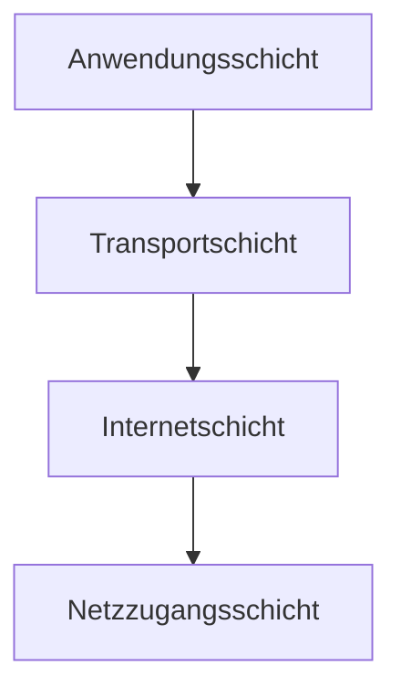

Das TCP/IP-Modell stellt eine Gruppe von Netzwerkprotokollen dar, die für die Vermittlung und den Transport von Daten in dezentralen Netzwerken zuständig sind. Es basiert auf den Protokollen Transmission Control Protocol (TCP) und Internet Protocol (IP) und gliedert sich in vier Schichten: Anwendungsschicht, Transportschicht, Internetschicht und Netzzugangsschicht. Zu den zentralen Aufgaben gehören logische Adressierung, Routing, Fehlerbehandlung sowie Anwendungsunterstützung. Das Modell ermöglicht standort- und herstellerunabhängige Datenübertragungen, weist jedoch Ineffizienzen bei geringen Datenmengen auf.

## Aufgaben

Das TCP/IP-Modell übernimmt mehrere Schlüsselaufgaben zur Gewährleistung einer effizienten Kommunikation:

- Logische Adressierung: Aufteilung großer Netzwerke in kleinere Segmente.
- Routing: Ermittlung des nächsten Netzwerkknotens für ein Datenpaket, um die Wegfindung über Netzwerksegmente hinaus zu ermöglichen.
- Fehlerbehandlung und Flusssteuerung: Sicherstellung einer verbindungsorientierten Kommunikation mit erneuter Übertragung von Paketen bei Fehlern.
- Anwendungsunterstützung: Adressierung von Diensten über [TCP/UDP-Ports](/open-fidup/lerninhalte/tcp-udp).
- Namensauflösung: Auflösung von Domänennamen in IPv4- oder IPv6-Adressen.

## Schichten

Das Modell besteht aus vier hierarchisch angeordneten Schichten, die jeweils spezifische Funktionen erfüllen:

4. **Anwendungsschicht**: Ermöglicht die Kommunikation von Anwendungen über das Netzwerk. Beispiele für Protokolle sind HTTP, FTP, POP, SMTP, TLS und SOCKS5.
3. **Transportschicht**: Stellt eine zuverlässige End-to-End-Kommunikation sicher. Wichtige Protokolle sind [TCP](/open-fidup/lerninhalte/tcp-udp) und [UDP](/open-fidup/lerninhalte/tcp-udp).
2. **Internetschicht**: Verantwortlich für die Weiterleitung und das Routing von Paketen. Protokolle umfassen IP und ICMP.
1. **Netzzugangsschicht**: Regelt die physische Verbindung von Subnetzen. Beispiele sind [Ethernet](/open-fidup/lerninhalte/ethernet) für kabelgebundene Verbindungen und IEEE 802.11 für Funkverbindungen.

## Vorteile

Das TCP/IP-Modell bietet mehrere Vorteile für die Netzwerkkommunikation:

- Datenübertragungen sind standort- und herstellerunabhängig.
- Der Anwender benötigt lediglich die Zieladresse; die Verbindung wird durch TCP/IP gesteuert.
- Anwendungen sind vom Übertragungssystem unabhängig.

## Nachteile

Trotz seiner Stärken weist das Modell auch Schwächen auf:

- Es ist ineffizient bei niedrigen Datenmengen.
- Spezielle Anforderungen an das Übertragungssystem sind nur schwer zu realisieren.

## Quellen

> TCP/IP. (2022, November 13). Retrieved from https://studyflix.de/informatik/tcp-ip-5692