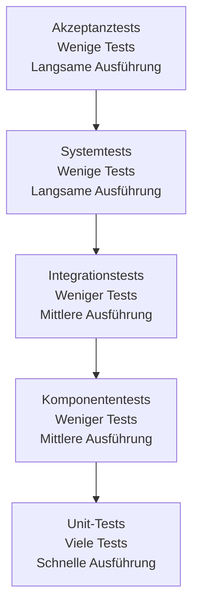

Testverfahren sind systematische Ansätze zur Überprüfung und Validierung von Software, um sicherzustellen, dass sie den [Anforderungen](/open-fidup/lerninhalte/funktionale-und-nicht-funktionale-anforderungen) entspricht und fehlerfrei funktioniert. Es gibt verschiedene Testmethoden und -techniken, die je nach Ziel und Kontext eingesetzt werden.

## Statische und dynamische Testverfahren

### Statische Testverfahren
Statische Testverfahren überprüfen Software-Artefakte ohne Ausführung des Codes. Sie zielen auf frühzeitige Fehlererkennung und die Validierung von Dokumentation sowie Code ab. Zu den Methoden gehören:

- **Review**: Systematische Überprüfung von Dokumenten oder Code durch Experten.
- Statische Codeanalyse.
- Walkthrough.

### Dynamische Testverfahren
Dynamische Testverfahren überprüfen die Software durch Ausführung des Codes. Sie testen das Funktionsverhalten, die Speicher- und CPU-Nutzung sowie die Gesamtleistung des Systems. Zu den Methoden gehören:

- Black-Box-Testing.
- White-Box-Testing.
- Graue-Box-Testing.

### Übersicht über Testverfahren

| Aspekt          | Statische Testverfahren | Dynamische Testverfahren |
|-----------------|-------------------------|--------------------------|
| Ausführung     | Ohne Code-Ausführung   | Mit Code-Ausführung      |
| Fokus          | Dokumentation und Code | Funktionsverhalten       |
| Ziele          | Frühzeitige Fehlererkennung | Leistung und Robustheit  |
| Methoden       | Review, Codeanalyse    | Black-Box, White-Box     |

### Black-Box-Testing
Beim Black-Box-Testing wird die Software getestet, ohne dass der Tester Kenntnisse über die interne Funktionsweise hat. Der Fokus liegt auf den Eingaben und Ausgaben.

Vorteile:
- Unabhängigkeit von der Implementierung.
- Tests basieren auf den Anforderungen und Spezifikationen.

Nachteile:
- Mangelnde Einsicht in die interne Logik kann zu unvollständigen Tests führen.

### White-Box-Testing
Beim White-Box-Testing hat der Tester Zugang zum Quellcode und testet die internen Strukturen und Abläufe der Software. Es werden spezifische Code-Pfade und Logik überprüft.

Vorteile:
- Detaillierte Tests der internen Logik.
- Identifikation von Sicherheitslücken und Codefehlern.

Nachteile:
- Erfordert tiefes technisches Wissen.
- Kann zeitaufwendig sein.

### Graue-Box-Testing
Graue-Box-Testing kombiniert Black-Box- und White-Box-Testing. Der Tester hat teilweise Kenntnisse über die interne Struktur, berücksichtigt aber auch die externen Anforderungen.

Vorteile:
- Bietet eine ausgewogene Sicht auf die Software.
- Ermöglicht umfassendere Tests.

## Testarten

### Unit-Tests
Unit-Tests zielen auf die kleinsten testbaren Teile der Software ab, wie Funktionen oder Methoden. Sie werden in der Regel von Entwicklern geschrieben und stellen sicher, dass jede Einheit wie erwartet funktioniert.

Beispiel: Test einer Funktion zur Berechnung der Summe zweier Zahlen, um sicherzustellen, dass sie die korrekte Summe zurückgibt.

### Komponenten-Tests
Komponenten-Tests zielen auf einzelne Komponenten oder Module der Software ab, um deren Funktionalität zu überprüfen. Sie stellen sicher, dass die Komponenten korrekt zusammenarbeiten.

Beispiel: Test eines Login-Formulars, um zu überprüfen, ob die Authentifizierung korrekt funktioniert und die Benutzeroberfläche die richtigen Fehlermeldungen anzeigt.

### Integrationstests
Integrationstests überprüfen die Interaktion zwischen verschiedenen Komponenten oder Systemen. Sie stellen sicher, dass die Integration der Komponenten reibungslos funktioniert.

Beispiel: Test der Interaktion zwischen dem Authentifizierungsmodul und der Datenbank, um sicherzustellen, dass Benutzeranmeldungen korrekt verarbeitet werden.

### Systemtests
Systemtests überprüfen das gesamte System als Ganzes, um sicherzustellen, dass es den Anforderungen entspricht. Sie validieren die Software in einer produktionsähnlichen Umgebung.

Beispiel: Test der gesamten Anwendung, um sicherzustellen, dass alle Funktionen wie Registrierung, Login und Datenanzeige wie erwartet zusammenarbeiten.

### Akzeptanztests
Akzeptanztests werden von Endbenutzern oder Stakeholdern durchgeführt, um zu überprüfen, ob die Software den Geschäftsanforderungen entspricht. Sie stellen sicher, dass die Software bereit für den Einsatz ist.

Beispiel: Durchführung eines Testszenarios, bei dem ein Benutzer ein Produkt kauft, um sicherzustellen, dass der gesamte Kaufprozess reibungslos funktioniert.

### Extremwerttest
Der Extremwerttest überprüft das Systemverhalten bei Grenzwerten und extremen Eingaben. Er zielt auf die Robustheit und Fehlertoleranz ab.

Beispiel: Test einer Funktion zur Altersberechnung mit Werten wie -1, 0 oder 150 Jahre.

## Test-Pyramide
Die Test-Pyramide ist ein Konzept, das die verschiedenen Testarten in einer Pyramide anordnet, um die Balance zwischen den Testebenen zu verdeutlichen. Sie fördert eine effektive Teststrategie mit schnellen Rückmeldungen und hoher Testabdeckung.

## Quellen

- [Wikipedia: Softwaretest](https://de.wikipedia.org/wiki/Softwaretest)