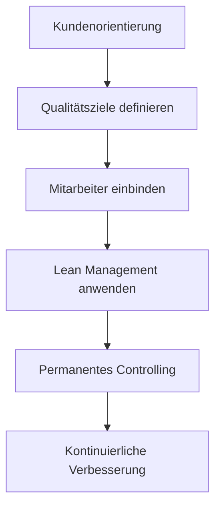

Total Quality Management (TQM) bezeichnet ein ganzheitliches System zur langfristigen Verankerung von Qualität und Qualitätszielen in allen Bereichen eines Unternehmens. Es findet Anwendung in allen Branchen und Unternehmensgrößen und strebt die Maximierung der Kundenzufriedenheit an. TQM integriert alle Mitarbeiter in den Prozess der Qualitätsverbesserung und nutzt Prinzipien wie Kundenorientierung und [Lean Management](/open-fidup/lerninhalte/lean-management) zur kontinuierlichen Optimierung.

## Merkmale
TQM optimiert die Qualität von Produkten und Dienstleistungen und strebt nach höchster Kundenzufriedenheit. Ein Qualitätsvorsprung und hohe Kundenzufriedenheit dienen als Wettbewerbsvorteil. Qualitätsziele bestimmen die Ausrichtung aller Ebenen und Funktionen des Unternehmens. Alle Mitarbeiter werden motiviert und tragen aktiv zur Verbesserung bei.

## Bedeutung
Die Qualität der Produkte stellt das oberste Ziel für Unternehmen dar. Fehlerfreie Produkte sind Voraussetzung für den Verkauf in großen Stückzahlen. TQM fördert die Einbindung aller Unternehmensbereiche in den Produktionsprozess. Das Hauptziel besteht in absoluter Kundenzufriedenheit durch schlankes Management und permanentes Qualitätscontrolling.

## Prinzipien
TQM basiert auf folgenden Prinzipien:

1. **Neue Blickwinkel schaffen**: Kundenzufriedenheit als oberstes Gebot.
2. **Stärkerer Einsatz der Unternehmensleitung**: Aktive Gestaltung des Umstrukturierungsprozesses.
3. **Mitarbeiterorientierung**: Einbindung der Mitarbeiter in den Prozess zur Förderung von Motivation und Kreativität.
4. **Kundenorientierung**: Der Kunde definiert Qualität; alle Prozesse orientieren sich an seinen Wünschen.
5. **Lean Management**: Schlankes Management fördert Kommunikation und Effizienz.
6. **Permanentes Qualitätscontrolling**: Ständige Überwachung der Qualität zur Sicherstellung der Zielvorgaben.

## Vor- und Nachteile

### Vorteile
- Das gesamte Unternehmen orientiert sich an neuen Qualitätsmaßstäben.
- Kosteneinsparungspotenziale ergeben sich nach der Umsetzung.
- Weniger Störungen in den Prozessabläufen führen zu höherer Ausbringungsmenge.
- Positive Auswirkungen auf Unternehmenszahlen wie Umsatz- und Gewinnsteigerung.

### Nachteile
- TQM erfordert eine Veränderung der Unternehmenskultur, was mit Widerständen verbunden sein kann.
- Mangelnde Akzeptanz bei Mitarbeitern kann zu Konflikten führen.
- Strikte Einhaltung der Abläufe kann bei vielen involvierten Mitarbeitern schwierig sein.

## Quellen
- [Wikipedia: Total Quality Management](https://de.wikipedia.org/wiki/Total_Quality_Management)
- Wirtschaft, D. M. (2016, August 14). Total Quality Management (TQM & EFQM) einfach erklärt - Qualitätsmanagement in Unternehmen. Youtube. Abgerufen von https://www.youtube.com/watch?v=nIXPrC_jfhU
- caesar. academy. (2022, December 05). Total-Quality-Management (Definition) - 👨🏼‍🎓 EINFACH ERKLÄRT 👩🏼‍🎓. Youtube. Abgerufen von https://www.youtube.com/watch?v=vv9vL1jzRWo
- ▷ Total Quality Management (TQM) » Definition, Erklärung & Beispiele + Übungsfragen. (2022, May 10). Abgerufen von https://www.bwl-lexikon.de/wiki/total-quality-management-tqm/#welche-prinzipien-verfolgt-tqm